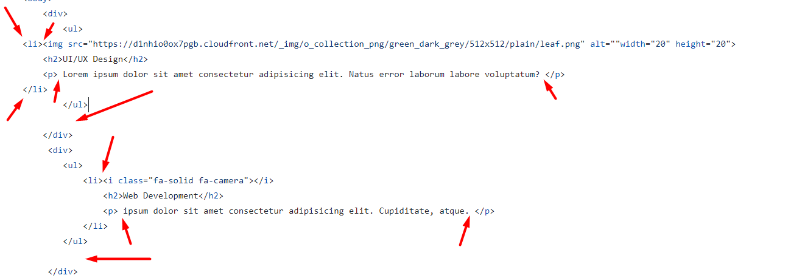
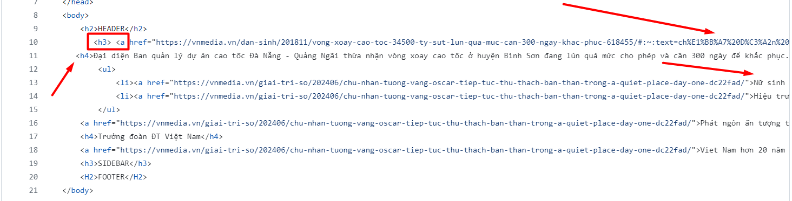

# Review bài tập về nhà buổi 1 - Lớp FullStack K10

## [Phan Tuan Manh](https://phantuanmanh.github.io/f8-fullstack-k10/)

- [x] **Bài 1:**

**Điểm: 9**

- Các thẻ `input` thuộc trong nhóm thẻ `form` và đây cũng là một biểu mẫu vậy nên cần được bọc trong thẻ `form`.

- Giá trị của thuộc tính `type` của thẻ `input` ở ô nhập liệu **email** cần có giá trị là **email**, hiện bài làm đang để giá trị của thuộc tính `type` của thẻ `input` là **Enter Email** điều này dẫn đến việc thuộc tính của thẻ `input` sẽ có giá trị mặc định là **text** do thẻ thuộc tính `type` không có giá trị **Enter Email**, ngoài ra một thẻ `input` cũng cần có các thuộc tính khác như `placeholder`(chỉ ra gợi ý để mô tả giá trị mong muốn của trường nhập), `name`(sử dụng để trang web có thể lấy được giá trị của input và xử lý ở phía server-side), ví dụ:

  ```html
  <input type="email" placeholder="Enter email" name="email" />
  ```

- [x] **Bài 2:**

**Điểm: 9.5**

- Tiêu đề của các bài viết nên dùng thẻ `h2` thay vì `h3` để tăng thêm độ nhấn mạnh cho tiêu đề của các bài viết.

- [x] **Bài 3:**

**Điểm: 8**

- Các thẻ heading được sử dụng để làm tiêu đề, đầu đề cho 1 mục hoặc cả trang. **HEADER**, **SIDEBAR**, **FOOTER** không mang ý nghĩa là một tiêu đề, nó chỉ là một **placeholder**, một thành phần giữ chỗ để biết rằng ở đó sẽ chứa một header, sidebar, footer mà đang sửa chữa, thêm, đang hoàn thiện. Vậy nên không sử dụng thẻ `h1` để bọc **Header** và **Footer**.

- Trong một trang chỉ nên có 1 thẻ `h1` để nhấn mạnh tiêu đề chính của trang đó, hiện bài làm đang sử dụng nhiều hơn 1 thẻ `h1`.

- Phần sidebar được sử dụng để chứa những thông tin bên cạnh nội dung chính vậy và nó không phải là một tiêu đề vậy nên không sử dụng thẻ `h2` để bọc **SIDEBAR** mà cần dùng thẻ `aside`.

  - Đề xuất sửa:

  ```html
  <header>Header</header>
  <main>
    ...
    <aside>SIDEBAR</aside>
  </main>
  <footer>FOOTER</footer>
  ```

- [x] **Điểm mạnh**:

  - Trình bày code rất tốt.

  - Sử dụng tốt các thẻ `html`

  - Có sự chủ động tìm hiểu và sử dụng tốt `fontawesome`

- [x] **Điểm yếu**

  - Chưa thực sự hiểu về semantic trong html

- [x] **Đánh giá chung**: Cần chú ý nhiều hơn đến semantic và một số lỗi nhỏ để hoàn thiện hơn, có thể sử dụng comment để nhận biết rõ điểm bắt đầu và kết thúc của các thành phần như **header**, **sidebar**, **footer**,...

- [x] **Điểm tổng kết: 8.5**

**Note: Anh sửa lại bài làm theo nhận xét rồi sau đó báo lại cho em để em kiểm tra lại nha**.

## [Vu Anh Tuan](https://vatuan2710.github.io/f8-fullstack-k10/Day-1/index)

- [x] **Bài 1:**

- Không nên set cả `width` và `height` cho ảnh, nên chỉ set một trong hai thuộc tính đó. Vì khi sử dụng cả 2 thuộc tính, nếu kích thước của ảnh thay đổi, thì sẽ phải thay đổi cả 2 thuộc tính `width` và `height`, điều này sẽ làm cho code không tối ưu. Hoặc sẽ làm cho tỷ lệ ảnh bị méo.

- Ở trường hợp này, **Get the invite** chưa đủ ý nghĩa làm một tiêu đề chính, dựa theo tiêu đề, và chỉ có một `input` nhập **email**, đây có thể là một `form` đăng ký thông báo thường có ở **footer**. Nên sử dụng thẻ `h2` thay vì thẻ `h1`.

- Các thẻ `input` và `button` thuộc trong nhóm thẻ `form` và đây cũng là một biểu mẫu vậy nên cần được bọc trong thẻ `form`.

- Giá trị của thuộc tính `type` của thẻ `input` ở ô nhập liệu **email** cần có giá trị là **email**, hiện bài làm đang để giá trị của thuộc tính `type` của thẻ `input` là **text**, thuộc tính `value` được dùng để giúp xác định giá trị mặc định của ô nhập liệu, trong trường hợp này chữ **Enter Email** khổng phải là giá trị mặc định của trường nhập **email** mà nó chỉ là gợi ý để mô tả giá trị mong muốn của trường nhập vì vậy nên sử dụng thuộc tính `placeholder` với giá trị là **Enter Email**, ngoài ra cần thêm thuộc tính `name` để trang web có thể lấy được giá trị của input và xử lý ở phía server-side.

- Thẻ `br` chỉ được sử dụng để ngắt dòng văn bản không được sử dụng để tạo khoảng cách giữa các thẻ `html`.

- [x] **Bài 2:**

- Thẻ `img` ở trong từng thẻ `li` được thể hiện là một hình ảnh tượng trưng và mô tả cho bài viết, nên có giá trị `alt` hợp lý, có thể sử dụng nội dung của `h2` để là giá trị.

- [x] **Bài 3:**

- Các thẻ heading được sử dụng để làm tiêu đề, đầu đề cho 1 mục hoặc cả trang. **HEADER**, **SIDEBAR**, **FOOTER** không mang ý nghĩa là một tiêu đề, nó chỉ là một **placeholder**, một thành phần giữ chỗ để biết rằng ở đó sẽ chứa một header, sidebar, footer mà đang sửa chữa, thêm, đang hoàn thiện. Vậy nên không sử dụng thẻ `h2` để bọc **Header**, **Footer** và `h3` để bọc **SIDEBAR**.

  - Đề xuất sửa:

  ```html
  <header>Header</header>
  <main>
    ...
    <aside>SIDEBAR</aside>
  </main>
  <footer>FOOTER</footer>
  ```

- Tiêu đề: **Vòng xoay cao tốc 34.500 tỷ sụt lún quá mức , cần 300 ngày khắc phục** được thể hiện là một tiêu đề lớn nhất, đáng chú ý nhất, nên sử dụng thẻ `<h1>` ở đây thay vì sử dụng thẻ `h2`.

- Dấu lớn hơn và nhỏ hơn khi viết thẻ đóng và thẻ mở cần phải nằm trên cùng một dòng, không ngắt dòng nội dung của một thẻ một cách không hợp lý, trong trường hợp này chữ **phục** đang được tách xuống một dòng trong khi toàn bộ nội dung còn lại nằm trên một dòng khác và thẻ đóng `</a>` cần được tách xuống dòng khác thay vì nằm cùng dòng với nội dung.

  

  (Tương tự với các trường hợp ở dưới).

- [x] **Điểm mạnh**:

  - Sử dụng tốt các thẻ `html` để tạo được giao diện theo yêu cầu

  - Có tìm hiểu và sử dụng được `CSS` mặc dù kiến thức chưa được học

  - Tên các file ảnh đặt tường minh dễ hiểu

- [x] **Điểm yếu**

  - Chưa thực sự hiểu về semantic trong html

  - Trình bày code chưa thực sự tốt

  - Quản lý các file ảnh chưa tốt khi toàn bộ các file ảnh đang được đặt ngang cấp với các file `html` trong thư mục **Day-1**, điều này dẫn đến việc khó quản lý khi số lượng ảnh và file `html` tăng lên

- [x] **Đánh giá chung**: Cần chú ý nhiều hơn đến semantic, cách quản lý folder, file và cách trình bày code, có thể sử dụng comment để nhận biết rõ điểm bắt đầu và kết thúc của các thành phần như **header**, **sidebar**, **footer**,...

- [x] **Điểm tổng kết: **

**Note: Anh sửa lại bài làm theo nhận xét rồi sau đó báo lại cho em để em kiểm tra lại nha**.

## [Nguyen Hai Duong](https://github.com/tenk22/F8_fullstacks/tree/main/btvnb1)

- [x] **Bài 1:**

- Không nên set cả `width` và `height` cho ảnh, nên chỉ set một trong hai thuộc tính đó. Vì khi sử dụng cả 2 thuộc tính, nếu kích thước của ảnh thay đổi, thì sẽ phải thay đổi cả 2 thuộc tính `width` và `height`, điều này sẽ làm cho code không tối ưu. Hoặc sẽ làm cho tỷ lệ ảnh bị méo.

- Ở trường hợp này, **Get the invite** chưa đủ ý nghĩa làm một tiêu đề chính, dựa theo tiêu đề, và chỉ có một `input` nhập **email**, đây có thể là một `form` đăng ký thông báo thường có ở **footer**. Nên sử dụng thẻ `h2` thay vì thẻ `h1`.

- **Lorem ipsum dolor, sit amet consectetur adipisicing elit.** thể hiện một đoạn văn bản không mang ý nghĩa vì vậy cần sử dụng thẻ `p` thay vì thẻ `div`.

- Không để thừa cách khoảng trắng như dưới dây

  

- Các thẻ `input` và `button` thuộc trong nhóm thẻ `form` và đây cũng là một biểu mẫu vậy nên cần được bọc trong thẻ `form`.

- Thẻ `input` là thẻ tự đóng vậy nên cần thêm `/` vào trước `>`

- Giá trị của thuộc tính `type` của thẻ `input` ở ô nhập liệu **email** cần có giá trị là **email**, hiện bài làm đang để giá trị của thuộc tính `type` của thẻ `input` là **text**, ngoài ra cần thêm thuộc tính `name` để trang web có thể lấy được giá trị của input và xử lý ở phía server-side, ví dụ:

  ```html
  <input type="email" placeholder="Enter email" name="email" />
  ```

- Thẻ `br` chỉ được sử dụng để ngắt dòng văn bản không được sử dụng để tạo khoảng cách giữa các thẻ `html`.

- Nội dung của thẻ `button` viết chưa chỉn chu, chỉ nên viết hoa chữ cái đầu tiên của một từ hoặc viết hoa toàn bộ chữ cái của từ đó.

  

- [x] **Bài 2:**

- Đề bài đang thể hiện một danh sách các bài viết vậy nên cần sử dụng cặp thẻ `ul` và `li` để thể hiện và khi đã thể hiện là một danh sách thì trong thẻ `ul` phải bao gồm nhiều thẻ `li` và cụ thể trong trường hợp này chỉ cần duy nhất một thẻ `ul` để thể hiện danh sách các bài viết và các thẻ `li` sẽ thể hiện từng bài viết, ví dụ:

  ```html
  <ul>
    <li>...</li>
    <li>...</li>
    ...
  </ul>
  ```

- Thụt lề không chính xác, đang thừa quá nhiều khoảng trắng ngắt dòng các thẻ `html` chưa hợp lý

  
  (Tương tự với các trường hợp ở dưới.)

- Nhận xét về cách set thuộc tính `width` và `height` cho thẻ `img` giống với bài 1.

- Thẻ `img` ở trong từng thẻ `li` được thể hiện là một hình ảnh tượng trưng và mô tả cho bài viết, nên có giá trị `alt` hợp lý, có thể sử dụng nội dung của `h2` để là giá trị.

- [x] **Bài 3:**

- Các thẻ heading được sử dụng để làm tiêu đề, đầu đề cho 1 mục hoặc cả trang. **HEADER**, **SIDEBAR**, **FOOTER** không mang ý nghĩa là một tiêu đề, nó chỉ là một **placeholder**, một thành phần giữ chỗ để biết rằng ở đó sẽ chứa một header, sidebar, footer mà đang sửa chữa, thêm, đang hoàn thiện. Vậy nên không sử dụng thẻ `h2` để bọc **Header**, **Footer** và `h3` để bọc **SIDEBAR** và phần ở giữa header và footer nên được bọc bởi thẻ `main`.

- Có thể sử dụng các thẻ như `<span>`, `<div>`, ... Các thẻ non-semantics để thể hiện **placeholder**, hoặc chữ **HEADER** có thể sử dụng thẻ `<header>`, **SIDEBAR** có thể sử dụng thẻ `<aside>` và **FOOTER** có thể sử dụng thẻ `<footer>`.

  - Đề xuất sửa:

  ```html
  <header>Header</header>
  <main>
    ...
    <aside>SIDEBAR</aside>
  </main>
  <footer>FOOTER</footer>
  ```

- Tiêu đề: **Vòng xoay cao tốc 34.500 tỷ sụt lún quá mức , cần 300 ngày khắc phục** được thể hiện là một tiêu đề lớn nhất, đáng chú ý nhất, nên sử dụng thẻ `<h1>` ở đây thay vì sử dụng thẻ `h3`.

- Nội dung của các thẻ `h4` trong bài làm không mang ý nghĩa là một tiêu đề mà nó chỉ là một đoạn văn bản vậy nên cần sử dụng thẻ `p` thay vì thẻ `h4`.

- Nội dung của các thẻ trong bài làm chưa đầy đủ như đề bài.

- Thụt lề chưa chính xác, thừa khoảng trắng và chưa ngắt dòng html khi quá dài trên 1 dòng

  

- [x] **Điểm mạnh**:

  - Tạo được giao diện theo yêu cầu

- [x] **Điểm yếu**

  - Chưa thực sự hiểu về semantic trong html

  - Trình bày code chưa tốt (Thụt lề chưa chính xác, thừa khoảng trắng,...)

- [x] **Đánh giá chung**: Cần chú ý nhiều hơn đến semantic, có thể sử dụng comment để nhận biết rõ điểm bắt đầu và kết thúc của các thành phần như **header**, **sidebar**, **footer**,... Nên tách riêng phần bài tập về nhà và phần học ở trên lớp thành 2 repo khác nhau để dễ quản lý hơn trong quá trình học tập.

- [x] **Điểm tổng kết: **

**Note: Anh sửa lại bài làm theo nhận xét rồi sau đó báo lại cho em để em kiểm tra lại nha**.

## [Nguyen Thanh An](https://ann573.github.io/f8-fullstack-k10/Day1/)

- [x] **Bài 1:**

- Ở trường hợp này, **Get the invite** chưa đủ ý nghĩa làm một tiêu đề chính, dựa theo tiêu đề, và chỉ có một `input` nhập **email**, đây có thể là một `form` đăng ký thông báo thường có ở **footer**. Nên sử dụng thẻ `h2` thay vì thẻ `h1`.

- **Lorem ipsum dolor, sit amet consectetur adipisicing elit.** thể hiện một đoạn văn bản không mang ý nghĩa vì vậy cần sử dụng thẻ `p` thay vì thẻ `span`.

- Các thẻ `input` và `button` thuộc trong nhóm thẻ `form` và đây cũng là một biểu mẫu vậy nên cần được bọc trong thẻ `form`.

- Cần thuộc tính `name` để trang web có thể lấy được giá trị của input và xử lý ở phía server-side.

- [x] **Bài 2:**

- Tiêu đề của các bài viết nên dùng thẻ `h2` thay vì `h3` để tăng thêm độ nhấn mạnh cho tiêu đề của các bài viết.

- Nhận xét tương tự như bài 1 về việc bài làm sử dụng thẻ `span` để bọc 1 đoạn văn bản.

- [x] **Bài 3:**

- Các thẻ heading được sử dụng để làm tiêu đề, đầu đề cho 1 mục hoặc cả trang. **HEADER**, **SIDEBAR**, **FOOTER** không mang ý nghĩa là một tiêu đề, nó chỉ là một **placeholder**, một thành phần giữ chỗ để biết rằng ở đó sẽ chứa một header, sidebar, footer mà đang sửa chữa, thêm, đang hoàn thiện. Vậy nên không sử dụng thẻ `h2` để bọc **Header**, **Footer** và `h3` để bọc **SIDEBAR** và phần ở giữa header và footer nên được bọc bởi thẻ `main`.

  - Đề xuất sửa:

  ```html
  <header>Header</header>
  <main>
    ...
    <aside>SIDEBAR</aside>
  </main>
  <footer>FOOTER</footer>
  ```

- Tiêu đề: **Vòng xoay cao tốc 34.500 tỷ sụt lún quá mức , cần 300 ngày khắc phục** được thể hiện là một tiêu đề lớn nhất, đáng chú ý nhất, nên sử dụng thẻ `<h1>` ở đây thay vì sử dụng thẻ `h2` và không được sử dụng thẻ `inline` (thẻ `a`) để bọc một thẻ `block` (`h2`).

- Nhận xét tương tự như bài 1 về việc bài làm sử dụng thẻ `span` để bọc 1 đoạn văn bản.

- [x] **Điểm mạnh**:

  - Sử dụng tốt các thẻ `html` để tạo được giao diện theo yêu cầu

  - Có tìm hiểu và sử dụng được `CSS` mặc dù kiến thức chưa được học

  - Có sự chủ động tìm hiểu và sử dụng fontawesome

  - Trình bày code rất tốt (rõ ràng, dễ đọc, thụt lề đúng cách, không bị thừa các khoảng trắng)

- [x] **Điểm yếu**

  - Chưa thực sự hiểu về semantic trong html

- [x] **Đánh giá chung**: Cần chú ý nhiều hơn đến semantic, có thể sử dụng comment để nhận biết rõ điểm bắt đầu và kết thúc của các thành phần như **header**, **sidebar**, **footer**,... Hiện anh đang để cả phần bài tập về nhà và phần học trên lớp cùng chung trong một folder, nên tách riêng phần bài tập về nhà và phần học ở trên lớp thành 2 repo khác nhau để dễ quản lý hơn trong quá trình học tập.

- [x] **Điểm tổng kết: **

**Note: Anh sửa lại bài làm theo nhận xét rồi sau đó báo lại cho em để em kiểm tra lại nha**.
