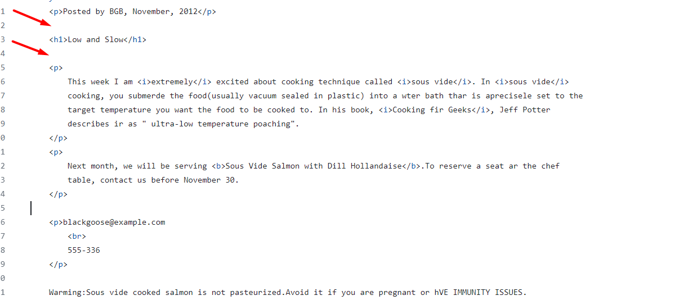
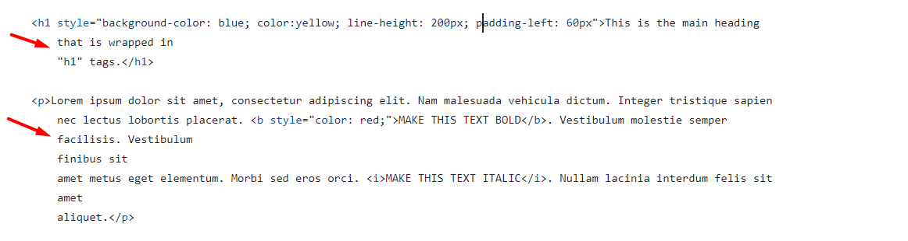
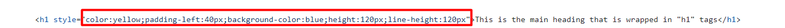
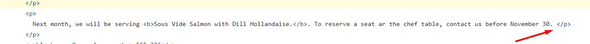
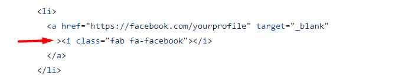
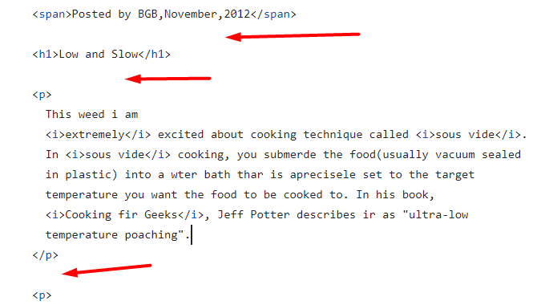

# Review bài tập về nhà buổi 2 - Lớp FullStack K10

## [Vu Anh Tuan](https://vatuan2710.github.io/f8-fullstack-k10/Day-2/index)

- [x] **Bài 1:**

`Điểm: 10`

- Có thể để `Cooking fir Geeks`trong thẻ `cite` vì đây là tên của một cuốn sách mà thẻ `cite` được dùng để xác định tiêu đề của một tác phẩm sáng tạo (ví dụ: một cuốn sách, một bài thơ, một bài hát, một bộ phim, một bức tranh, một tác phẩm điêu khắc, v.v.).

- [x] **Bài 2:**

`Điểm: 10`

- [x] **Bài 3:**

`Điểm: 10`

- [x] **Bài 4:**

`Điểm: 10`

- [x] **Điểm mạnh:**

- Sử dụng tốt các thẻ html để tạo được giao diện theo yêu cầu

- Bài làm chuẩn semantic(có sự cả thiện rất tốt so với bài tập buổi 1)

- Chủ động tìm hiểu và sử dụng tốt `CSS`, `Fontawesome` và thẻ `HTML` chưa được học trên lớp.

- Trình bày code rất tốt(rõ ràng, dễ đọc, thụt lề đúng cách, không bị thừa các khoảng trắng).

- [x] **Điểm yếu:**

Đánh giá chung: Bài làm rất tốt, tuy nhiên cần chú ý nên tách phần bài tập về nhà và phần học trên lớp ra thành các repo khác nhau để dễ quản lý khi số lượng bài tập về nhà tăng lên.

`Điểm tổng kết: 10`

## [Phan Tuan Manh](https://phantuanmanh.github.io/f8-fullstack-k10/Day-2/index.html)

- [x] **Bài 1:**

`Điểm: 6.5`

- **Posted by BGB, November, 2012** không phải là một đoạn văn bản mà nó chỉ thể hiện thời gian và người post bài vì vậy nên dùng thẻ `div` hoặc thẻ `span` thay vì thẻ `p` để bọc, tương tự với **blackgoose@example.com** và **555-336** nên được bọc trong thẻ `address` vì phần này thể hiện thông tin liên hệ của người đăng bài.

- Toàn bộ nội dung của bài này là nội dung của 1 bài blog vì vậy cần dùng thẻ `article` bọc toàn bộ nội dung.

- Nên dùng thẻ `em` để bọc **extremely** thay vì sử dụng thẻ `i` vì ở đây chủ của bài blog đang muốn nhấn mạnh rằng người đó cực kỳ thích thú với kỹ thuật nấu ăn gọi là **sous vide**.

- Nên dùng thẻ `strong` để bọc **Sous Vide Salmon with Dill Hollandaise** thay vì thẻ `b` để nhấn mạnh rằng trong tháng tới thì họ sẽ phục vụ món **Sous Vide Salmon with Dill Hollandaise** tại nhà hàng của họ.

- **Warming:Sous...IMMUNITY ISSUES.** là một đoạn văn bản vì vậy cần được bọc trong thẻ `p`.

- Có thể để `Cooking fir Geeks`trong thẻ `cite` vì đây là tên của một cuốn sách mà thẻ `cite` được dùng để xác định tiêu đề của một tác phẩm sáng tạo (ví dụ: một cuốn sách, một bài thơ, một bài hát, một bộ phim, một bức tranh, một tác phẩm điêu khắc, v.v.).

- **Warning: Sous vide cooked salmon is not pasteurized. Avoid it if you are pregnant or h** là một đoạn văn bản có cỡ chữ nhỏ nên cần dùng thẻ `small` (xác định văn bản nhỏ hơn như bản quyền và các nhận xét phụ khác) để bọc hoặc có thể dùng `css` để chỉnh lại cỡ chữ.

- Không để thừa các khoảng cách

  
  (Tương tự với toàn bộ các bài 2 và 4)

- [x] **Bài 2:**

`Điểm: 8.5`

- **strong text** là hai từ được nhấn mạnh vậy nên cần sử dụng thẻ `strong` thay vì thẻ `b`.

- Thẻ `h1` được dùng để thể hiện tiêu đề chính của một trang vậy nên không nên `css` cho thẻ `h1` giống như là một khối có màu nền và có dòng chữ ở giữa điều đó dẫn đến việc toàn bộ khối đó được hiểu là một tiêu đề của cả trang, có thể học một thẻ `div` ra bên ngoài thẻ `h1` rồi sau đó `css` cho thẻ `div` đó có phần **background** giống theo yêu cầu đề bài.

- Ngắt dòng văn bản chưa hợp lý

  

- [x] **Bài 3:**

`Điểm: 8.75`

- Đề bài đang thể hiện một danh sách các bài viết vậy nên cần sử dụng cặp thẻ `ul` và `li` để thể hiện và khi đã thể hiện là một danh sách thì trong thẻ `ul` phải bao gồm nhiều thẻ `li` và cụ thể trong trường hợp này chỉ cần duy nhất một thẻ `ul` để thể hiện danh sách các bài viết và các thẻ `li` sẽ thể hiện từng bài viết, ví dụ:

  ```html
  <ul>
    <li>...</li>
    <li>...</li>
    ...
  </ul>
  ```

- Tiêu đề của các bài viết nên dùng thẻ `h2` thay vì `h3` để tăng thêm độ nhấn mạnh cho tiêu đề của các bài viết.

- [x] **Bài 4:**

`Điểm: 8`

- Toàn bộ nội dung của bài này đề thuộc phần **FOOTER** của một trang (chân trang, nằm tại vị trí cuối cùng của website) vậy nên cần bọc toàn bộ phần này trong thẻ `footer`.

- Thẻ `ul` nằm dưới thẻ `h3` có nội dung là **Quick Links** là một danh sách chứa các liên kết chuyển hướng vậy nên cần bọc thẻ `nav` ra ngoài thẻ `ul`.

- Nhận xét về việc thừa các khoảng cách giống như ở bài 1.

- [x] **Điểm mạnh:**

- Sử dụng tốt các thẻ html

- Chủ động tìm hiểu và sử dụng tốt `CSS`, `Fontawesome`

- [x] **Điểm yếu:**

- Chưa thực sự hiểu về semantic trong html

- Trình bày code chưa thực sự tốt (Ngắt dòng nội dung chưa hợp lý và thừa các khoảng các giữa các thẻ `html`)

- [x] **Đánh giá chung:** Cần chú ý hơn đến `semantic` và một số lỗi nhỏ để hoàn thiện hơn.

`Điểm tổng kết: 7.95`

`Note: Anh sửa lại bài làm theo nhận xét rồi sau đó báo lại cho em để em kiểm tra lại nha.`

## [Nguyen Huy Hoang](https://github.com/nguyenhoang2404/f8-fullstack-k10/blob/main/BaiTapVeNha2/Bai1.html)

- [x] **Bài 1:**

`Điểm: 6.5`

- Bài làm đang thiếu phần thể hiện thời gian và người post(**Posted by BGB, November, 2012**).

- Toàn bộ nội dung của bài này là nội dung của 1 bài blog vì vậy cần dùng thẻ `article` bọc toàn bộ nội dung.

- Ở nội dung của thẻ `p` đầu tiên, dùng thẻ `em` để bọc **extremely** vì ở đây chủ của bài blog đang muốn nhấn mạnh rằng người đó cực kỳ thích thú với kỹ thuật nấu ăn gọi là **sous vide**. Các từ **sous vide** cần được bọc trong thẻ `i`(dùng để xác định một đoạn văn bản được định dạng kiểu chữ in nghiêng).

- Có thể để `Cooking fir Geeks`trong thẻ `cite` vì đây là tên của một cuốn sách mà thẻ `cite` được dùng để xác định tiêu đề của một tác phẩm sáng tạo (ví dụ: một cuốn sách, một bài thơ, một bài hát, một bộ phim, một bức tranh, một tác phẩm điêu khắc, v.v.).

- Dùng thẻ `strong` để bọc **Sous Vide Salmon with Dill Hollandaise** để nhấn mạnh rằng trong tháng tới thì họ sẽ phục vụ món **Sous Vide Salmon with Dill Hollandaise** tại nhà hàng của họ.

- **blackgoose@example.com** và **555-336** không phải là một đoạn văn bản nên không dùng thẻ `p` bọc, nên bọc trong thẻ `address` vì phần này thể hiện thông tin liên hệ của người đăng bài, ví dụ:

  ```html
  <address>
    blackgoose@example.com <br />
    555-336
  </address>
  ```

- **Warning: Sous vide cooked salmon is not pasteurized. Avoid it if you are pregnant or h** là một đoạn văn bản có cỡ chữ nhỏ nên cần dùng thẻ `small` (xác định văn bản nhỏ hơn như bản quyền và các nhận xét phụ khác) để bọc hoặc có thể dùng `css` để chỉnh lại cỡ chữ.

- [x] **Bài 2:**

`Điểm: 8`

- **strong text** là hai từ được nhấn mạnh vậy nên cần sử dụng thẻ `strong` để bọc.

- Thẻ `h1` được dùng để thể hiện tiêu đề chính của một trang vậy nên không nên `css` cho thẻ `h1` giống như là một khối có màu nền và có dòng chữ ở giữa điều đó dẫn đến việc toàn bộ khối đó được hiểu là một tiêu đề của cả trang, có thể học một thẻ `div` ra bên ngoài thẻ `h1` rồi sau đó `css` cho thẻ `div` đó có phần **background** giống theo yêu cầu đề bài.

- Khi viết `css inline` nên viết cách nhau ra một khoảng giữa các thuộc tính, khoảng cách giữa tên thuộc tính và giá trị tránh việc viết liền như trong bài làm



Ví dụ: `color: yellow; padding-left: 40px; background-color: blue;`

- [x] **Bài 3:**

`Điểm: 9.5`

- Tiêu đề của các bài viết nên dùng thẻ `h2` thay vì `h3` để tăng thêm độ nhấn mạnh cho tiêu đề của các bài viết.

- Thẻ `img` ở trong từng thẻ `li` được thể hiện là một hình ảnh tượng trưng và mô tả cho bài viết, nên có giá trị `alt` hợp lý, có thể sử dụng nội dung của thẻ heading để làm giá trị.

- [x] **Bài 4:**

`Điểm: 8`

- Toàn bộ nội dung của bài này đề thuộc phần **FOOTER** của một trang (chân trang, nằm tại vị trí cuối cùng của website) vậy nên cần bọc toàn bộ phần này trong thẻ `footer`.

- Thẻ `ul` nằm dưới thẻ `h3` có nội dung là **Quick Links** là một danh sách chứa các liên kết chuyển hướng vậy nên cần bọc thẻ `nav` ra ngoài thẻ `ul`.

- Các `icon` trong danh sách **Follow Us** đều có tác dụng để người dùng bấm vào và chuyển hướng đến các trang mạng xã hội tương ứng vậy nên cần bọc thẻ `a` ra ngoài các thẻ `i`.

- Bài làm đang nội dung **Copyright Hoc Web Chuan All Right Reserved**.

- [x] **Điểm mạnh:**

- Sử dụng tốt các thẻ `html` để tạo được giao diện theo yêu cầu

- Chủ động tìm hiểu và sử dụng tốt `CSS`, `Fontawesome`

- [x] **Điểm yếu:**

- Chưa thực sự hiểu về `semantic` trong `html`

- Chưa cẩn thận trong việc kiểm tra kỹ giao diện mẫu trước khi code

- Quản lý các file ảnh chưa tốt khi toàn bộ các file ảnh đang được đặt ngang cấp với các file `html` trong thư mục `BaiTapVeNha2`, điều này dẫn đến việc khó quản lý khi số lượng ảnh và file `html` tăng lên

- [x] **Đánh giá chung:** Cần chú ý nhiều hơn đến `semantic`, cách trình bày khi viết `css inline` và cách quản lý các file ảnh.

`Điểm tổng kết: 8`

`Note: Anh sửa lại bài làm theo nhận xét rồi sau đó báo lại cho em để em kiểm tra lại nha.`

## [Nguyen Thanh An](https://ann573.github.io/f8-fullstack-k10/Day2/)

- [x] **Bài 1:**

`Điểm: 7`

- Toàn bộ nội dung của bài này là nội dung của 1 bài blog vì vậy cần dùng thẻ `article` bọc toàn bộ nội dung.

- **Posted by BGB, November, 2012** không phải là một đoạn văn bản mà nó chỉ thể hiện thời gian và người post bài vì vậy nên dùng thẻ `div` hoặc thẻ `span` thay vì thẻ `p` để bọc, tương tự với **blackgoose@example.com** và **555-336** nên được bọc trong thẻ `address` vì phần này thể hiện thông tin liên hệ của người đăng bài.

- Nên dùng thẻ `em` để bọc **extremely** thay vì sử dụng thẻ `i` vì ở đây chủ của bài blog đang muốn nhấn mạnh rằng người đó cực kỳ thích thú với kỹ thuật nấu ăn gọi là **sous vide**. Hai từ **sous vide** xuất hiện lần thứ 2 chưa được in nghiêng.

- Có thể để `Cooking fir Geeks`trong thẻ `cite` vì đây là tên của một cuốn sách mà thẻ `cite` được dùng để xác định tiêu đề của một tác phẩm sáng tạo (ví dụ: một cuốn sách, một bài thơ, một bài hát, một bộ phim, một bức tranh, một tác phẩm điêu khắc, v.v.).

- Nên dùng thẻ `strong` để bọc **Sous Vide Salmon with Dill Hollandaise** thay vì thẻ `b` để nhấn mạnh rằng trong tháng tới thì họ sẽ phục vụ món **Sous Vide Salmon with Dill Hollandaise** tại nhà hàng của họ.

- **Warning: Sous vide cooked salmon is not pasteurized. Avoid it if you are pregnant or h** là một đoạn văn bản có cỡ chữ nhỏ nên cần dùng thẻ `small` (xác định văn bản nhỏ hơn như bản quyền và các nhận xét phụ khác) để bọc hoặc có thể dùng `css` để chỉnh lại cỡ chữ.

- [x] **Bài 2:**

`Điểm: 9.5`

- Thẻ `h1` được dùng để thể hiện tiêu đề chính của một trang vậy nên không nên `css` cho thẻ `h1` giống như là một khối có màu nền và có dòng chữ ở giữa điều đó dẫn đến việc toàn bộ khối đó được hiểu là một tiêu đề của cả trang, có thể học một thẻ `div` ra bên ngoài thẻ `h1` rồi sau đó `css` cho thẻ `div` đó có phần **background** giống theo yêu cầu đề bài.

- [x] **Bài 3:**

`Điểm: 10`

- [x] **Bài 4:**

`Điểm: 9.5`

- Thẻ `ul` nằm dưới thẻ `h2` có nội dung là **Quick Links** là một danh sách chứa các liên kết chuyển hướng vậy nên cần bọc thẻ `nav` ra ngoài thẻ `ul`.

- [x] **Điểm mạnh:**

- Sử dụng tốt các thẻ `html` để tạo được giao diện theo yêu cầu

- Chủ động tìm hiểu và sử dụng tốt `CSS`, `Fontawesome`

- Trình bày code rất tốt(rõ ràng, dễ đọc, thụt lề đúng cách, không bị thừa các khoảng trắng)

- [x] **Điểm yếu:**

- Chưa thực sự hiểu về `semantic` trong `html`

- Chưa cẩn thận trong việc kiểm tra kỹ giao diện mẫu trước khi code

- [x] **Đánh giá chung:** Cần chú ý hơn đến `semantic` và nên tách phần bài tập về nhà và phần học trên lớp ra thành các repo khác nhau để dễ quản lý khi số lượng bài tập về nhà tăng lên.

`Điểm tổng kết: 9`

`Note: Bạn sửa lại bài làm theo nhận xét rồi sau đó báo lại cho mình để mình kiểm tra lại nha.`

## [Vu Quoc Dung](https://dungvuquoc0102.github.io/f8_fullstack_k10_repo/)

- [x] **Bài 1:**

`Điểm: 9.5`

- **Posted by BGB, November, 2012** không phải là một đoạn văn bản mà nó chỉ thể hiện thời gian và người post bài vì vậy nên dùng thẻ `div` hoặc thẻ `span` thay vì thẻ `p` để bọc.

- [x] **Bài 2:**

`Điểm: 9`

- Thẻ `h1` được dùng để thể hiện tiêu đề chính của một trang vậy nên không nên `css` cho thẻ `h1` giống như là một khối có màu nền và có dòng chữ ở giữa điều đó dẫn đến việc toàn bộ khối đó được hiểu là một tiêu đề của cả trang, có thể học một thẻ `div` ra bên ngoài thẻ `h1` rồi sau đó `css` cho thẻ `div` đó có phần **background** giống theo yêu cầu đề bài.

- **strong text** là hai từ được nhấn mạnh vậy nên cần sử dụng thẻ `strong` thay vì thẻ `b`.

- [x] **Bài 3:**

`Điểm: 9.75`

- Tiêu đề của các bài viết nên dùng thẻ `h2` thay vì `h3` để tăng thêm độ nhấn mạnh cho tiêu đề của các bài viết.

- [x] **Bài 4:**

`Điểm: 9.75`

- Thẻ `ul` nằm dưới thẻ `h2` có nội dung là **Quick Links** là một danh sách chứa các liên kết chuyển hướng vậy nên cần bọc thẻ `nav` ra ngoài thẻ `ul`.

- [x] **Điểm mạnh:**

- Sử dụng tốt các thẻ html để tạo được giao diện theo yêu cầu

- Bài làm tương đối tốt về semantic semantic(có sự cả thiện rất tốt so với bài tập buổi 1)

- Chủ động tìm hiểu và sử dụng tốt `CSS`, `Fontawesome` và thẻ `HTML` chưa được học trên lớp.

Đánh giá chung: Bài làm rất tốt.

`Điểm tổng kết: 9.5`

`Note: Anh sửa lại bài làm theo nhận xét rồi sau đó báo lại cho em để em kiểm tra lại nha.`

## [Tran Ngoc Duy](https://tranduyriba.github.io/bai-tap-f8/)

- [x] Bài 1:

`Điểm: 7`

- **Posted by BGB, November, 2012** không phải là một đoạn văn bản mà nó chỉ thể hiện thời gian và người post bài vì vậy nên dùng thẻ `div` hoặc thẻ `span` thay vì thẻ `p` để bọc, tương tự với **blackgoose@example.com** và **555-336** nên được bọc trong thẻ `address` vì phần này thể hiện thông tin liên hệ của người đăng bài.

- Toàn bộ nội dung của bài này là nội dung của 1 bài blog vì vậy cần dùng thẻ `article` bọc toàn bộ nội dung.

- Ở nội dung của thẻ `p` thứ 2 trong bài làm, dùng thẻ `em` để bọc **extremely** vì ở đây chủ của bài blog đang muốn nhấn mạnh rằng người đó cực kỳ thích thú với kỹ thuật nấu ăn gọi là **sous vide**. Các từ **sous vide** cần được bọc trong thẻ `i`(dùng để xác định một đoạn văn bản được định dạng kiểu chữ in nghiêng).

- Có thể để `Cooking fir Geeks`trong thẻ `cite` vì đây là tên của một cuốn sách mà thẻ `cite` được dùng để xác định tiêu đề của một tác phẩm sáng tạo (ví dụ: một cuốn sách, một bài thơ, một bài hát, một bộ phim, một bức tranh, một tác phẩm điêu khắc, v.v.).

- Dùng thẻ `strong` để bọc **Sous Vide Salmon with Dill Hollandaise** để nhấn mạnh rằng trong tháng tới thì họ sẽ phục vụ món **Sous Vide Salmon with Dill Hollandaise** tại nhà hàng của họ.

- **Warning: Sous vide cooked salmon is not pasteurized. Avoid it if you are pregnant or h** là một đoạn văn bản có cỡ chữ nhỏ nên cần dùng thẻ `small` (xác định văn bản nhỏ hơn như bản quyền và các nhận xét phụ khác) để bọc hoặc có thể dùng `css` để chỉnh lại cỡ chữ.

- [x] Bài 2:

`Điểm: 8`

- **strong text** là hai từ được nhấn mạnh vậy nên cần sử dụng thẻ `strong` để bọc.

- Thẻ `h1` được dùng để thể hiện tiêu đề chính của một trang vậy nên không nên `css` cho thẻ `h1` giống như là một khối có màu nền và có dòng chữ ở giữa điều đó dẫn đến việc toàn bộ khối đó được hiểu là một tiêu đề của cả trang, có thể học một thẻ `div` ra bên ngoài thẻ `h1` rồi sau đó `css` cho thẻ `div` đó có phần **background** giống theo yêu cầu đề bài.

- Trong thẻ `ul` chỉ nên có thẻ con trực tiếp là thẻ thẻ `li` và theo đề bài thì tiêu đề, nội dung và hình ảnh(các thẻ `h1`, `p`, `img` trong bài làm) không nằm trong danh sách vậy nên không đặt trong thẻ `ul`.

- [x] Bài 3:

`Điểm: 10`

- [x] Bài 4:

`Điểm: 9`

- Toàn bộ nội dung của bài này đề thuộc phần **FOOTER** của một trang (chân trang, nằm tại vị trí cuối cùng của website) vậy nên cần bọc toàn bộ phần này trong thẻ `footer`.

- Thẻ `ul` nằm dưới thẻ `h2` có nội dung là **Quick Links** là một danh sách chứa các liên kết chuyển hướng vậy nên cần bọc thẻ `nav` ra ngoài thẻ `ul`.

- [x] **Điểm mạnh:**

- Sử dụng tốt các thẻ `html` để tạo được giao diện theo yêu cầu

- Chủ động tìm hiểu và sử dụng tốt `CSS`, `Fontawesome`

- Trình bày code rất tốt(rõ ràng, dễ đọc, thụt lề đúng cách, không bị thừa các khoảng trắng).

- [x] **Điểm yếu:**

- Chưa thực sự hiểu về `semantic` trong `html`

- Chưa cẩn thận trong việc kiểm tra kỹ giao diện mẫu trước khi code

Đánh giá chung: Cần chú ý nhiều hơn đến `semantic` và cẩn thận hơn trong việc kiểm tra giao diện mẫu.

`Điểm tổng kết: 8.5`

`Note: Anh sửa lại bài làm theo nhận xét rồi sau đó báo lại cho em để em kiểm tra lại nha.`

## [Nguyen Hai Duong](https://tenk22.github.io/F8_fullstacks/)

- [x] Bài 1:

`Điểm: 7`

- **Posted by BGB, November, 2012** không phải là một đoạn văn bản mà nó chỉ thể hiện thời gian và người post bài vì vậy nên dùng thẻ `div` hoặc thẻ `span` thay vì thẻ `p` để bọc, tương tự với **blackgoose@example.com** và **555-336** nên được bọc trong thẻ `address` vì phần này thể hiện thông tin liên hệ của người đăng bài.

- Nên dùng thẻ `em` để bọc **extremely** thay vì sử dụng thẻ `i` vì ở đây chủ của bài blog đang muốn nhấn mạnh rằng người đó cực kỳ thích thú với kỹ thuật nấu ăn gọi là **sous vide**.

- Nên dùng thẻ `strong` để bọc **Sous Vide Salmon with Dill Hollandaise** thay vì thẻ `b` để nhấn mạnh rằng trong tháng tới thì họ sẽ phục vụ món **Sous Vide Salmon with Dill Hollandaise** tại nhà hàng của họ.

- Có thể để `Cooking fir Geeks`trong thẻ `cite` vì đây là tên của một cuốn sách mà thẻ `cite` được dùng để xác định tiêu đề của một tác phẩm sáng tạo (ví dụ: một cuốn sách, một bài thơ, một bài hát, một bộ phim, một bức tranh, một tác phẩm điêu khắc, v.v.).

- **Warning: Sous vide cooked salmon is not pasteurized. Avoid it if you are pregnant or h** là một đoạn văn bản có cỡ chữ nhỏ nên cần dùng thẻ `small` (xác định văn bản nhỏ hơn như bản quyền và các nhận xét phụ khác) để bọc hoặc có thể dùng `css` để chỉnh lại cỡ chữ.

- Bài làm thừa một thẻ đóng `p`

  

- [x] Bài 2:

`Điểm: 9.5`

- Thẻ `h1` được dùng để thể hiện tiêu đề chính của một trang vậy nên không nên `css` cho thẻ `h1` giống như là một khối có màu nền và có dòng chữ ở giữa điều đó dẫn đến việc toàn bộ khối đó được hiểu là một tiêu đề của cả trang, có thể học một thẻ `div` ra bên ngoài thẻ `h1` rồi sau đó `css` cho thẻ `div` đó có phần **background** giống theo yêu cầu đề bài.

- [x] Bài 3:

`Điểm: 8`

- Trong thẻ `ul` thì chỉ nên có thẻ `li` là con trực tiếp vậy nên tất các thẻ `h2` và thẻ `p` trong bài làm cần được đặt vào trong các thẻ `li` tương ứng.

- [x] Bài 4:

`Điểm: 8`

- Toàn bộ nội dung của bài này đề thuộc phần **FOOTER** của một trang (chân trang, nằm tại vị trí cuối cùng của website) vậy nên cần bọc toàn bộ phần này trong thẻ `footer`.

- Thẻ `ul` nằm dưới thẻ `h3` có nội dung là **Quick Links** là một danh sách chứa các liên kết chuyển hướng vậy nên cần bọc thẻ `nav` ra ngoài thẻ `ul`.

- Dấu lớn hơn và nhỏ hơn khi viết thẻ đóng và thẻ mở cần phải nằm trên cùng một dòng

  

- [x] **Điểm mạnh:**

- Sử dụng tốt các thẻ `html` để tạo giao diện

- Chủ động tìm hiểu và sử dụng tốt `CSS`, `Fontawesome`

- [x] **Điểm yếu:**

- Chưa thực sự hiểu về `semantic` trong `html`

- Trình bày code chưa thực sự tốt

- [x] **Đánh giá chung:** Cần chú ý hơn đến `semantic` và nên tách phần bài tập về nhà và phần học trên lớp ra thành các repo khác nhau để dễ quản lý khi số lượng bài tập về nhà tăng lên.

`Điểm tổng kết: 8.13`

`Note: Anh sửa lại bài làm theo nhận xét rồi sau đó báo lại cho em để em kiểm tra lại nha.`

## [Le Huu Trong](https://kaiosuke.github.io/exercise2/)

- [x] Bài 1:

`Điểm: 8`

- **Posted by BGB, November, 2012** không phải là một đoạn văn bản mà nó chỉ thể hiện thời gian và người post bài vì vậy nên dùng thẻ `div` hoặc thẻ `span` thay vì thẻ `p` để bọc.

- Toàn bộ nội dung của bài này là nội dung của 1 bài blog vì vậy nên dùng thẻ `article` bọc toàn bộ nội dung.

- Nên dùng thẻ `em` để bọc **extremely** thay vì sử dụng thẻ `i` vì ở đây chủ của bài blog đang muốn nhấn mạnh rằng người đó cực kỳ thích thú với kỹ thuật nấu ăn gọi là **sous vide**.

- Có thể để `Cooking fir Geeks`trong thẻ `cite` vì đây là tên của một cuốn sách mà thẻ `cite` được dùng để xác định tiêu đề của một tác phẩm sáng tạo (ví dụ: một cuốn sách, một bài thơ, một bài hát, một bộ phim, một bức tranh, một tác phẩm điêu khắc, v.v.).

- **Warning: Sous vide cooked salmon is not pasteurized. Avoid it if you are pregnant or h** là một đoạn văn bản có cỡ chữ nhỏ nên cần dùng thẻ `small` (xác định văn bản nhỏ hơn như bản quyền và các nhận xét phụ khác) để bọc hoặc có thể dùng `css` để chỉnh lại cỡ chữ.

- [x] Bài 2:

`Điểm: 9`

- **strong text** là hai từ được nhấn mạnh vậy nên cần sử dụng thẻ `strong` để bọc.

- Thẻ `h1` được dùng để thể hiện tiêu đề chính của một trang vậy nên không nên `css` cho thẻ `h1` giống như là một khối có màu nền và có dòng chữ ở giữa điều đó dẫn đến việc toàn bộ khối đó được hiểu là một tiêu đề của cả trang, nên `css` cho thẻ `div` bọc ở ngoài `h1` có phần **background** giống theo yêu cầu đề bài.

- [x] Bài 3:

`Điểm: 10`

- [x] Bài 4:

`Điểm: 9.5`

- Thẻ `ul` nằm dưới thẻ `h2` có nội dung là **Quick Links** là một danh sách chứa các liên kết chuyển hướng vậy nên cần bọc thẻ `nav` ra ngoài thẻ `ul`.

- [x] **Điểm mạnh:**

- Sử dụng tốt các thẻ `html` để tạo được giao diện theo yêu cầu

- Chủ động tìm hiểu và sử dụng tốt `CSS`, `Fontawesome`

- Trình bày code rất tốt(rõ ràng, dễ đọc, thụt lề đúng cách, không bị thừa các khoảng trắng).

- [x] **Điểm yếu:**

- Chưa thực sự hiểu về `semantic` trong `html`

Đánh giá chung: Cần chú ý nhiều hơn đến `semantic`.

`Điểm tổng kết: 9.13`

`Note: Anh sửa lại bài làm theo nhận xét rồi sau đó báo lại cho em để em kiểm tra lại nha.`

## [Hoang Thanh Huy](https://huyhtf88188.github.io/f8_fullstack/day2/)

- [x] Bài 1:

`Điểm: 7.5`

- **Posted by BGB, November, 2012** không phải là một đoạn văn bản mà nó chỉ thể hiện thời gian và người post bài vì vậy nên dùng thẻ `div` hoặc thẻ `span` thay vì thẻ `header` để bọc.

- Toàn bộ nội dung của bài này là nội dung của 1 bài blog vì vậy nên dùng thẻ `article` bọc toàn bộ nội dung.

- Nên dùng thẻ `em` để bọc **extremely** thay vì sử dụng thẻ `i` vì ở đây chủ của bài blog đang muốn nhấn mạnh rằng người đó cực kỳ thích thú với kỹ thuật nấu ăn gọi là **sous vide**.

- Có thể để `Cooking fir Geeks`trong thẻ `cite` vì đây là tên của một cuốn sách mà thẻ `cite` được dùng để xác định tiêu đề của một tác phẩm sáng tạo (ví dụ: một cuốn sách, một bài thơ, một bài hát, một bộ phim, một bức tranh, một tác phẩm điêu khắc, v.v.).

- **blackgoose@example.com** và **555-336** không phải là một đoạn văn bản nên không dùng thẻ `p` bọc, nên bọc trong thẻ `address` vì phần này thể hiện thông tin liên hệ của người đăng bài, ví dụ:

  ```html
  <address>
    blackgoose@example.com <br />
    555-336
  </address>
  ```

- **Warning: Sous vide cooked salmon is not pasteurized. Avoid it if you are pregnant or h** là một đoạn văn bản có cỡ chữ nhỏ nên cần dùng thẻ `small` (xác định văn bản nhỏ hơn như bản quyền và các nhận xét phụ khác) để bọc hoặc có thể dùng `css` để chỉnh lại cỡ chữ.

- [x] Bài 2:

`Điểm: 10`

- [x] Bài 3:

`Điểm: 10`

- [x] Bài 4:

`Điểm: 10`

- [x] **Điểm mạnh:**

- Sử dụng tốt các thẻ `html` để tạo được giao diện theo yêu cầu

- Chủ động tìm hiểu và sử dụng tốt `CSS`, `Fontawesome`

- Trình bày code rất tốt(rõ ràng, dễ đọc, thụt lề đúng cách, không bị thừa các khoảng trắng).

- [x] **Điểm yếu:**

- Chưa thực sự hiểu về `semantic` trong `html`

- Chưa cẩn thận trong việc kiểm tra kỹ giao diện mẫu trước khi code

Đánh giá chung: Cần chú ý nhiều hơn đến `semantic` và cẩn thận hơn trong việc kiểm tra giao diện mẫu.

`Điểm tổng kết: 9.4`

`Note: Anh sửa lại bài làm theo nhận xét rồi sau đó báo lại cho em để em kiểm tra lại nha.`

## [Nguyen Truong Giang](https://nguyentruonggiang212001.github.io/f8-fullstack-k10/Assignment2/index.html)

- [x] Bài 1:

`Điểm: 6`

- Toàn bộ nội dung của bài này là nội dung của 1 bài blog vì vậy cần dùng thẻ `article` bọc toàn bộ nội dung.

- Nên dùng thẻ `em` để bọc **extremely** thay vì sử dụng thẻ `i` vì ở đây chủ của bài blog đang muốn nhấn mạnh rằng người đó cực kỳ thích thú với kỹ thuật nấu ăn gọi là **sous vide**.

- Nên dùng thẻ `strong` để bọc **Sous Vide Salmon with Dill Hollandaise** thay vì thẻ `b` để nhấn mạnh rằng trong tháng tới thì họ sẽ phục vụ món **Sous Vide Salmon with Dill Hollandaise** tại nhà hàng của họ.

- Có thể để `Cooking fir Geeks`trong thẻ `cite` vì đây là tên của một cuốn sách mà thẻ `cite` được dùng để xác định tiêu đề của một tác phẩm sáng tạo (ví dụ: một cuốn sách, một bài thơ, một bài hát, một bộ phim, một bức tranh, một tác phẩm điêu khắc, v.v.).

- **Warning: Sous vide cooked salmon is not pasteurized. Avoid it if you are pregnant or h** là một đoạn văn bản có cỡ chữ nhỏ nên cần dùng thẻ `small` (xác định văn bản nhỏ hơn như bản quyền và các nhận xét phụ khác) để bọc hoặc có thể dùng `css` để chỉnh lại cỡ chữ.

- **blackgoose@example.com** và **555-336** không phải là một đoạn văn bản nên không dùng thẻ `p` bọc, nên bọc trong thẻ `address` vì phần này thể hiện thông tin liên hệ của người đăng bài, ví dụ:

  ```html
  <address>
    blackgoose@example.com <br />
    555-336
  </address>
  ```

- Thẻ `br` chỉ được sử dụng để ngắt dòng văn bản không được sử dụng để tạo khoảng cách giữa các thẻ `html`.

- **VE IMMUNITY ISSUES** trong đề bài không được in đậm.

- Không để thừa các khoảng cách

  

- [x] Bài 2:

`Điểm: 7.5`

- **strong text** là hai từ được nhấn mạnh vậy nên cần sử dụng thẻ `strong` để bọc.

- Nhận xét về việc để thừa các khoảng cách tương tự như ở bài 1.

- Không nên set cả `width` và `height` cho ảnh, nên chỉ set một trong hai thuộc tính đó. Vì khi sử dụng cả 2 thuộc tính, nếu kích thước của ảnh thay đổi, thì sẽ phải thay đổi cả 2 thuộc tính `width` và `height`, điều này sẽ làm cho code không tối ưu. Hoặc sẽ làm cho tỷ lệ ảnh bị méo.

- [x] Bài 3:

`Điểm: 9`

- Tiêu đề của các bài viết nên dùng thẻ `h2` thay vì `h3` để tăng thêm độ nhấn mạnh cho tiêu đề của các bài viết.

- Thẻ `img` ở trong từng thẻ `li` được thể hiện là một hình ảnh tượng trưng và mô tả cho bài viết, nên có giá trị `alt` hợp lý, có thể sử dụng nội dung của thẻ heading để làm giá trị.

- [x] Bài 4:

`Điểm: 8`

- Toàn bộ nội dung của bài này đề thuộc phần **FOOTER** của một trang (chân trang, nằm tại vị trí cuối cùng của website) vậy nên cần bọc toàn bộ phần này trong thẻ `footer`.

- Thẻ `ul` nằm dưới thẻ `h3` có nội dung là **Quick Links** là một danh sách chứa các liên kết chuyển hướng vậy nên cần bọc thẻ `nav` ra ngoài thẻ `ul` và cần sử dụng thẻ `a` thay vì thẻ `u`.

- Các `icon` trong danh sách **Follow Us** đều có tác dụng để người dùng bấm vào và chuyển hướng đến các trang mạng xã hội tương ứng vậy nên cần bọc thẻ `a` ra ngoài các thẻ `i`.

- [x] **Điểm mạnh:**

- Sử dụng tốt các thẻ `html` để tạo được giao diện theo yêu cầu

- Chủ động tìm hiểu và sử dụng tốt `CSS`, `Fontawesome`

- [x] **Điểm yếu:**

- Chưa thực sự hiểu về `semantic` trong `html`

- Chưa cẩn thận trong việc kiểm tra kỹ giao diện mẫu trước khi code

- Trình bày code chưa thực sự tốt

- Quản lý các file ảnh, `html` và `css` chưa tốt khi toàn bộ các file đang ngược đặng cùng cấp với nhau

- [x] **Đánh giá chung:** Cần chú ý nhiều hơn đến `semantic` và cách quản lý các file.

`Điểm tổng kết: 7.65`

`Note: Anh sửa lại bài làm theo nhận xét rồi sau đó báo lại cho em để em kiểm tra lại nha.`
