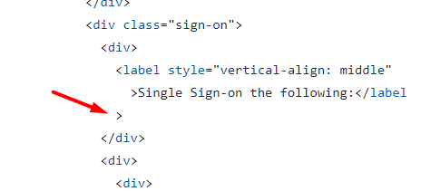
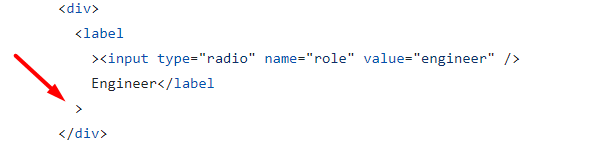

# Review bài tập về nhà buổi 3 - Lớp FullStack K10

## [Phan Tuan Manh](https://phantuanmanh.github.io/f8-fullstack-k10/Day-3/index.html)

- [x] **Bài 1:**

`Điểm: 9.75`

- Giá trị của thuộc tính `type` của thẻ `input` ở ô nhập liệu **email** cần có giá trị là **email**.

- [x] **Bài 2:**

`Điểm: 8.5`

- Nội dung của thẻ `th` không mang ý nghĩa là một tiêu đề của một nhóm ô trong bảng do vậy nên sử dụng thẻ `td` thay vì thẻ `th`.

- Không để thừa khoảng cách

  

- [x] **Bài 3:**

`Điểm: 9.5`

- Nội dung của các thẻ `label`(trừ những thẻ `label` có nội dung bao gồm thẻ `input`) đều mang ý nghĩa là một tiêu đề của một nhóm ô trong bảng do vậy nên dùng thẻ `th` thay vì thẻ `td` để bọc thẻ `label`.

- [x] **Bài 4:**

`Điểm: 7`

- **Get in touch with us by filling contact form below** không mang ý nghĩa là một tiêu đề chính vậy nên không sử dụng thẻ `h1` để bọc mà thay vào đó nên sử dụng thẻ `h2`.

- Nhận xét về việc thừa khoảng cách giống như bài 1.

- Đặt tên `id` chưa hợp lý

  

- Bài làm đang sử dụng thừa một thẻ `div`

  

- [x] **Điểm mạnh:**

- Vẫn duy trì được điểm mạnh của các buổi trước tuy nhiên việc code `html` chuẩn semantic đã tốt hơn rất nhiều.

- [x] **Điểm yếu:**

- Trình bày code chưa thực sự tốt.

- Chưa cẩn thận trong việc kiểm tra yêu cầu bài tập(chưa sử dụng `comment`).

- [x] **Đánh giá chung:** Cần chú ý hơn đến đến cách trình bày, cách đặt tên `id` và yêu cầu của bập trước khi code.

`Điểm tổng kết: 8.2(trừ 0.5 điểm vì chưa đáp ứng đủ yêu cầu bài tập)`

`Note: Anh sửa lại bài làm theo nhận xét rồi sau đó báo lại cho em để em kiểm tra lại nha.`

## [Vu Anh Tuan](https://vatuan2710.github.io/f8-fullstack-k10/Day-3/index)

- [x] **Bài 1:**

`Điểm: 10`

- [x] **Bài 2:**

`Điểm: 10`

- [x] **Bài 3:**

`Điểm: 9.5`

- Không bọc thẻ `th` ra ngoài các thẻ `input` có thuộc tính `type` là `radio` và thẻ `label` nằm ngay dưới vì thẻ `th` chỉ được sử dụng nếu nội dung của thẻ `th` mang ý nghĩa là một tiêu đề của một nhóm ô trong bảng.

- [x] **Bài 4:**

`Điểm: 9.5`

- Chưa thụt lề

  

- [x] **Điểm mạnh:**

- Vẫn duy trì được một số điểm mạnh của các buổi trước.

- [x] **Điểm yếu:**

- Chưa cẩn thận trong việc kiểm tra yêu cầu bài tập(chưa sử dụng `comment`).

Đánh giá chung: Bài làm rất tốt, tuy nhiên cần chú ý kỹ yêu cầu của bập trước khi code.

`Điểm tổng kết: 8.75(trừ 1 điểm vì chưa đáp ứng đủ yêu cầu bài tập)`

`Note: Bạn sửa lại bài làm theo nhận xét rồi sau đó báo lại cho mình để mình kiểm tra lại nha.`

## [Nguyen Thanh An](https://ann573.github.io/f8-fullstack-k10/BTVN/Day3/index.html)

- [x] **Bài 1:**

`Điểm: 9.5`

- Bài làm đang để giá trị của thuộc tính `type` là **email** ở một số trường không phải là trường nhập **email** như trường nhập thành phố và trường nhập zip code.

- [x] **Bài 2:**

`Điểm: 10`

- [x] **Bài 3:**

`Điểm: 9`

- Nội dung của các thẻ `label`(trừ những thẻ `label` có nội dung bao gồm thẻ `input`) đều mang ý nghĩa là một tiêu đề của một nhóm ô trong bảng do vậy nên dùng thẻ `th` thay vì thẻ `td` để bọc thẻ `label`.

- Không để thừa các khoảng trắng

  

- [x] **Bài 4:**

`Điểm: 9.5`

- **Get in touch with us by filling contact form below** không mang ý nghĩa là một tiêu đề chính vậy nên không sử dụng thẻ `h1` để bọc mà thay vào đó nên sử dụng thẻ `h2`.

- [x] **Điểm mạnh:**

- Vẫn duy trì được một số điểm mạnh của các buổi trước tuy nhiên việc code `html` chuẩn semantic đã tốt hơn rất nhiều.

- [x] **Điểm yếu:**

- Chưa cẩn thận trong việc kiểm tra yêu cầu bài tập(chưa sử dụng `comment`).

Đánh giá chung: Bài làm rất tốt, tuy nhiên cần chú ý kỹ yêu cầu của bập trước khi code.

`Điểm tổng kết: 8.5(trừ 1 điểm vì chưa đáp ứng đủ yêu cầu bài tập)`

`Note: Bạn sửa lại bài làm theo nhận xét rồi sau đó báo lại cho mình để mình kiểm tra lại nha.`

## [Nguyen Truong Giang](https://nguyentruonggiang212001.github.io/f8-fullstack-k10/Assignment3/index.html)

- [x] **Bài 1:**

`Điểm: 10`

- [x] **Bài 2:**

`Điểm: 9`

- Bài làm đang sử dụng thừa một thẻ `body` và cần chú ý không để thừa các khoảng cách

  

- [x] **Bài 3:**

`Điểm: 9.5`

- Nội dung của các thẻ `label`(trừ những thẻ `label` có nội dung bao gồm thẻ `input`) đều mang ý nghĩa là một tiêu đề của một nhóm ô trong bảng do vậy nên dùng thẻ `th` thay vì thẻ `td` để bọc thẻ `label`.

- [x] **Bài 4:**

`Điểm: 9.75`

- Cần thuộc tính `name` cho toàn bộ các thẻ `input` để trang web có thể lấy được giá trị của `input` và xử lý ở phía `server-side`.

- [x] **Điểm mạnh:**

- Vẫn duy trì được một số điểm mạnh của các buổi trước tuy nhiên việc code `html` chuẩn semantic đã tốt hơn rất nhiều.

- [x] **Điểm yếu:**

- Chưa cẩn thận trong việc kiểm tra yêu cầu bài tập(chưa sử dụng `comment`).

Đánh giá chung: Bài làm rất tốt, tuy nhiên cần chú ý kỹ yêu cầu của bập trước khi code.

`Điểm tổng kết: 8.6(trừ 1 điểm vì chưa đáp ứng đủ yêu cầu bài tập)`

`Note: Anh sửa lại bài làm theo nhận xét rồi sau đó báo lại cho em để em kiểm tra lại nha.`

## [Vu Quoc Dung](https://dungvuquoc0102.github.io/f8_fullstack_k10_repo/day3/ex1.html)

- [x] **Bài 1:**

`Điểm: 10`

- [x] **Bài 2:**

`Điểm: 10`

- [x] **Bài 3:**

`Điểm: 10`

- [x] **Bài 4:**

`Điểm: 9.5`

- Đặt tên `id` chưa hợp lý

  

- [x] **Điểm mạnh:**

- Vẫn duy trì được điểm mạnh của các buổi trước.

- [x] **Điểm yếu:**

- Chưa cẩn thận trong việc kiểm tra yêu cầu bài tập(chưa sử dụng `comment`).

Đánh giá chung: Bài làm rất tốt, tuy nhiên cần chú ý cách đặt tên `id` và yêu cầu của bài tập trước khi code.

`Điểm tổng kết: 8.875(trừ 1 điểm vì chưa đáp ứng đủ yêu cầu bài tập)`

## [Le Huu Trong](https://kaiosuke.github.io/excercise3/)

- [x] **Bài 1:**

`Điểm: 9.5`

- Đặt tên `class` chưa hợp lý

  

- [x] **Bài 2:**

`Điểm: 9.5`

- Nhận xét về việc đặt tên `class` giống bài 1.

- [x] **Bài 3:**

`Điểm: 9.5`

- Nhận xét về việc đặt tên `class` giống bài 1.

- [x] **Bài 4:**

`Điểm: 9`

- Nhận xét về việc đặt tên `class` giống bài 1, tương tự với cách đặt tên `id`.

- **Get in touch with us by filling contact form below** không mang ý nghĩa là một tiêu đề chính vậy nên không sử dụng thẻ `h1` để bọc mà thay vào đó nên sử dụng thẻ `h2`.

- [x] **Điểm mạnh:**

- Vẫn duy trì được điểm mạnh của các buổi trước.

- [x] **Điểm yếu:**

- Chưa cẩn thận trong việc kiểm tra yêu cầu bài tập(chưa sử dụng `comment`).

- Cách đặt tên `class` chưa hợp lý và chưa được đồng nhất.

Đánh giá chung: Bài làm rất tốt, tuy nhiên cần chú ý cách đặt tên `id`, `class` và yêu cầu của bài tập trước khi code.

`Điểm tổng kết: 8.4(trừ 1 điểm vì chưa đáp ứng đủ yêu cầu bài tập)`

`Note: Anh sửa lại bài làm theo nhận xét rồi sau đó báo lại cho em để em kiểm tra lại nha.`

## [Hoang Thanh Huy](https://huyhtf88188.github.io/f8_fullstack/day2/)

- [x] **Bài 1:**

`Điểm: 10`

- [x] **Bài 2:**

`Điểm: 10`

- [x] **Bài 3:**

`Điểm: 8`

- Toàn bộ bài này là một `form` dùng để đăng nhập vậy nên cần được bọc trong thẻ `form`.

- Các dấu lớn hơn và nhỏ hơn của các thẻ đóng và thẻ mở cần nằm trên cùng một dòng

  

- Nội dung của các thẻ `label`(trừ những thẻ `label` có nội dung bao gồm thẻ `input`) đều mang ý nghĩa là một tiêu đề của một nhóm ô trong bảng do vậy nên dùng thẻ `th` thay vì thẻ `td` để bọc thẻ `label`.

- [x] **Bài 4:**

`Điểm: 9`

- Cần thuộc tính `name` cho toàn bộ các thẻ `input` để trang web có thể lấy được giá trị của `input` và xử lý ở phía `server-side`.

- **Send message** là một nút bấm để `submit form` vậy nên cần được bọc trong thẻ `button`.

- [x] **Điểm mạnh:**

- Vẫn duy trì được điểm mạnh của các buổi trước.

- [x] **Điểm yếu:**

- Chưa cẩn thận trong việc kiểm tra yêu cầu bài tập(chưa sử dụng `comment`).

Đánh giá chung: Bài làm rất tốt, tuy nhiên cần chú ý yêu cầu của bài tập trước khi code.

`Điểm tổng kết: 8.25(trừ 1 điểm vì chưa đáp ứng đủ yêu cầu bài tập)`

`Note: Anh sửa lại bài làm theo nhận xét rồi sau đó báo lại cho em để em kiểm tra lại nha.`

## [Tran Ngoc Duy](https://tranduyriba.github.io/bai-tap-f8/)

- [x] **Bài 1:**

`Điểm: 10`

- [x] **Bài 2:**

`Điểm: 10`

- [x] **Bài 3:**

`Điểm: 8.5`

- Các dấu lớn hơn và nhỏ hơn của các thẻ đóng và thẻ mở cần nằm trên cùng một dòng

  

- Các thẻ `input` như hình bên dưới nên được bọc bởi thẻ `label` thay vì thẻ `div` để khi người dùng **click** vào chữ **Admin** thì thẻ `input` có thuộc tính `type` là **checkbox** hoặc **radio** có thể thay đổi được trạng thái `checked`.

  

- [x] **Bài 4:**

`Điểm: 10`

- [x] **Điểm mạnh:**

- Vẫn duy trì được điểm mạnh của các buổi trước tuy nhiên việc code `html` chuẩn `semantic` đã tốt hơn rất nhiều.

- [x] **Điểm yếu:**

- Chưa cẩn thận trong việc kiểm tra yêu cầu bài tập(chưa sử dụng `comment`).

Đánh giá chung: Bài làm rất tốt, tuy nhiên cần chú ý yêu cầu của bài tập trước khi code.

`Điểm tổng kết: 8.65(trừ 1 điểm vì chưa đáp ứng đủ yêu cầu bài tập)`

`Note: Anh sửa lại bài làm theo nhận xét rồi sau đó báo lại cho em để em kiểm tra lại nha.`

## [Nguyen Trung Hieu](https://hieuvsgithub.github.io/Nop_bai_tap/Day_3/)

- [x] **Bài 1:**

`Điểm: 4`

- Thẻ `br` chỉ được sử dụng để ngắt dòng văn bản không được sử dụng để tạo khoảng cách giữa các thẻ `html`.

- Các dấu lớn hơn và nhỏ hơn của các thẻ đóng và thẻ mở cần nằm trên cùng một dòng

  

- Nếu đặt `id` của một thẻ như cách dưới đây thì một thẻ sẽ có hai `id` trong khi một thẻ chỉ nên có duy nhất một `id`.

  

- Giao diện chưa hiển thị đúng theo yêu cầu, trong bài này có thể sử dụng `table` để chia `layout` hoặc sử dụng `css`.

- [x] **Bài 2:**

`Điểm: 9.5`

- Nội dung của thẻ `th` không mang ý nghĩa là một tiêu đề của một nhóm ô trong bảng do vậy nên sử dụng thẻ `td` thay vì thẻ `th`.

- [x] **Bài 3:**

`Điểm: 6`

- Giao diện chưa hiển thị đúng theo yêu cầu, trong bài này có thể sử dụng `table` để chia `layout` hoặc sử dụng `css`.

- Nhận xét về cách trình bày tương tự như ở bài 1.

- Cần thuộc tính `name` cho toàn bộ các thẻ `input` để trang web có thể lấy được giá trị của `input` và xử lý ở phía `server-side`.

- Giá trị của thuộc tính `type` của thẻ `input` ở ô nhập liệu **password** cần có giá trị là **password**.

- [x] **Bài 4:**

`Điểm: 7`

- Giao diện chưa hiển thị đúng theo yêu cầu.

- **Get in touch with us by filling contact form below** không mang ý nghĩa là một tiêu đề chính vậy nên không sử dụng thẻ `h1` để bọc mà thay vào đó nên sử dụng thẻ `h2`.

- [x] **Điểm yếu:**

- Không duy trì được điểm mạnh của các buổi trước và chưa cải thiện được

- Chưa cẩn thận trong việc kiểm tra yêu cầu bài tập(chưa sử dụng `comment`).

Đánh giá chung: Bài làm chưa tốt, cần cố gắng và dành nhiều thời gian hơn cho bài tập về nhà.

`Điểm tổng kết: 5.63(trừ 1 điểm vì chưa đáp ứng đủ yêu cầu bài tập)`

`Note: Anh sửa lại bài làm theo nhận xét rồi sau đó báo lại cho em để em kiểm tra lại nha, trong quá trình làm bài nếu anh gặp khó khăn gì thì anh liên hệ em để em nha.`

## [Nguyen Hai Duong](https://tenk22.github.io/F8_fullstacks/)

- [x] **Bài 1:**

`Điểm: 10`

- [x] **Bài 2:**

`Điểm: 10`

- [x] **Bài 3:**

`Điểm: 9`

- Các dấu lớn hơn và nhỏ hơn của các thẻ đóng và thẻ mở cần nằm trên cùng một dòng

  

- [x] **Bài 4:**

`Điểm: 9`

- **Get in touch with us by filling contact form below** không mang ý nghĩa là một tiêu đề chính vậy nên không sử dụng thẻ `h1` để bọc mà thay vào đó nên sử dụng thẻ `h2`.

- [x] **Điểm mạnh:**

- Vẫn duy trì được điểm mạnh của các buổi trước tuy nhiên việc code `html` chuẩn `semantic` đã tốt hơn rất nhiều.

- [x] **Điểm yếu:**

- Chưa cẩn thận trong việc kiểm tra yêu cầu bài tập(chưa sử dụng `comment`).

Đánh giá chung: Bài làm rất tốt, tuy nhiên cần chú ý yêu cầu của bài tập trước khi code.

`Điểm tổng kết: 8.5(trừ 1 điểm vì chưa đáp ứng đủ yêu cầu bài tập)`

`Note: Anh sửa lại bài làm theo nhận xét rồi sau đó báo lại cho em để em kiểm tra lại nha.`

## [Nguyen The Han](https://nguyenthehanf8.github.io/F8-Fullstack-Offline/Day-3/)

- [x] **Bài 1:**

`Điểm: 8.5`

- Các dấu lớn hơn và nhỏ hơn của các thẻ đóng và thẻ mở cần nằm trên cùng một dòng

  

- Toàn bộ phần từ sau thẻ `p` đề thuộc một `form` đăng ký vậy nên cần được bọc trong thẻ `form`.

- [x] **Bài 2:**

`Điểm: 10`

- [x] **Bài 3:**

`Điểm: 9.5`

- Toàn bộ bài này là một `form` vậy nên cần được bọc trong thẻ `form`.

- [x] **Bài 4:**

`Điểm: 9`

- **Get in touch with us by filling contact form below** không mang ý nghĩa là một tiêu đề chính vậy nên không sử dụng thẻ `h1` để bọc mà thay vào đó nên sử dụng thẻ `h2`.

- Đặt tên `id` chưa hợp lý

  

- [x] **Điểm mạnh:**

- Vẫn duy trì được điểm mạnh của các buổi trước tuy nhiên việc code `html` chuẩn `semantic` đã tốt hơn rất nhiều.

- [x] **Điểm yếu:**

- Chưa cẩn thận trong việc kiểm tra yêu cầu bài tập(chưa sử dụng `comment`).

Đánh giá chung: Bài làm rất tốt, tuy nhiên cần chú ý yêu cầu của bài tập trước khi code.

`Điểm tổng kết: 9.25(trừ 1 điểm vì chưa đáp ứng đủ yêu cầu bài tập)`

`Note: Bạn sửa lại bài làm theo nhận xét rồi sau đó báo lại cho mình, để mình kiểm tra lại nha.`

## [Nguyen Huy Hoang](https://nguyenhoang2404.github.io/f8-fullstack-k10/BaiTapVeNha3/FormSignUp.html)

- [x] **Bài 1:**

`Điểm: 8.5`

- Không để thừa các khoảng cách

  

- Hầu hết thuộc tính `for` của thẻ `label` đều không có giá trị chính xác với `id` của thẻ `input` tương ứng.

- Cần thuộc tính `name` cho toàn bộ các thẻ `input` để trang web có thể lấy được giá trị của `input` và xử lý ở phía `server-side`.

- [x] **Bài 2:**

`Điểm: 9.5`

- Nội dung của thẻ `th` không mang ý nghĩa là một tiêu đề của một nhóm ô trong bảng do vậy nên sử dụng thẻ `td` thay vì thẻ `th`.

- [x] **Bài 3:**

`Điểm: 6.5`

- Hầu hết thuộc tính `for` của thẻ `label` đều không có giá trị chính xác với `id` của thẻ `input` tương ứng.

- Cần thuộc tính `name` cho toàn bộ các thẻ `input` để trang web có thể lấy được giá trị của `input` và xử lý ở phía `server-side`.

- Nhận xét về việc thừa các khoảng cách tương tự ở bài 1.

- Các thẻ `input` như hình bên dưới nên được bọc bởi thẻ `label` thay vì thẻ `div` để khi người dùng **click** vào chữ **Admin** thì thẻ `input` có thuộc tính `type` là **checkbox** hoặc **radio** có thể thay đổi được trạng thái `checked`.

  

- Thuộc tính `type` của nhóm thẻ `input` nằm sau thẻ `label` có nội dung là **Sign Sign-on to the following** cần có `type` là `checkbox`.

- Các thẻ `input` có giá trị của thuộc tính `type` là `checkbox` hoặc `radio` cần có thuộc tính `name` để nhóm các thẻ `input` này lại với nhau.

- [x] **Bài 4:**

`Điểm: 7.5`

- Thụt lề chưa hợp lý

  

- Cần thuộc tính `name` cho toàn bộ các thẻ `input` để trang web có thể lấy được giá trị của `input` và xử lý ở phía `server-side`.

- Bài làm đang thiếu một nút bấm `Send message` và phần lưu ý `*Please fill all require form field, thanks!`

- [x] **Điểm mạnh:**

- Vẫn duy trì được điểm mạnh của các buổi trước.

- [x] **Điểm yếu:**

- Chưa cẩn thận trong việc kiểm tra yêu cầu bài tập(chưa sử dụng `comment`).

- Chưa khắc phục được điểm yếu của các buổi trước đó.

Đánh giá chung: Bài làm tốt, tuy nhiên cần chú ý yêu cầu của bài tập trước khi code và nên đặt thẻ style nằm trong thẻ head.

`Điểm tổng kết: 7(trừ 1 điểm vì chưa đáp ứng đủ yêu cầu bài tập)`

`Note: Bạn sửa lại bài làm theo nhận xét rồi sau đó báo lại cho mình, để mình kiểm tra lại nha.`
