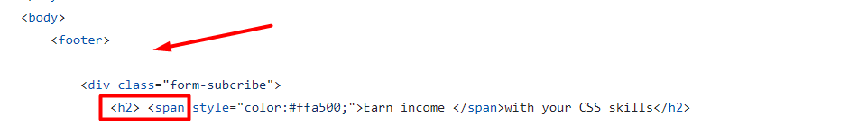
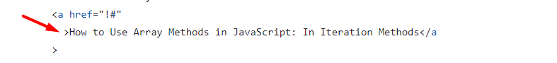
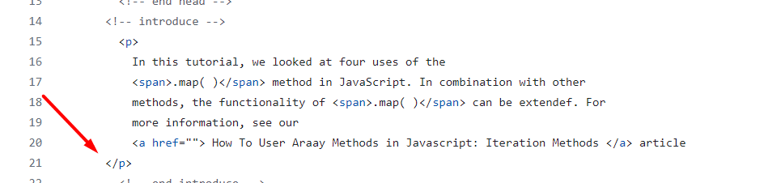
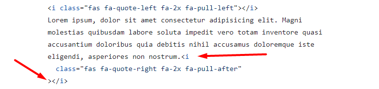

# Review bài tập về nhà buổi 4 - Lớp FullStack K10

## [Phan Tuan Manh](https://phantuanmanh.github.io/f8-fullstack-k10/)

- [x] **Bài 1:**

`Điểm: 9.5`

- **Form Subscribe** là 1 thành phần rất quan trọng trên website. **Form** này thường được đặt ở **Footer** của một trang (chân trang, nằm tại vị trí cuối cùng của website) do vậy nên bọc toàn bộ phần này trong thẻ `footer`.

- [x] **Bài 2:**

`Điểm: 9.5`

- Bài tập này thể hiện một đoạn trích dẫn vậy nên nội dung được trích dẫn cần được bọc trong thẻ `blockquote`.

- [x] **Bài 3:**

`Điểm: 10`

- [x] **Bài 4:**

`Điểm: 10`

- [x] **Điểm mạnh:**

- Duy trì được điểm mạnh và cải thiện được điểm yếu của các buổi trước đó.

- Trình bày code rất tốt(rõ ràng, dễ đọc, thụt lề đúng cách, không bị thừa các khoảng trắng).

- Sử dụng tốt `comment`.

- Hiểu và áp dụng tốt `CSS Selector`, `Pseudo-classes`, `Pseudo-elements`.

- Đặt tên `class` rõ ràng, dễ hiểu, phù hợp với mục đích sử dụng của các thẻ.

- [x] **Đánh giá chung:** Bài làm rất tốt.

`Điểm tổng kết: 9.75`

`Note: Anh sửa lại bài làm theo nhận xét rồi sau đó báo lại cho em để em kiểm tra lại nha.`

## [Nguyen Huy Hoang](https://nguyenhoang2404.github.io/f8-fullstack-k10/BaiTapVeNha4/)

- [x] **Bài 1:**

`Điểm: 5.5`

- Chưa thực hiện yêu cầu của bài tập khi `hover` vào khung màu xanh.

- Màu chữ chưa giống với giao diện yêu cầu của bài tập.

- Không để thừa các khoảng cách

  

- Cần thêm thuộc tính `name` cho thẻ `input` có thuộc tính `type="email"` để trang web có thể lấy được giá trị của `input` và xử lý ở phía `server-side`.

- Thẻ `style` dưới thẻ `head` và trên thẻ `body` là không đúng về mặt ngữ nghĩa và cũng không tuân thủ chuẩn `HTML`. Thẻ `style` được sử dụng để nhúng `CSS` vào trong trang `HTML` và nó chỉ nên được đặt trong phần `head` của tài liệu `HTML`.

- [x] **Bài 2:**

`Điểm: 5.5`

- Bài tập này thể hiện một đoạn trích dẫn vậy nên nội dung được trích dẫn cần được bọc trong thẻ `blockquote`.

- Giao diện chưa giống với yêu cầu của bài tập.

- Nhật xét vể vị trí đặt thẻ `style` tương tự như bài 1.

- [x] **Bài 3:**

`Điểm: 9`

- Không nên set cả `width` và `height` cho ảnh, nên chỉ set một trong hai thuộc tính đó. Vì khi sử dụng cả 2 thuộc tính, nếu kích thước của ảnh thay đổi, thì sẽ phải thay đổi cả 2 thuộc tính `width` và `height`, điều này sẽ làm cho code không tối ưu. Hoặc sẽ làm cho tỷ lệ ảnh bị méo.

- [x] **Bài 4:**

`Điểm: 7`

- **JS Maps Conclusion** không mang ý nghĩa là một tiêu đề chính vậy nên không sử dụng thẻ `h1` để bọc mà thay vào đó nên sử dụng thẻ `h2`.

- Nhận xét về việc thừa các khoảng trắng tương tự như bài 1.

- Nhật xét vể vị trí đặt thẻ `style` tương tự như bài 1.

- [x] **Điểm mạnh:**

- Vẫn duy trì được điểm mạnh của các buổi trước.

- [x] **Điểm yếu:**

- Chưa khắc phục được điểm yếu của các buổi trước đó.

- [x] **Đánh giá chung:** Cần chú ý đến yêu cầu và giao diện của bài tập trước khi code và nên đặt thẻ `style` nằm trong thẻ `head`.

`Điểm tổng kết: 6.75`

`Note: Anh sửa lại bài làm theo nhận xét rồi sau đó báo lại cho em để em kiểm tra lại nha.`

## [Vu Anh Tuan](https://vatuan2710.github.io/f8-fullstack-k10/Day-4/index)

- [x] **Bài 1:**

`Điểm: 10`

- [x] **Bài 2:**

`Điểm: 8.5`

- Bài tập này thể hiện một đoạn trích dẫn vậy nên nội dung được trích dẫn cần được bọc trong thẻ `blockquote`.

- Nội dung trích dẫn ở giao diện mẫu được in nghiêng trong khi bài làm thì không.

- [x] **Bài 3:**

`Điểm: 10`

- [x] **Bài 4:**

`Điểm: 10`

- [x] **Điểm mạnh:**

- Duy trì được điểm mạnh và cải thiện được điểm yếu của các buổi trước đó.

- Sử dụng tốt `comment`.

- Hiểu và áp dụng tốt `CSS Selector`, `Pseudo-classes`, `Pseudo-elements`.

- Đặt tên `class` rõ ràng, dễ hiểu, phù hợp với mục đích sử dụng của các thẻ.

- [x] **Điểm yếu:**

- Chưa cẩn thận trong việc kiểm tra kỹ giao diện mẫu trước khi code.

- [x] **Đánh giá chung:** Bài làm rất tốt.

`Điểm tổng kết: 9.625`

## [Nguyen Thanh An](https://ann573.github.io/f8-fullstack-k10/BTVN/Day4/index.html)

- [x] **Bài 1:**

`Điểm: 10`

- [x] **Bài 2:**

`Điểm: 10`

- [x] **Bài 3:**

`Điểm: 10`

- [x] **Bài 4:**

`Điểm: 10`

- [x] **Điểm mạnh:**

- Duy trì được điểm mạnh và cải thiện được điểm yếu của các buổi trước đó.

- Sử dụng tốt `comment`.

- Hiểu và áp dụng tốt `CSS Selector`, `Pseudo-classes`, `Pseudo-elements`.

- Đặt tên `class` rõ ràng, dễ hiểu, phù hợp với mục đích sử dụng của các thẻ.

- [x] **Đánh giá chung:** Bài làm rất tốt.

`Điểm tổng kết: 10`

## [Nguyen Hai Duong](https://tenk22.github.io/F8_fullstacks/)

- [x] **Bài 1:**

`Điểm: 8.5`

- **Earn income with your CSS skills** không mang ý nghĩa là một tiêu đề chính vậy nên không sử dụng thẻ `h1` để bọc mà thay vào đó nên sử dụng thẻ `h2`.

- Tại giao diện mẫu hai chữ **Earn income** màu vàng còn trong bài làm đang để các chữ **with your CSS skills** màu vàng.

- Cần thêm thuộc tính `name` cho thẻ `input` có thuộc tính `type="email"` để trang web có thể lấy được giá trị của `input` và xử lý ở phía `server-side`.

- [x] **Bài 2:**

`Điểm: 9.5`

- Bài tập này thể hiện một đoạn trích dẫn vậy nên nội dung được trích dẫn cần được bọc trong thẻ `blockquote`.

- [x] **Bài 3:**

`Điểm: 10`

- [x] **Bài 4:**

`Điểm: 8.5`

- **How To Use Array Methods in JavaScript: Iteration Methods** và **Learn more here →** trong giao diện mẫu đều có dấu gạch chân trong khi bài làm cần phải `hover` vào thì mới có.

- **.map()** rong giao diện mẫu có phần `background` màu xanh nhạt trong khi bài làm không có, có thể `css` cho thẻ `code` để đổi màu `background`.

- [x] **Điểm mạnh:**

- Vẫn duy trì được điểm mạnh của các buổi trước.

- Hiểu và áp dụng tốt `CSS Selector`, `Pseudo-classes`, `Pseudo-elements`.

- [x] **Điểm yếu:**

- Chưa khắc phục được điểm yếu của các buổi trước đó.

- Chưa cẩn thận trong việc kiểm tra kỹ giao diện mẫu trước khi code.

- [x] **Đánh giá chung:** Bài làm tốt.

`Điểm tổng kết: 9.125`

`Note: Anh sửa lại bài làm theo nhận xét rồi sau đó báo lại cho em để em kiểm tra lại nha.`

## [Vu Quoc Dung](https://dungvuquoc0102.github.io/f8_fullstack_k10_repo/)

- [x] **Bài 1:**

`Điểm: 10`

- [x] **Bài 2:**

`Điểm: 10`

- [x] **Bài 3:**

`Điểm: 10`

- [x] **Bài 4:**

`Điểm: 10`

- [x] **Điểm mạnh:**

- Duy trì được điểm mạnh của các buổi trước đó.

- Hiểu và áp dụng tốt `CSS Selector`, `Pseudo-classes`, `Pseudo-elements`.

- Đặt tên `class` rõ ràng, dễ hiểu, phù hợp với mục đích sử dụng của các thẻ.

- [x] **Điểm yếu:**

- Chưa khắc phục được điểm yếu của buổi trước đó.

- [x] **Đánh giá chung:** Bài làm rất tốt.

`Điểm tổng kết: 10`

## [Le Huu Trong](https://kaiosuke.github.io/Excercise-4/)

- [x] **Bài 1:**

`Điểm: 8`

- Theo đề bài khi `hover` vào khung màu xanh thì sẽ có các hành động theo yêu cầu, tuy nhiên trong bài làm các hành động cần thực hiện theo yêu cầu đề bài chỉ được thực hiện khi `hover` vào các thẻ `input` và `button`.

- [x] **Bài 2:**

`Điểm: 10`

- [x] **Bài 3:**

`Điểm: 10`

- [x] **Bài 4:**

`Điểm: 8`

- **JS Maps Conclusion** không mang ý nghĩa là một tiêu đề chính vậy nên không sử dụng thẻ `h1` để bọc mà thay vào đó nên sử dụng thẻ `h2`.

- Các dấu lớn hơn và nhỏ hơn của các thẻ đóng và thẻ mở cần nằm trên cùng một dòng

  

- [x] **Điểm mạnh:**

- Vẫn duy trì được điểm mạnh của các buổi trước.

- Hiểu và áp dụng tốt `CSS Selector`, `Pseudo-classes`, `Pseudo-elements`.

- Sử dụng tốt `comment`.

- [x] **Điểm yếu:**

- Chưa cẩn thận trong việc kiểm tra yêu cầu bài tập

- [x] **Đánh giá chung:** Bài làm tốt, tuy nhiên không nên đặt toàn bộ `css` của các bài trong một file vì có thể sẽ dẫn đến tình trạng xung đột `selector` trong `CSS` và việc sử dụng `camelCase`(**formSubscribe**) trong tên `class` là không phổ biến. Thay vào đó, anh có thể dùng dấu gạch ngang `-` để phân tách các từ như `container--form-subscribe`.

`Điểm tổng kết: 9`

`Note: Anh sửa lại bài làm theo nhận xét rồi sau đó báo lại cho em để em kiểm tra lại nha.`

## [Hoang Thanh Huy](https://huyhtf88188.github.io/f8_fullstack/day2/)

- [x] **Bài 1:**

`Điểm: 9`

- Khi `hover` vào khung màu xanh chữ **Earn income** được đổi màu trong khi đề bài không yêu cầu.

- **Earn income with your CSS skills** mang ý nghĩa là tiêu đề của **Form Subscribe** và nên được bọc bởi thẻ `h2`.

- [x] **Bài 2:**

`Điểm: 9`

- Việc sử dụng thẻ `a` để bọc dấu ngoặc kép của một trích dẫn trong đoạn mã không đúng về mặt ngữ nghĩa (semantic HTML). Thẻ `a` được dùng để tạo liên kết đến các tài nguyên khác, nhưng trong trường hợp này, dấu ngoặc kép không phải là một liên kết.

- [x] **Bài 3:**

`Điểm: 10`

- [x] **Bài 4:**

`Điểm: 9`

- Thụt lề chưa hợp lý

  

- [x] **Điểm mạnh:**

- Vẫn duy trì được một vài điểm mạnh của các buổi trước.

- Hiểu và áp dụng tốt `CSS Selector`, `Pseudo-classes`, `Pseudo-elements`.

- Sử dụng tốt `comment`.

- [x] **Điểm yếu:**

- Không duy trì được điểm mạnh của các buổi trước.

- Chưa thực sự hiểu về `semantic` trong `html`.

- Chưa cẩn thận trong việc kiểm tra yêu cầu bài tập.

- Đặt tên `class` chưa hợp lý, tên các class cần rõ ràng và nhất quán hơn để dễ bảo trì và hiểu mã nguồn. Chẳng hạn, trong bài 1 `subscribe_all` có thể đổi thành `subscription-container`, `send_me` thành `submit-button`, và `send` thành `button-text`.

- [x] **Đánh giá chung:** Bài làm tốt, tuy nhiên cần chú ý hơn đến cách đặt tên `class` và việc đặt tất cả các file `HTML` và `CSS` của các bài tập ngang cấp với nhau trong cùng một thư mục và đặt tên file kết hợp giữa tiếng Anh và tiếng Việt làm giảm tính cấu trúc và dễ dàng quản lý của dự án. Điều này có thể dẫn đến khó khăn trong việc tìm kiếm và duy trì mã nguồn. Nên tạo thư mục riêng cho mỗi bài tập để phân tách các file `HTML` và `CSS`, sử dụng tiếng Anh hoặc tiếng Việt một cách nhất quán cho tên file và tránh sự kết hợp ngôn ngữ(nên sử dụng tiếng Anh).

`Điểm tổng kết: 9.25`

`Note: Anh sửa lại bài làm theo nhận xét rồi sau đó báo lại cho em để em kiểm tra lại nha.`

## [Nguyen Truong Giang](https://nguyentruonggiang212001.github.io/f8-fullstack-k10/Assginnmet4/)

- [x] **Bài 1:**

`Điểm: 7.5`

- Đặt tên `class` là **banner** cho một **form subscribe** không phù hợp với mục đích và nội dung của phần tử đó. Tên **banner** thường được sử dụng để chỉ các phần tử quảng cáo hoặc thông báo lớn trên trang web. Điều này có thể gây nhầm lẫn và làm giảm tính rõ ràng và dễ hiểu của mã nguồn. Nên sử dụng các tên `class` như **subscribe-form** hoặc **footer-subscribe** để phản ánh chính xác chức năng của **form subscribe** trong `footer`.

- Theo đề bài khi `hover` vào khung màu xanh thì sẽ có các hành động theo yêu cầu, tuy nhiên trong bài làm khi `hover` vào khung màu xanh màu nền của button chưa chuyển sang màu vàng(Giống như chữ **Earn income**) và chữ của button chưa chuyển sang màu trắng(`#fff`) mà chỉ khi `hover` vào thẻ `button` mới có.

- [x] **Bài 2:**

`Điểm: 9`

- Thẻ `style` dưới thẻ `head` và trên thẻ `body` là không đúng về mặt ngữ nghĩa và cũng không tuân thủ chuẩn `HTML`. Thẻ `style` được sử dụng để nhúng `CSS` vào trong trang `HTML` và nó chỉ nên được đặt trong phần `head` của tài liệu `HTML`.

- [x] **Bài 3:**

`Điểm: 9`

- Nhật xét vể vị trí đặt thẻ `style` tương tự như bài 2.

- [x] **Bài 4:**

`Điểm: 9`

- Nhật xét vể vị trí đặt thẻ `style` tương tự như bài 2.

- [x] **Điểm mạnh:**

- Vẫn duy trì được điểm mạnh của các buổi trước.

- Hiểu và áp dụng tốt `CSS Selector`, `Pseudo-classes`, `Pseudo-elements`.

- Sử dụng tốt `comment`.

- [x] **Điểm yếu:**

- Chưa cẩn thận trong việc kiểm tra yêu cầu bài tập.

- Đặt tên `class` chưa hợp lý.

- [x] **Đánh giá chung:** Bài làm tốt, tuy nhiên cần chú ý cách đặt tên `class`, vị trí đặt thẻ `style` và yêu cầu của bài tập.

`Điểm tổng kết: 8.625`

`Note: Anh sửa lại bài làm theo nhận xét rồi sau đó báo lại cho em để em kiểm tra lại nha.`

## [Nguyen Trung Hieu](https://hieuvsgithub.github.io/Nop_bai_tap/Day_4/)

- [x] **Bài 1:**

`Điểm: 7`

- Theo đề bài khi `hover` vào khung màu xanh thì sẽ có các hành động theo yêu cầu, tuy nhiên trong bài làm các hành động cần thực hiện theo yêu cầu đề bài chỉ được thực hiện khi `hover` vào các thẻ `input` và `button`.

- Giao diện chưa đúng với yêu cầu.

- **Earn income with your CSS skills** không mang ý nghĩa là một tiêu đề chính vậy nên không sử dụng thẻ `h1` để bọc mà thay vào đó nên sử dụng thẻ `h2`.

- Các thẻ `input` và `button` thuộc trong nhóm thẻ `form` và đây cũng là một **form subscribe** vậy nên cần được bọc trong thẻ `form`.

- [x] **Bài 2:**

`Điểm: 7`

- Các dấu lớn hơn và nhỏ hơn của các thẻ đóng và thẻ mở cần nằm trên cùng một dòng

  

- Giao diện chưa đúng với yêu cầu.

- [x] **Bài 3:**

`Điểm: 10`

- [x] **Bài 4:**

`Điểm: 6`

- Giao diện chưa đúng với yêu cầu.

- Nhận xét về cách trình bày giống với bài 2.

- **JS Maps Conclusion** không mang ý nghĩa là một tiêu đề chính vậy nên không sử dụng thẻ `h1` để bọc mà thay vào đó nên sử dụng thẻ `h2`.

- [x] **Điểm yếu:**

- Không duy trì được điểm mạnh và chưa cải thiện được điểm yếu của các buổi trước đó.

- Chưa cẩn thận trong việc kiểm tra yêu cầu bài tập.

- [x] **Đánh giá chung:** Cần cố gắng và dành nhiều thời gian hơn cho bài tập về nhà, chủ động đặt câu hỏi cho trợ giảng để có thể giải quyết bài tập một cách tốt nhất.

`Điểm tổng kết: 7.5`

`Note: Bạn sửa lại bài làm theo nhận xét rồi sau đó báo lại cho mình để mình kiểm tra lại nha.`

## [Nguyen The Han](https://nguyenthehanf8.github.io/F8-Fullstack-Ofline/Day-4/)

- [x] **Bài 1:**

`Điểm: 9.5`

- **Form Subscribe** là 1 thành phần rất quan trọng trên website. **Form** này thường được đặt ở **Footer** của một trang (chân trang, nằm tại vị trí cuối cùng của website) do vậy nên bọc toàn bộ phần này trong thẻ `footer`.

- [x] **Bài 2:**

`Điểm: 10`

- [x] **Bài 3:**

`Điểm: 10`

- [x] **Bài 4:**

`Điểm: 10`

- [x] **Điểm mạnh:**

- Vẫn duy trì được điểm mạnh của các buổi trước.

- Hiểu và áp dụng tốt `CSS Selector`, `Pseudo-classes`, `Pseudo-elements`.

- [x] **Điểm yếu:**

- Chưa cải thiện được điểm yếu của buổi trước đó.

Đánh giá chung: Bài làm rất tốt.

`Điểm tổng kết: 7.875(trừ 2 điểm vì nộp bài tập muộn)`

`Note: Bạn sửa lại bài làm theo nhận xét rồi sau đó báo lại cho mình, để mình kiểm tra lại nha.`
