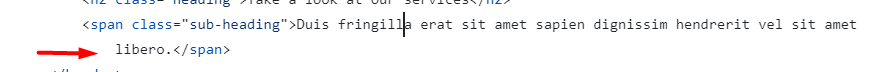
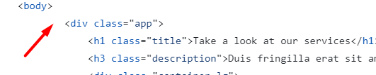
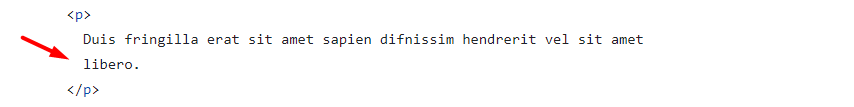
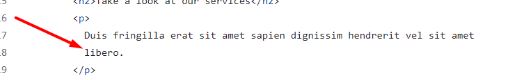
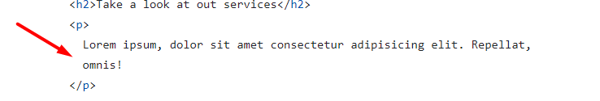
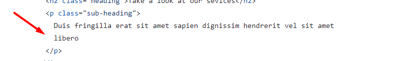

# Review bài tập về nhà buổi 5 - Lớp FullStack K10

## [Phan Tuan Manh](https://phantuanmanh.github.io/f8-fullstack-k10/)

- [x] **Bài 1:**

`Điểm: 10`

- [x] **Bài 2:**

`Điểm: 7`

- Đề bài yêu cầu sử dụng thuộc tính `checked` của thẻ `input` để hoàn thành bài tập trong khi bài làm đang sử dụng `JavaScript`.

- [x] **Bài 3:**

`Điểm: 8`

- **Duis fringilla erat sit amet sapien dignissim hendrerit vel sit amet libero.** là một đoạn văn bản vậy nên cần dùng thẻ `p` để bọc thay vì thẻ `span`

- Ngắt dòng văn bản chưa hợp lý

  

- **Photography**, **Web Designing** và **Videography** nên sử dụng thẻ `h3` thay vì thẻ `h2`.

- [x] **Điểm mạnh:**

- Duy trì được điểm mạnh của các buổi trước đó.

- Sử dụng tốt các thuộc tính định dạng văn bản.

- Chủ động tìm hiểu và sử dụng được responsive.

- [x] **Điểm yếu:**

- Không duy trì được một số điểm mạnh của các buổi trước(trình bày code, sử dụng các thẻ chuẩn semantic,...).

- Chưa cẩn thận trong việc kiểm tra yêu cầu bài tập.

- [x] **Đánh giá chung:** Bài làm tốt.

`Điểm tổng kết: 8.33`

`Note: Anh sửa lại bài làm theo nhận xét rồi sau đó báo lại cho em để em kiểm tra lại nha.`

## [Vu Anh Tuan](https://vatuan2710.github.io/f8-fullstack-k10/Day-5/index)

- [x] **Bài 1:**

`Điểm: 8`

- Bài làm đang thực hiện `css` cho thẻ `h1` trong khi không sử dụng thẻ `h1`.

- `Font` chữ trong bài làm là `font` chữ có chân trong khi `font` chữ trong giao diện mẫu là `font` chữ không chân.

- [x] **Bài 2:**

`Điểm: 10`

- [x] **Bài 3:**

`Điểm: 10`

- [x] **Điểm mạnh:**

- Duy trì được điểm mạnh các buổi trước đó.

- Sử dụng tốt các thuộc tính định dạng văn bản.

- [x] **Điểm yếu:**

- Chưa cẩn thận trong việc `selector` và kiểm tra `font` chữ của giao diện mẫu.

- [x] **Đánh giá chung:** Bài làm rất tốt.

`Điểm tổng kết: 9.33`

`Note: Bạn sửa lại bài làm theo nhận xét rồi sau đó báo lại cho mình để mình kiểm tra lại nha.`

## [Nguyen Thanh An](https://ann573.github.io/f8-fullstack-k10/BTVN/Day5/)

- [x] **Bài 1:**

`Điểm: 10`

- [x] **Bài 2:**

`Điểm: 9`

- Khi nội dung của một đoạn văn bản được bọc trong thẻ `p` quá dài thì nên ngắt dòng một cách hợp lý để code nhìn gọn gàng và dễ đọc hơn.

- Khi người dùng `click` vào bất kỳ một vị trí nào ở phần khung hiển thị tiêu đều(tiêu đề hoặc phần `background` màu cam) thì đều phải hiển thị nội dung tương ứng để tăng trải nghiệm người dùng thay vì việc người dùng phải `click` chính xác vào tiêu đề. Điều này xảy ra là do thẻ `label` là thẻ `inline` vậy nên chiều rộng sẽ phụ thuộc vào nội dung bên trong thẻ nên khi người dùng `click` vào các phần không phải thẻ `label` thì nội dung sẽ không được hiển thị.

  - Đề xuất sửa:

    ```css
    label {
      cursor: pointer;
      margin-left: 0.2rem;
      display: block;
    }
    ```

- [x] **Bài 3:**

`Điểm: 10`

- [x] **Điểm mạnh:**

- Duy trì được điểm mạnh các buổi trước đó.

- Sử dụng tốt các thuộc tính định dạng văn bản.

- [x] **Đánh giá chung:** Bài làm rất tốt, tuy nhiên cần chú ý hơn đến trải nghiệm người dùng.

`Điểm tổng kết: 9.67`

`Note: Bạn sửa lại bài làm theo nhận xét rồi sau đó báo lại cho mình để mình kiểm tra lại nha.`

## [Nguyen Huy Hoang](https://nguyenhoang2404.github.io/f8-fullstack-k10/BaiTapVeNha5/)

- [x] **Bài 1:**

`Điểm: 7`

- Thẻ `style` dưới thẻ `head` và trên thẻ `body` là không đúng về mặt ngữ nghĩa và cũng không tuân thủ chuẩn `HTML`. Thẻ `style` được sử dụng để nhúng `CSS` vào trong trang `HTML` và nó chỉ nên được đặt trong phần `head` của tài liệu `HTML`.

- Giao diện chưa giống với giao diện mẫu khi phần `Blurred Background` đang được căn giữa khung ảnh trong khi giao diện mẫu thì không và đè lên toàn bộ chữ `React`.

  - Đề xuất sửa:

    ```css
    .blur-background {
      ...
      top: 38%;
      left: 56%;
      width: 436px;
      ...
    }
    ```

- Khi trình bày code `css` thì nên cách ra một khoảng giữa `selector` và dấu `{`

- [x] **Bài 2:**

`Điểm: 9`

- Khi người dùng `click` vào bất kỳ một vị trí nào ở phần khung hiển thị tiêu đều(tiêu đề hoặc phần `background` màu cam) thì đều phải hiển thị nội dung tương ứng để tăng trải nghiệm người dùng thay vì việc người dùng phải `click` chính xác vào tiêu đề. Điều này xảy ra là do thẻ `label` là thẻ `inline` vậy nên chiều rộng sẽ phụ thuộc vào nội dung bên trong thẻ nên khi người dùng `click` vào các phần không phải thẻ `label` thì nội dung sẽ không được hiển thị.

- Nhận xét về việc trình bày code `css` tương tự như bài 1.

- [x] **Bài 3:**

`Điểm: 7`

- Nhận xét về việc trình bày code `css` tương tự như bài 1.

- Không để thừa các khoảng cách

  

- **Take a look at our services** không mang ý nghĩa là một tiêu đề chính vậy nên không sử dụng thẻ `h1` để bọc mà thay vào đó nên sử dụng thẻ `h2`.

- **Duis fringilla erat sit amet sapien dignissim hendrerit vel sit amet libero.** là không mang ý nghĩa là một tiêu đề mà là một đoạn văn bản vậy nên cần được bọc trong thẻ `p` thay vì thẻ `h3`.

- [x] **Điểm mạnh:**

- Vẫn duy trì được điểm mạnh của các buổi trước.

- Hiểu và áp dụng tốt `CSS Selector`, `Pseudo-classes`, `Pseudo-elements`.

- Sử dụng tốt các thuộc tính định dạng văn bản.

- [x] **Điểm yếu:**

- Chưa khắc phục được điểm yếu của các buổi trước đó.

- [x] **Đánh giá chung:** Cần chú ý đến yêu cầu và giao diện của bài tập trước khi code, cách trình bày, trải nghiệm người dùng và nên đặt thẻ `style` nằm trong thẻ `head`.

`Điểm tổng kết: 7.67`

`Note: Anh sửa lại bài làm theo nhận xét rồi sau đó báo lại cho em để em kiểm tra lại nha.`

## [Le Huu Trong](https://kaiosuke.github.io/Excercise-5/)

- [x] **Bài 1:**

`Điểm: 9`

- `Font` chữ trong bài làm là `font` chữ có chân trong khi `font` chữ trong giao diện mẫu là `font` chữ không chân.

- [x] **Bài 2:**

`Điểm: 8`

- Nhận xét về `font` chữ giống với bài 1.

- Khi người dùng `click` vào bất kỳ một vị trí nào ở phần khung hiển thị tiêu đều(tiêu đề hoặc phần `background` màu cam) thì đều phải hiển thị nội dung tương ứng để tăng trải nghiệm người dùng thay vì việc người dùng phải `click` chính xác vào tiêu đề. Điều này xảy ra là do thẻ `label` là thẻ `inline` vậy nên chiều rộng sẽ phụ thuộc vào nội dung bên trong thẻ nên khi người dùng `click` vào các phần không phải thẻ `label` thì nội dung sẽ không được hiển thị.

- [x] **Bài 3:**

`Điểm: 9`

- Nhận xét về `font` chữ giống với bài 1.

- [x] **Điểm mạnh:**

- Duy trì được điểm mạnh của các buổi trước đó.

- Sử dụng tốt các thuộc tính định dạng văn bản.

- [x] **Đánh giá chung:** Bài làm tốt, tuy nhiên cần chú ý hơn đến trải nghiệm người dùng.

`Điểm tổng kết: 8.67`

`Note: Anh sửa lại bài làm theo nhận xét rồi sau đó báo lại cho em để em kiểm tra lại nha.`

## [Nguyen Hai Duong](https://github.com/tenk22/F8_fullstacks/blob/main/btvnb5/b1/b1.html)

- [x] **Bài 1:**

`Điểm: 8`

- `blurred-background` nên giảm giá trị của thuộc tính `backdrop-filter` xuống còn `2px` để chữ `React` có thể hiển thị rõ hơn giống như trong giao diện mẫu.

- **Blurred Background** không mang ý nghĩa là một tiêu đề chính vậy nên không sử dụng thẻ `h1` để bọc mà thay vào đó nên sử dụng thẻ `h2`.

- **F8 Fullstack** là một liên kết vậy nên cần được bọc bởi thẻ `a`.

- [x] **Bài 2:**

`Điểm: 10`

- [x] **Bài 3:**

`Điểm: 8`

- **Take a look at our services** không mang ý nghĩa là một tiêu đề chính vậy nên không sử dụng thẻ `h1` để bọc mà thay vào đó nên sử dụng thẻ `h2`.

- **Photography**, **Web Designing** và **Videography** nên sử dụng thẻ `h3` thay vì thẻ `h2`.

- `font-size` của các thẻ `p` và `button` trong bài làm đang to hơn so với giao diện mẫu trong khi `font-size` của các thẻ `i` thì lại bé hơn.

- [x] **Điểm mạnh:**

- Vẫn duy trì được điểm mạnh của các buổi trước.

- Sử dụng tốt các thuộc tính định dạng văn bản.

- Chủ động tìm hiểu và sử dụng tốt một số thuộc tính chưa được học.

- [x] **Điểm yếu:**

- Chưa khắc phục được điểm yếu của các buổi trước đó.

- [x] **Đánh giá chung:** Bài làm tốt.

`Điểm tổng kết: 8.67`

`Note: Anh sửa lại bài làm theo nhận xét rồi sau đó báo lại cho em để em kiểm tra lại nha.`

## [Vu Quoc Dung](https://dungvuquoc0102.github.io/f8_fullstack_k10_repo/)

- [x] **Bài 1:**

`Điểm: 10`

- [x] **Bài 2:**

`Điểm: 10`

- [x] **Bài 3:**

`Điểm: 10`

- [x] **Điểm mạnh:**

- Vẫn duy trì được điểm mạnh của các buổi trước.

- Sử dụng tốt các thuộc tính định dạng văn bản.

- Chủ động tìm hiểu và sử dụng tốt một số thuộc tính chưa được học.

- [x] **Đánh giá chung:** Bài làm rất tốt.

`Điểm tổng kết: 10`

## [Nguyen Truong Giang](https://nguyentruonggiang212001.github.io/f8-fullstack-k10/Assginment5/)

- [x] **Bài 1:**

`Điểm: 9.5`

- **F8 Fullstack** là một liên kết vậy nên cần được bọc bởi thẻ `a`.

- [x] **Bài 2:**

`Điểm: 8.5`

- `Font` chữ trong bài làm là `font` chữ có chân trong khi `font` chữ trong giao diện mẫu là `font` chữ không chân.

- Câu trả lời của mỗi câu hỏi là một đoạn văn bản vậy nên cần được bọc bởi thẻ `p`.

- [x] **Bài 3:**

`Điểm: 9`

- Ngắt dòng văn bản chưa hợp lý

  

- [x] **Điểm mạnh:**

- Vẫn duy trì được điểm mạnh của các buổi trước.

- Sử dụng tốt các thuộc tính định dạng văn bản.

- Chủ động tìm hiểu và sử dụng tốt một số thuộc tính chưa được học.

- [x] **Đánh giá chung:** Bài làm tốt,.

`Điểm tổng kết: 9`

`Note: Anh sửa lại bài làm theo nhận xét rồi sau đó báo lại cho em để em kiểm tra lại nha.`

## [Hoang Thanh Huy](https://huyhtf88188.github.io/f8_fullstack/day2/)

- [x] **Bài 1:**

`Điểm: 10`

- [x] **Bài 2:**

`Điểm: 8`

- Các dấu lớn hơn và nhỏ hơn của các thẻ đóng và thẻ mở cần nằm trên cùng một dòng

  

- `Font` chữ trong bài làm là `font` chữ có chân trong khi `font` chữ trong giao diện mẫu là `font` chữ không chân.

- Khi người dùng `click` vào bất kỳ một vị trí nào ở phần khung hiển thị tiêu đều(tiêu đề hoặc phần `background` màu cam) thì đều phải hiển thị nội dung tương ứng để tăng trải nghiệm người dùng thay vì việc người dùng phải `click` chính xác vào tiêu đề. Điều này xảy ra là do thẻ `label` là thẻ `inline` vậy nên chiều rộng sẽ phụ thuộc vào nội dung bên trong thẻ nên khi người dùng `click` vào các phần không phải thẻ `label` thì nội dung sẽ không được hiển thị.

- [x] **Bài 3:**

`Điểm: 9`

- **Photography**, **Web Designing** và **Videography** nên sử dụng thẻ `h3` thay vì thẻ `h2`.

- [x] **Điểm mạnh:**

- Vẫn duy trì được một vài điểm mạnh của các buổi trước.

- Sử dụng tốt các thuộc tính định dạng văn bản.

- Chủ động tìm hiểu và sử dụng tốt một số thuộc tính chưa được học.

- [x] **Điểm yếu:**

- Không duy trì được một số điểm mạnh và chưa cải thiện được điểm yếu của các buổi trước.

- [x] **Đánh giá chung:** Bài làm tốt, tuy nhiên cần chú ý hơn đến cách đặt tên `class` và việc đặt tên file kết hợp giữa tiếng Anh và tiếng Việt làm giảm tính cấu trúc và dễ dàng quản lý của dự án. Điều này có thể dẫn đến khó khăn trong việc tìm kiếm và duy trì mã nguồn. Nên sử dụng tiếng Anh hoặc tiếng Việt một cách nhất quán cho tên file và tránh sự kết hợp ngôn ngữ(**nên sử dụng tiếng Anh**).

`Điểm tổng kết: 9`

`Note: Anh sửa lại bài làm theo nhận xét rồi sau đó báo lại cho em để em kiểm tra lại nha.`

## [Nguyen Trung Hieu](https://hieuvsgithub.github.io/Nop_bai_tap/Day_5/Bai_1.html)

- [x] **Bài 1:**

`Điểm: 7`

- **Blurred Background** nên sử dụng thẻ `h2` thay vì thẻ `h3` để tăng thêm độ nhấn mạnh cho tiêu đề.

- Cần thêm thuộc tính `background-repeat: no-repeat;` vào `body` để tránh việc lặp `background-image`.

- Giao diện chưa giống với giao diện mẫu khi phần `Blurred Background` đang được căn giữa khung ảnh trong khi giao diện mẫu thì không và đè lên toàn bộ chữ `React`.

  - Đề xuất sửa:

    ```css
    article {
      ...
      top: 40%;
      left: 45%;
      ...
    }
    ```

- `Font` chữ trong bài làm là `font` chữ có chân trong khi `font` chữ trong giao diện mẫu là `font` chữ không chân.

- [x] **Bài 2:**

`Điểm: 5`

- Nhận xét về `font` chữ giống với bài 1.

- Đặt tên `class` chưa hợp lý, các tên `class` như **b**, **bb** và **bbb** không đủ rõ ràng và mô tả không chính xác nội dung hoặc chức năng của phần tử.

- Chưa thực hiện bất kỳ một yêu cầu nào của đề bài.

- [x] **Bài 3:**

`Điểm: 6`

- Ngắt dòng văn bản chưa hợp lý

  

- Giao diện của bài làm chưa được `css` do toàn bộ file `css` đã được `comment`.

- [x] **Điểm yếu:**

- Chưa cải thiện được điểm yếu của các buổi trước đó.

- Chưa cẩn thận trong việc kiểm tra kỹ giao diện mẫu và yêu cầu đề bài trước khi code.

- Đặt tên `class` chưa hợp lý.

- Chưa kiểm tra kỹ lại toàn bộ bài làm trước và sau khi nộp bài tâp.

- [x] **Đánh giá chung:** Bài làm chưa tốt, cần cố gắng và dành nhiều thời gian hơn cho bài tập về nhà, chủ động đặt câu hỏi cho trợ giảng để có thể giải quyết bài tập một cách tốt nhất.

`Điểm tổng kết: 6`

`Note: Bạn sửa lại bài làm theo nhận xét rồi sau đó báo lại cho mình để mình kiểm tra lại nha.`

## [Tran Ngoc Duy](https://tranduyriba.github.io/bai-tap-f8/Day-5/bai-1.html)

- [x] **Bài 1:**

`Điểm: 7`

- `Font` chữ trong bài làm là `font` chữ có chân trong khi `font` chữ trong giao diện mẫu là `font` chữ không chân.

- **F8 Fullstack** là một liên kết vậy nên cần được bọc bởi thẻ `a`.

- Tên `class` như `section-bai1`, `div-bai1`, `div-bai2` không mô tả rõ ràng chức năng hoặc nội dung của phần tử. Tránh đặt tên `class` kết hợp giữa tiếng Anh và tiếng Việt, vì nó có thể gây khó hiểu và thiếu nhất quán. Nên sử dụng các tên `class` cụ thể và có ý nghĩa hơn, bằng một ngôn ngữ duy nhất, chẳng hạn như `section-example`, `content-wrapper`, `content-description`. Điều này sẽ giúp mã dễ hiểu và dễ bảo trì hơn.

- [x] **Bài 2:**

`Điểm: 5`

- Chưa thực hiện được bất kỳ yêu cầu nào của đề bài.

- `Selector` dấu `~` được sử dụng để chọn tất cả các phần tử là anh em kế tiếp của một phần tử cụ thể và nằm sau nó trong cùng cấp. Nói cách khác, nó chọn các phần tử anh em mà xuất hiện sau phần tử được chọn đầu tiên trong cùng một cấp độ cha, do đó việc bài làm đang sử dụng `selector` này để chọn thẻ `p` nằm sau thẻ `input` có `class` bắt đầu là **checkbox** là chưa đúng vì thẻ `input` đang được đặt trong thẻ `div` có `class` là **quest-heading** trong khi thẻ `p` nằm kế tiếp thẻ `div` đó.

- Thuộc tính `display` không có giá trị `hidden`, cần sửa lại giá trị của thuộc tính là `none`.

- `Selector` dấu `+` được sử dụng để chọn phần tử là anh em kế tiếp ngay sau một phần tử cụ thể và cùng cấp. Nói cách khác, nó chỉ chọn phần tử anh em ngay lập tức xuất hiện sau phần tử được chọn đầu tiên trong cùng một cấp độ cha, do đó việc bài làm đang sử dụng `selector` này để chọn thẻ `input` nằm ngay sau thẻ `div` có `class` có chữ **question** là chưa đúng vì thẻ `input` đang được đặt trong thẻ `div` có `class` có chữ **question** chứ không phải nằm ngay sau thẻ thẻ `div` đó.

- Nhận xét về `font` chữ giống với bài 1.

- [x] **Bài 3:**

`Điểm: 7`

- Ngắt dòng văn bản chưa hợp lý

  

- Nhận xét về `font` chữ giống với bài 1.

- Giao diện chưa đúng với yêu cầu.

- [x] **Điểm mạnh:**

- Duy trì được một vài điểm mạnh của các buổi trước đó.

- [x] **Điểm yếu:**

- Chưa cải thiện được điểm yếu của các buổi trước đó.

- Chưa cẩn thận trong việc kiểm tra kỹ giao diện mẫu và yêu cầu đề bài trước khi code.

- Đặt tên `class` chưa hợp lý.

- Chưa hiểu và vận dụng tốt `selector` trong `css`.

- [x] **Đánh giá chung:** Bài làm chưa tốt, cần cố gắng và dành nhiều thời gian hơn cho bài tập về nhà, chủ động đặt câu hỏi cho trợ giảng để có thể giải quyết bài tập một cách tốt nhất.

`Note: Anh sửa lại bài làm theo nhận xét rồi sau đó báo lại cho em để em kiểm tra lại nha.`

## [Nguyen The Han](https://nguyenthehanf8.github.io/F8-Fullstack-Ofline/Day-5/)

- [x] **Bài 1:**

`Điểm: 9`

- `Font` chữ trong bài làm là `font` chữ có chân trong khi `font` chữ trong giao diện mẫu là `font` chữ không chân.

- [x] **Bài 2:**

`Điểm: 6`

- Chưa thực hiện bất kỳ một yêu cầu nào của đề bài.

- [x] **Bài 3:**

`Điểm: 8`

- Ngắt dòng văn bản chưa hợp lý.

  

- Nhận xét về `font` chữ giống với bài 1.

- [x] **Điểm mạnh:**

- Vẫn duy trì được điểm mạnh của các buổi trước.

- Sử dụng tốt các thuộc tính định dạng văn bản.

- Chủ động tìm hiểu và sử dụng tốt một số thuộc tính chưa được học.

- [x] **Điểm yếu:**

- Chưa cải thiện được điểm yếu của buổi trước đó.

Đánh giá chung: Cần chú ý thực hiện đúng yêu cầu bài tập, chủ động đặt câu hỏi cho trợ giảng để có thể giải quyết bài tập một cách tốt nhất.

`Điểm tổng kết: 7.67`

`Note: Bạn sửa lại bài làm theo nhận xét rồi sau đó báo lại cho mình, để mình kiểm tra lại nha.`
