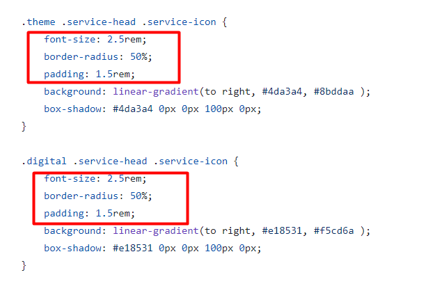
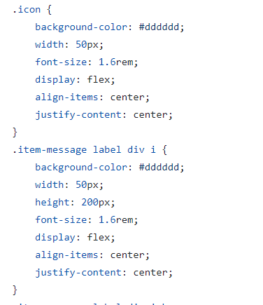
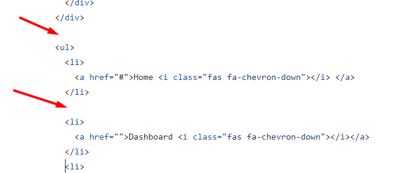

# Review bài tập về nhà buổi 6 - Lớp FullStack K10

## [Phan Tuan Manh](https://phantuanmanh.github.io/f8-fullstack-k10/)

- [x] **Bài 1:**

`Điểm: 6`

- Không được sử dụng thẻ inline (thẻ `label`) để bọc một thẻ block (`div`). Một ngoại lệ là thẻ `a` (anchor), là thẻ inline duy nhất có thể bao bọc các thẻ block như div tuy nhiên chỉ nên sử dụng trong một số trường hợp đặc biệt để tạo liên kết bao quanh các phần tử block nhằm cải thiện trải nghiệm người dùng.

- Chưa thực hiện yêu cầu đề bài khi `focus`, `active` vào các field.

- **Selector CSS** `.row>label` nên được viết với khoảng cách giữa các phần tử để cải thiện tính dễ đọc, tách các phần tử trong selector bằng khoảng trắng hoặc dòng mới để trình bày rõ ràng hơn, ví dụ như `.row > label`.

- Lớp giả `:focus` không áp dụng trực tiếp cho thẻ `div` vì `div` không phải là một phần tử có thể nhận `focus` mặc định. `Focus` thường áp dụng cho các phần tử tương tác như các thẻ `button`, `input`, hoặc các phần tử `form` khác. Các phần tử này có thể nhận `focus` khi người dùng nhấn phím `Tab` hoặc tương tác với chúng bằng chuột.

- Các thẻ `input` và `button` trong bài làm không kế thừa thuộc tính `font-family` của thẻ `html` do vậy cần thêm thuộc tính `font-family: "Lato", sans-serif;` cho các thẻ `input` và `button`.

- [x] **Bài 2:**

`Điểm: 8.75`

- Màu của background trong bài làm đang là `#EDF4FD` trong khi đề bài yêu cầu sử dụng mã màu `#ebf5fe`.

- Khi `:hover` vào các `card` thì bị giật layout do chúng tăng `border` lên `2px`, nên sử dụng `outline` thay cho `border` vì `outline` không chiếm không gian layout.

- [x] **Bài 3:**

`Điểm: 8.5`

- **Category** trong giao diện mẫu có phần `background` với hai bên được ôm lại giống như một cái nút bấm trong khi bài làm chưa có.

- Thẻ `ul` trong bài làm là một danh sách chứa các liên kết chuyển hướng vậy nên cần bọc thẻ `nav` ra ngoài thẻ `ul`.

- [x] **Điểm mạnh:**

- Duy trì được hầu hết điểm mạnh của các buổi trước đó.

- Sử dụng tốt các thuộc tính `background`, `border`, `border-radius`, `padding` và `margin`.

- Chủ động tìm hiểu và sử dụng các thuộc tính `css` chưa được học.

- Sử dụng hiệu quả các biến `CSS` cùng với `media queries`.

- [x] **Điểm yếu:**

- Chưa cải thiện được điểm yếu của các buổi trước.

- Chưa cẩn thận trong việc kiểm tra giao diện mẫu và yêu cầu bài tập.

- Chưa thực sự hiểu về lớp giả trong `CSS`.

- [x] **Đánh giá chung:** Bài làm tốt.

`Điểm tổng kết: 7.75`

`Note: Anh sửa lại bài làm theo nhận xét rồi sau đó báo lại cho em để em kiểm tra lại nha.`

## [Nguyen Huy Hoang](https://nguyenhoang2404.github.io/f8-fullstack-k10/BaiTapVeNha6/index.html)

- [x] **Bài 1:**

`Điểm: 6.5 `

- Khi trình bày code `css` thì nên cách ra một khoảng giữa `selector` và dấu `{`.

- **We'd like ... to chat** là một đoạn văn bản và nó không mang ý nghĩa là một tiêu đề do đó nên sử dụng thẻ `p` để bọc thay vì thẻ `h3`.

- Khi `:hover` vào các `form-input` thì bị giật layout do chúng tăng `border` lên `2px`, nên sử dụng `outline` thay cho `border` vì `outline` không chiếm không gian layout.

- Khi `focus`, `active` vào các `field` mà có icon hình ngôi sao chưa chuyển icon ngôi sao thành icon `x`.

- Phần icon của thẻ `select` nên xử lý thêm để giống với bản mẫu.

- Thẻ `textarea` nên có thêm thuộc tính `resize: none;` để ngăn người dùng thay đổi kích thước của `textarea`.

- Nên sử dụng kết hợp các `selector` cho những đoạn `css` được lặp đi lặp lại

  

- Các thẻ `input` và `button` trong bài làm không kế thừa thuộc tính `font-family` của thẻ `body` do vậy cần thêm thuộc tính `font-family: "Lato", sans-serif;` cho các thẻ `input` và `button`.

- [x] **Bài 2:**

`Điểm: 9`

- Nhận xét về việc trình bày `css` tương tự bài 1.

- [x] **Bài 3:**

`Điểm: 8.5`

- Đây là phần header của một trang, do đó nên sử dụng thẻ `header` thay vì thẻ `nav` để bao bọc nội dung. Thẻ `header` được thiết kế để chứa các phần tử như tiêu đề, logo, và các điều hướng chính, trong khi thẻ `nav` nên được sử dụng để chứa các liên kết điều hướng.

- **Category** là một nút bấm và nó không mang ý nghĩa là một tiêu đề do đó nên sử dụng thẻ `button` thay vì thẻ `h3`.

- Thẻ `ul` trong bài làm là một danh sách chứa các liên kết chuyển hướng vậy nên cần bọc thẻ `nav` ra ngoài thẻ `ul`.

- [x] **Điểm mạnh:**

- Vẫn duy trì được điểm mạnh của các buổi trước.

- Sử dụng tốt các thuộc tính `background`, `border`, `border-radius`, `padding` và `margin`.

- Chủ động tìm hiểu và sử dụng các thuộc tính `css` chưa được học.

- [x] **Điểm yếu:**

- Chưa khắc phục được điểm yếu của các buổi trước đó.

- Chưa kiểm tra kỹ giao diện mẫu.

- [x] **Đánh giá chung:** Bài làm tốt, tuy nhiên cần chú ý nhiều hơn đến giao diện của bài tập trước khi code, cách trình bày và `semantic`. Việc viết toàn bộ `CSS` và `HTML` trong một file có thể làm cho mã trở nên khó quản lý và bảo trì. Nên tách `CSS` ra một file riêng để dễ dàng tổ chức và làm việc hiệu quả hơn.

`Điểm tổng kết: 8`

`Note: Anh sửa lại bài làm theo nhận xét rồi sau đó báo lại cho em để em kiểm tra lại nha.`

## [Le Huu Trong](https://kaiosuke.github.io/Excercise-6/)

- [x] **Bài 1:**

`Điểm: 9.75`

- Các thẻ `input` và `button` trong bài làm không kế thừa thuộc tính `font-family` của thẻ `body` do vậy cần thêm thuộc tính `font-family: "Lato", sans-serif;` cho các thẻ `input` và `button`.

- [x] **Bài 2:**

`Điểm: 9.5`

- Việc sử dụng thẻ `section` chưa đúng về mặt ngữ nghĩa. Thẻ `section` nên được sử dụng để nhóm các nội dung liên quan với nhau trong một ngữ cảnh cụ thể. Trong trường hợp này, nên có thể sử dụng thẻ `article` cho từng phần dịch vụ hoặc gói các dịch vụ trong một thẻ `section` duy nhất.

- [x] **Bài 3:**

`Điểm: 9`

- Đây là phần header của một trang, do đó nên sử dụng thẻ `header` để bao bọc nội dung. Thẻ `header` được thiết kế để chứa các phần tử như tiêu đề, logo, và các điều hướng chính.

- [x] **Điểm mạnh:**

- Duy trì được điểm mạnh của các buổi trước đó.

- Sử dụng tốt các thuộc tính `background`, `border`, `border-radius`, `padding` và `margin`.

- Chủ động tìm hiểu và sử dụng các thuộc tính `css` chưa được học.

- [x] **Đánh giá chung:** Bài làm rất tốt.

`Điểm tổng kết: 9.42`

`Note: Anh sửa lại bài làm theo nhận xét rồi sau đó báo lại cho em để em kiểm tra lại nha.`

## [Vu Anh Tuan](https://vatuan2710.github.io/f8-fullstack-k10/Day-6/index)

- [x] **Bài 1:**

`Điểm: 7.75`

- Không được sử dụng thẻ `inline` (thẻ `label`) để bọc một thẻ `block` (`div`). Một ngoại lệ là thẻ `a` (anchor), là thẻ `inline` duy nhất có thể bao bọc các thẻ `block` như `div` tuy nhiên chỉ nên sử dụng trong một số trường hợp đặc biệt để tạo liên kết bao quanh các phần tử `block` nhằm cải thiện trải nghiệm người dùng.

- Khi `focus`, `active` vào các `field` mà có icon hình ngôi sao chưa chuyển icon ngôi sao thành icon `x`.

- Các thẻ `input` và `button` trong bài làm không kế thừa thuộc tính `font-family` của thẻ `html` do vậy cần thêm thuộc tính `font-family: "Lato", sans-serif;` cho các thẻ `input` và `button`.

- [x] **Bài 2:**

`Điểm: 8.5`

- Font `Roboto` không có sẵn trên tất cả các thiết bị và trình duyệt và sẽ không thể sử dụng trực tiếp như trong bài làm, thay vào đó có thể `import` font `Roboto` từ `Google Fonts` trong file `CSS`.

  Đề xuất sửa:

  ```css
  @import url("https://fonts.googleapis.com/css2?family=Roboto:ital,wght@0,100;0,300;0,400;0,500;0,700;0,900;1,100;1,300;1,400;1,500;1,700;1,900&display=swap");
  ```

- Khi `:hover` vào các `card` thì bị giật layout do chúng tăng `border` lên `1.5px`, nên sử dụng `outline` thay cho `border` vì `outline` không chiếm không gian layout.

- [x] **Bài 3:**

`Điểm: 7`

- Nhận xét về cách sử dụng font `Roboto` tương tự bài 2.

- Đây là phần header của một trang, do đó nên sử dụng thẻ `header` thay vì thẻ `nav` để bao bọc nội dung. Thẻ `header` được thiết kế để chứa các phần tử như tiêu đề, logo, và các điều hướng chính, trong khi thẻ `nav` nên được sử dụng để chứa các liên kết điều hướng.

- Thẻ `ul` trong bài làm là một danh sách chứa các liên kết chuyển hướng vậy nên cần bọc thẻ `nav` ra ngoài thẻ `ul`.

- Không để thừa các khoảng cách

  

- [x] **Điểm mạnh:**

- Duy trì được hầu hết điểm mạnh các buổi trước đó.

- Sử dụng tốt các thuộc tính `background`, `border`, `border-radius`, `padding` và `margin`.

- Chủ động tìm hiểu và sử dụng các thuộc tính `css` chưa được học.

- [x] **Điểm yếu:**

- Chưa hiểu về cách sử dụng font chữ.

- Chưa cẩn thận trong việc kiểm tra kỹ yêu cầu bài tập.

- Chưa thực sự hiểu về `semantic`.

- [x] **Đánh giá chung:** Bài làm khá tốt, tuy nhiên cần lưu ý một số góp ý nêu trên để hoàn thiện hơn.

`Điểm tổng kết: 7.75`

`Note: Bạn sửa lại bài làm theo nhận xét rồi sau đó báo lại cho mình để mình kiểm tra lại nha.`

## [Vu Quoc Dung](https://dungvuquoc0102.github.io/f8_fullstack_k10_repo/)

- [x] **Bài 1:**

`Điểm: 8.75`

- Các thẻ `input` và `button` trong bài làm không kế thừa thuộc tính `font-family` của thẻ `body` do vậy cần thêm thuộc tính `font-family: "Lato", sans-serif;` cho các thẻ `input` và `button`.

- Font của tiêu đề theo yêu cầu đề bài là `Lobster`, tuy nhiên font trong bài làm đang là `sans-serif` mặc dù đã sử dụng thuộc tính `font-family: "Lobster";`, điều này là do bài làm đang `import` nhầm font `Roboto` thay vì `Lobster`.

- [x] **Bài 2:**

`Điểm: 9`

- Font chữ trong bài làm đang là `sans-serif` do mặc dù đã sử dụng thuộc tính `font-family: "Roboto", sans-serif;`, , điều này là do bài làm đang `import` font chưa chính xác.

  Đề xuất sửa:

  ```css
  @import url("https://fonts.googleapis.com/css2?family=Roboto:ital,wght@0,100;0,300;0,400;0,500;0,700;0,900;1,100;1,300;1,400;1,500;1,700;1,900&display=swap");
  ```

- [x] **Bài 3:**

`Điểm: 10`

- [x] **Điểm mạnh:**

- Vẫn duy trì được điểm mạnh của các buổi trước.

- Sử dụng tốt các thuộc tính `background`, `border`, `border-radius`, `padding` và `margin`.

- Chủ động tìm hiểu và sử dụng các thuộc tính `css` chưa được học.

- [x] **Điểm yếu:**

- Chưa cẩn thận trong việc sử dụng font chữ.

- [x] **Đánh giá chung:** Bài làm rất tốt.

`Điểm tổng kết: 9.25`

`Note: Anh sửa lại bài làm theo nhận xét rồi sau đó báo lại cho em để em kiểm tra lại nha.`

## [Nguyen Truong Giang]()

Not found

## [Nguyen Thanh An](https://ann573.github.io/f8-fullstack-k10/BTVN/Day6/)

- [x] **Bài 1:**

`Điểm: 9`

- Khi `focus`, `active` vào các `field` màu `border` của trường nhập dữ liệu chưa được thay đổi, các trường `Message` và `Subject` chưa hiển thị theo yêu cầu bài tập.

- [x] **Bài 2:**

`Điểm: 10`

- [x] **Bài 3:**

`Điểm: 9.75`

- Phần `background` của **Category** trong bài làm đang có màu đậm hơn so với giao diện mẫu.

- [x] **Điểm mạnh:**

- Duy trì được điểm mạnh các buổi trước đó.

- Sử dụng tốt các thuộc tính `background`, `border`, `border-radius`, `padding` và `margin`.

- Chủ động tìm hiểu và sử dụng các thuộc tính `css` chưa được học.

- [x] **Đánh giá chung:** Bài làm rất tốt, tuy nhiên cần cẩn thận hơn một chút trong việc kiểm tra yêu cầu đề bài và giao diện mẫu.

`Điểm tổng kết: 9.583`

`Note: Bạn sửa lại bài làm theo nhận xét rồi sau đó báo lại cho mình để mình kiểm tra lại nha.`

## [Hoang Thanh Huy](https://huyhtf88188.github.io/f8_fullstack/day2/)

- [x] **Bài 1:**

`Điểm: 6.5`

- Các thẻ `input` và `button` trong bài làm không kế thừa thuộc tính `font-family` của thẻ `html` do vậy cần thêm thuộc tính `font-family: "Lato", sans-serif;` cho các thẻ `input` và `button`.

- Khi `:hover` vào các thẻ `input` thì bị giật layout do chúng tăng `border` lên `2px`, nên sử dụng `outline` thay cho `border` vì `outline` không chiếm không gian layout.

- Phần icon của thẻ `select` nên xử lý thêm để giống với bản mẫu.

- Có thể thêm `padding` cho các thẻ `select` và `textarea` để phần `option` và `placeholder` không bị sát với đường viền.

- Hiện lại bài làm đang để phần checkbox là thẻ `input` có `type="checkbox"` theo như mặc định và chưa `css` lại để phần checkbox được hiển thị giống như giao diện mẫu. Nội dung **Send me a copy this message** nên được bọc bởi thẻ `label` có thuộc tính `for` với giá trị là `id` của thẻ `input` có `type="checkbox"` để khi người dùng click vào có thể thay đổi trạng thái của phần checkbox.

- Khi `focus`, `active` vào các `field` chưa thực hiện theo yêu cầu bài tập.

- Thuộc tính `type` của thẻ `input` trong `html` không có giá trị là `name`.

- [x] **Bài 2:**

`Điểm: 8`

- Hiện tại font chữ trong bài làm đang là `system-ui` do thứ tự các font trong thuộc tính `font-family`.

- **Learn More** trong bài làm viết sai chính tả và chưa được `css` giống giao diện mẫu.

- Nội dung của toàn bộ thẻ tiêu đề trong bài làm đang giống nhau.

- [x] **Bài 3:**

`Điểm: 9`

- Đây là phần header của một trang, do đó nên sử dụng thẻ `header` để bao bọc nội dung. Thẻ `header` được thiết kế để chứa các phần tử như tiêu đề, logo, và các điều hướng chính.

- [x] **Điểm mạnh:**

- Vẫn duy trì được một vài điểm mạnh của các buổi trước.

- Sử dụng tốt các thuộc tính `background`, `border`, `border-radius`, `padding` và `margin`.

- Chủ động tìm hiểu và sử dụng các thuộc tính `css` chưa được học.

- [x] **Điểm yếu:**

- Chưa hiểu về cách sử dụng font chữ.

- Chưa cẩn thận trong việc kiểm tra kỹ yêu cầu và giao diện mẫu của bài tập.

- [x] **Đánh giá chung:** Bài làm tương đối tốt, tuy nhiên cần lưu ý một số góp ý nêu trên để hoàn thiện hơn.

`Điểm tổng kết: 7.83`

`Note: Anh sửa lại bài làm theo nhận xét rồi sau đó báo lại cho em để em kiểm tra lại nha.`

## [Nguyen The Han](https://nguyenthehanf8.github.io/F8-Fullstack-Ofline/Day-6/ex01.html)

- [x] **Bài 1:**

`Điểm: 6`

- Các thẻ `input` và `button` trong bài làm không kế thừa thuộc tính `font-family` của thẻ `body` do vậy cần thêm thuộc tính `font-family: "Lato", sans-serif;` cho các thẻ `input` và `button`.

- Khi `focus`, `active`, `hover` vào các `field` chưa thực hiện theo yêu cầu bài tập.

- Hiện lại bài làm đang để phần checkbox là thẻ `input` có `type="checkbox"` theo như mặc định và chưa `css` lại để phần checkbox được hiển thị giống như giao diện mẫu.

- [x] **Bài 2:**

`Điểm: 9.5`

- Nên sử dụng kết hợp các `selector` cho những đoạn `css` được lặp đi lặp lại.

  

- [x] **Bài 3:**

`Điểm: 8.5`

- Đây là phần header của một trang, do đó nên sử dụng thẻ `header` để bao bọc nội dung. Thẻ `header` được thiết kế để chứa các phần tử như tiêu đề, logo, và các điều hướng chính.

- Thẻ `ul` trong bài làm là một danh sách chứa các liên kết chuyển hướng vậy nên cần bọc thẻ `nav` ra ngoài thẻ `ul`.

- [x] **Điểm mạnh:**

- Vẫn duy trì được điểm mạnh của các buổi trước.

- Sử dụng tốt các thuộc tính `background`, `border`, `border-radius`, `padding` và `margin`.

- Chủ động tìm hiểu và sử dụng các thuộc tính `css` chưa được học.

- [x] **Điểm yếu:**

- Chưa cẩn thận trong việc kiểm tra kỹ yêu cầu và giao diện mẫu của bài tập.

- [x] **Đánh giá chung:** Cần chú ý thực hiện đúng yêu cầu bài tập, chủ động đặt câu hỏi cho trợ giảng để có thể giải quyết bài tập một cách tốt nhất.

`Điểm tổng kết: 8`

`Note: Bạn sửa lại bài làm theo nhận xét rồi sau đó báo lại cho mình, để mình kiểm tra lại nha.`

## [Nguyen Hai Duong](https://github.com/tenk22/F8_fullstacks/blob/main/btvnb6/b1/b1.html)

- [x] **Bài 1:**

`Điểm: 5`

- Các thẻ `input` trong bài làm không kế thừa thuộc tính `font-family` của thẻ `body` do vậy cần thêm thuộc tính `font-family: "Lato", sans-serif;` cho các thẻ `input`.

- Khi `focus`, `active`, `hover` vào các `field` chưa thực hiện theo yêu cầu bài tập.

- Giao diện của bài làm chưa giống với giao diện mẫu.

- Cần cải thiện cách trình bày mã `CSS` để dễ đọc và duy trì hơn. Cụ thể, nên nhất quán trong việc đặt dấu ngoặc nhọn `{` ở cùng dòng với selector, giảm khoảng cách thừa giữa các `rule sets`, và căn chỉnh các thuộc tính một cách đồng đều.

- [x] **Bài 2:**

`Điểm: 7`

- Giao diện của bài làm chưa giống với giao diện mẫu.

- Nhận xét về cách trình bày `CSS` tương tự bài 1.

- [x] **Bài 3:**

`Điểm: 8`

- Phần `background` của **Category** trong bài làm đang có màu đậm hơn so với giao diện mẫu, nội dung và icon cũng đang quá sát nhau.

- Đây là phần header của một trang, do đó nên sử dụng thẻ `header` thay vì thẻ `nav` để bao bọc nội dung. Thẻ `header` được thiết kế để chứa các phần tử như tiêu đề, logo, và các điều hướng chính, trong khi thẻ `nav` nên được sử dụng để chứa các liên kết điều hướng.

- **Home**, **Courses**, ... là các liên kết chuyển hướng vậy nên cần được bọc bởi thẻ `nav`.

- [x] **Điểm mạnh:**

- Vẫn duy trì được một vài điểm mạnh của các buổi trước.

- Chủ động tìm hiểu và sử dụng các thuộc tính `css` chưa được học.

- [x] **Điểm yếu:**

- Chưa cẩn thận trong việc kiểm tra kỹ yêu cầu và giao diện mẫu của bài tập.

- Trình bày `css` chưa tốt.

- [x] **Đánh giá chung:** Cần chú ý thực hiện đúng yêu cầu bài tập, chủ động đặt câu hỏi cho trợ giảng để có thể giải quyết bài tập một cách tốt nhất.

`Điểm tổng kết: 6.67`

`Note: Anh sửa lại bài làm theo nhận xét rồi sau đó báo lại cho em, để em kiểm tra lại nha.`

## [Nguyen Trung Hieu](https://hieuvsgithub.github.io/Nop_bai_tap/Day_6/bai_1.html)

- [x] **Bài 1:**

`Điểm: 5`

- Các thẻ `input` và `button` trong bài làm không kế thừa thuộc tính `font-family` của thẻ `form` do vậy cần thêm thuộc tính `font-family: "Lato", sans-serif;` cho các thẻ `input` và `button`.

- Khi `focus`, `active`, `hover` vào các `field` chưa thực hiện theo yêu cầu bài tập.

- Giao diện của bài làm chưa giống với giao diện mẫu.

- Khi `:hover` vào các `item-user` thì bị giật layout do chúng tăng `border` lên `1px`, nên sử dụng `outline` thay cho `border` vì `outline` không chiếm không gian layout.

- Nên sử dụng kết hợp các `selector` cho những đoạn `css` được lặp đi lặp lại

  

- Không được sử dụng thẻ inline (thẻ `label`) để bọc một thẻ block (`div`). Một ngoại lệ là thẻ `a` (anchor), là thẻ inline duy nhất có thể bao bọc các thẻ block như div tuy nhiên chỉ nên sử dụng trong một số trường hợp đặc biệt để tạo liên kết bao quanh các phần tử block nhằm cải thiện trải nghiệm người dùng.

- [x] **Bài 2:**

`Điểm: 8`

- Chưa có bóng mờ phía sau icon dựa theo `background` của icon.

- Tiêu đề và phần `background` của icon đang quá sát nhau.

- Khi `:hover` vào các `item` thì bị giật layout do chúng tăng `border` lên `1px`, nên sử dụng `outline` thay cho `border` vì `outline` không chiếm không gian layout.

- [x] **Bài 3:**

`Điểm: 4`

- Giao diện của bài làm chưa giống với giao diện mẫu.

- Không để thừa các khoảng cách

  

- Hầu hết toàn code trong file `css` đều đã được `comment`.

- [x] **Điểm yếu:**

- Chưa khắc phục được điểm yếu của các buổi trước.

- Chưa cẩn thận trong việc kiểm tra kỹ yêu cầu và giao diện mẫu của bài tập.

- [x] **Đánh giá chung:** Cần dành nhiều thời gian hơn cho bài tập, `chủ động đặt câu hỏi cho trợ giảng để có thể giải quyết bài tập một cách tốt nhất`. Quản lý các file `html` và `css` chưa tốt khi toàn bộ các file đang được đặt ngang cấp với nhau trong cùng một thư mục, điều này dẫn đến việc khó quản lý khi số lượng các file tăng lên.

`Điểm tổng kết: 5.67`

`Note: Bạn sửa lại bài làm theo nhận xét rồi sau đó báo lại cho mình, để mình kiểm tra lại nha.`
