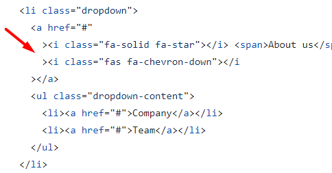

# Review bài tập về nhà buổi 7 - Lớp FullStack K10

## [Phan Tuan Manh](https://phantuanmanh.github.io/f8-fullstack-k10/Day-7/index.html)

- [x] **Bài 1:**

`Điểm: 10`

- [x] **Bài 2:**

`Điểm: 9.5`

- Các thẻ `input` và `button` trong bài làm không kế thừa thuộc tính `font-family` của thẻ `html` do vậy cần thêm thuộc tính `font-family: "Nunito", sans-serif;` cho các thẻ `input` và `button`.

- [x] **Điểm mạnh:**

- Duy trì được điểm mạnh và cải thiện được điểm yếu của những buổi trước.

- [x] **Đánh giá chung:** Bài làm rất tốt, tuy nhiên cần lưu ý một số góp ý nêu trên để hoàn thiện hơn.

`Điểm tổng kết: 9.75`

`Note: Anh sửa lại bài làm theo nhận xét rồi sau đó báo lại cho em để em kiểm tra lại nha.`

## [Vu Anh Tuan](https://vatuan2710.github.io/f8-fullstack-k10/Day-7/index)

- [x] **Bài 1:**

`Điểm: 6`

- Khi `hover` vào từng item thì background màu xanh đang để sát viền nhưng bản mẫu sẽ không sát viền như vậy, cần điều chỉnh lại.

- Khi `hover` vào 1 item để xuất hiện SubMenu thì khi di chuyển chuột qua khoảng cách giữa item đó đến menu cấp con thì sẽ bị mất menu con do mất sự kiện `hover`.

- SubMenu chưa giống với giao diện mẫu.

- Thẻ `ul` trong bài làm là một danh sách chứa các liên kết chuyển hướng vậy nên cần bọc thẻ `nav` ra ngoài thẻ `ul`.

- Các dấu lớn hơn và nhỏ hơn của các thẻ đóng và thẻ mở cần nằm trên cùng một dòng

  

- Font `Open Sans` không có sẵn trên tất cả các thiết bị và trình duyệt và sẽ không thể sử dụng trực tiếp như trong bài làm, thay vào đó có thể `import` font `Open Sans` từ `Google Fonts` trong file `CSS`.

  Đề xuất sửa:

  ```css
  @import url("https://fonts.googleapis.com/css2?family=Open+Sans:ital,wght@0,300..800;1,300..800&display=swap");
  ```

- [x] **Bài 2:**

`Điểm: 7`

- Thuộc tính `background-image` không hoạt động là do `URL` không được đặt trong dấu ngoặc kép. Để giải quyết vấn đề này, hãy thêm dấu ngoặc kép xung quanh `URL`.

- **Just Log** là một tiêu đề vậy nên cần được bọc trong thẻ **heading**.

- Các thẻ `input` và `button` trong bài làm không kế thừa thuộc tính `font-family` của thẻ `body` do vậy cần thêm thuộc tính `font-family: "Nunito", sans-serif;` cho các thẻ `input` và `button`.

- Cần cải thiện cách trình bày mã `CSS` để dễ đọc và duy trì hơn. Cụ thể, nên nhất quán trong việc đặt dấu ngoặc nhọn `{` ở cùng dòng với selector, giảm khoảng cách thừa giữa các `rule sets`, và căn chỉnh các thuộc tính một cách đồng đều.

- [x] **Điểm mạnh:**

- Duy trì được một số điểm mạnh các buổi trước đó.

- [x] **Điểm yếu:**

- Trình bày code HTML và CSS chưa tốt.

- Chưa hiểu về cách sử dụng font chữ.

- Chưa cẩn thận trong việc kiểm tra kỹ giao diện mẫu và yêu cầu bài tập.

- Chưa thực sự hiểu về `semantic`.

- [x] **Đánh giá chung:** Bài làm khá tốt, tuy nhiên cần lưu ý một số góp ý nêu trên để hoàn thiện hơn.

`Điểm tổng kết: 6.5`

`Note: Bạn sửa lại bài làm theo nhận xét rồi sau đó báo lại cho mình để mình kiểm tra lại nha.`

## [Le Huu Trong](https://kaiosuke.github.io/Excercise-7/)

- [x] **Bài 1:**

`Điểm: 9.5`

- Khi `hover` vào 1 item để xuất hiện SubMenu thì khi di chuyển chuột qua khoảng cách giữa item đó đến menu cấp con thì sẽ bị mất menu con do mất sự kiện `hover`.

- [x] **Bài 2:**

`Điểm: 10`

- [x] **Điểm mạnh:**

- Duy trì được điểm mạnh của các buổi trước đó.

- [x] **Đánh giá chung:** Bài làm rất tốt.

`Điểm tổng kết: 9.75`

`Note: Anh sửa lại bài làm theo nhận xét rồi sau đó báo lại cho em để em kiểm tra lại nha.`

## [Nguyen Thanh An](https://ann573.github.io/f8-fullstack-k10/BTVN/Day7/)

- [x] **Bài 1:**

`Điểm: 8`

- Khi `hover` vào các item có nội dung **About us** và **Portfolio** chưa hiển thị dropdown tương ứng.

- Khi `hover` vào 1 item để xuất hiện SubMenu thì khi di chuyển chuột qua khoảng cách giữa item đó đến menu cấp con thì sẽ bị mất menu con do mất sự kiện `hover`.

- Đây là phần header của một trang, do đó nên sử dụng thẻ `header` để bao bọc nội dung. Thẻ `header` được thiết kế để chứa các phần tử như tiêu đề, logo, và các điều hướng chính.

- [x] **Bài 2:**

`Điểm: 10`

- [x] **Điểm mạnh:**

- Duy trì được điểm mạnh các buổi trước đó.

- [x] **Đánh giá chung:** Bài làm rất tốt.

`Điểm tổng kết: 9`

`Note: Bạn sửa lại bài làm theo nhận xét rồi sau đó báo lại cho mình để mình kiểm tra lại nha.`

## [Vu Quoc Dung](https://dungvuquoc0102.github.io/f8_fullstack_k10_repo/day7/ex1.html#)

- [x] **Bài 1:**

`Điểm: 10`

- [x] **Bài 2:**

`Điểm: 10`

- [x] **Điểm mạnh:**

- Duy trì được điểm mạnh các buổi trước đó.

- [x] **Đánh giá chung:** Bài làm rất tốt.

`Điểm tổng kết: 10`

## [Nguyen Truong Giang](https://nguyentruonggiang212001.github.io/f8-fullstack-k10/Assignment7/index.html)

- [x] **Bài 1:**

`Điểm: 7.75`

- Khi `hover` vào các item có nội dung **About us** và **Portfolio** chưa hiển thị dropdown tương ứng.

- Khi `hover` vào 1 item để xuất hiện SubMenu thì khi di chuyển chuột qua khoảng cách giữa item đó đến menu cấp con thì sẽ bị mất menu con do mất sự kiện `hover`.

- Chiều rộng của SubMenu đang nhỏ hơn so với giao diện mẫu.

- Đây là phần header của một trang, do đó nên sử dụng thẻ `header` để bao bọc nội dung. Thẻ `header` được thiết kế để chứa các phần tử như tiêu đề, logo, và các điều hướng chính.

- [x] **Bài 2:**

`Điểm: 8.5`

- Các thẻ `input` và `button` trong bài làm không kế thừa thuộc tính `font-family` của thẻ `body` do vậy cần thêm thuộc tính `font-family: "Nunito", sans-serif;` cho các thẻ `input` và `button`.

- Việc sử dụng thẻ `h2` cho logo 'JL' và thẻ `span` cho tên 'Just Log' không đúng về mặt ngữ nghĩa (semantic). Nên sử dụng các thẻ phù hợp để tăng cường tính ngữ nghĩa và truy cập của trang web. Ví dụ, sử dụng thẻ `img` cho logo nếu nó là một hình ảnh và thẻ `h1` hoặc `h2` cho tên thương hiệu.

- [x] **Điểm mạnh:**

- Vẫn duy trì được một vài điểm mạnh của các buổi trước.

- [x] **Điểm yếu:**

- Chưa cẩn thận trong việc kiểm tra kỹ yêu cầu và giao diện mẫu của bài tập.

- Chưa thực sự hiểu về `semantic`.

- [x] **Đánh giá chung:** Bài làm tốt, tuy nhiên cần lưu ý một số góp ý nêu trên để hoàn thiện hơn. Việc viết toàn bộ mã HTML và CSS trong một file có thể gây khó khăn cho việc bảo trì và quản lý mã. Bạn nên tách riêng HTML và CSS thành các file riêng biệt. Điều này giúp mã dễ đọc hơn, dễ bảo trì hơn.

`Điểm tổng kết: 8.125`

`Note: Anh sửa lại bài làm theo nhận xét rồi sau đó báo lại cho em, để em kiểm tra lại nha.`

## [Nguyen The Han](https://nguyenthehanf8.github.io/F8-Fullstack-Ofline/Day-7/)

- [x] **Bài 1:**

`Điểm: `

- Khi `hover` vào 1 item để xuất hiện SubMenu thì khi di chuyển chuột qua khoảng cách giữa item đó đến menu cấp con thì sẽ bị mất menu con do mất sự kiện `hover`.

- [x] **Bài 2:**

`Điểm: `
