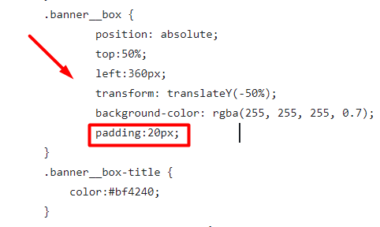
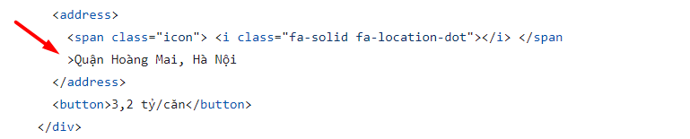

# Review bài tập về nhà buổi 8 - Lớp FullStack K10

## [Nguyen Thanh An](https://ann573.github.io/f8-fullstack-k10/BTVN/Day8/)

- [x] **Bài 1:**

`Điểm: 10`

- [x] **Bài 2:**

`Điểm: 9`

- Đây là phần header của một trang, do đó nên sử dụng thẻ `header` để bao bọc nội dung. Thẻ `header` được thiết kế để chứa các phần tử như tiêu đề, logo, và các điều hướng chính.

- [x] **Bài 3:**

`Điểm: 9`

- Chưa có đường kẻ ngang bên cạnh tiều đề **KHÁM PHÁ BẤT ĐỘNG SẢN CÁC KHU VỰC NỔI BẬT**.

- [x] **Điểm mạnh:**

- Duy trì được điểm mạnh các buổi trước đó.

- [x] **Đánh giá chung:** Bài làm rất tốt, tuy nhiên cần cẩn thận hơn trong việc kiểm tra kỹ giao diện mẫu.

`Điểm tổng kết: 9.33`

`Note: Bạn sửa lại bài làm theo nhận xét rồi sau đó báo lại cho mình để mình kiểm tra lại nha.`

## [Nguyen Huy Hoang](https://nguyenhoang2404.github.io/f8-fullstack-k10/BaiTapVeNha8/BaiTap1.html)

- [x] **Bài 1:**

`Điểm: 7.75`

- Vị trí của nội dung trong bài làm đang cách xa phần bên trái của `background` hơn so với giao diện mẫu.

- Thụt lề chưa hợp lý, thuộc tính và giá trị của thuộc tính đang quá sát nhau

  

- Font chữ của giá trong trong bài làm đang là `Asap` trong khi yêu cầu của bài tập là font `SFU`.

- [x] **Bài 2:**

`Điểm: 8`

- Nhận xét về cách trình bày `css` tương tự bài 1.

- **TẬP ĐOÀN VINGROUP** nên sử dụng thẻ `h1` hoặc `h2` để bọc thay vì thẻ `h3` để tăng thêm độ nhấn mạnh cho tiêu đề.

- Tên `class` của bạn có quá nhiều dấu gạch ngang, làm cho mã trở nên dài và khó đọc. Nên hạn chế số lượng dấu gạch ngang và sử dụng tên `class` ngắn gọn nhưng vẫn đủ rõ nghĩa.

- [x] **Bài 3:**

`Điểm: 7.5`

- Chưa có đường kẻ ngang bên cạnh tiều đề **KHÁM PHÁ BẤT ĐỘNG SẢN CÁC KHU VỰC NỔI BẬT**.

- Nhận xét về cách đặt tên `class` tương tự bài 2.

- `Background` của thẻ `li` có nội dung **Hồ Chí Minh** bên trong chưa giống với giao diện mẫu.

- `font-size` và `font-weight` của số lượng bất động sản đang bán trong bài làm đang giống với phần nội dung **bất động sản đang bán** và điều này khác với giao diện mẫu.

- Nhận xét về cách trình bày `css` tương tự bài 1.

- [x] **Điểm mạnh:**

- Vẫn duy trì được điểm mạnh của các buổi trước.

- [x] **Điểm yếu:**

- Chưa khắc phục được điểm yếu của các buổi trước đó.

- Chưa cẩn thận trong việc kiểm tra kỹ giao diện mẫu và yêu cầu bài tập.

- [x] **Đánh giá chung:** Bài làm tốt, tuy nhiên cần chú ý nhiều hơn đến giao diện và yêu cầu của bài tập trước khi code, cách trình bày và semantic. Việc viết toàn bộ CSS và HTML trong một file có thể làm cho mã trở nên khó quản lý và bảo trì. Nên tách CSS ra một file riêng để dễ dàng tổ chức và làm việc hiệu quả hơn.

`Điểm tổng kết: 7.75`

`Note: Anh sửa lại bài làm theo nhận xét rồi sau đó báo lại cho em để em kiểm tra lại nha.`

## [Phan Tuan Manh](https://phantuanmanh.github.io/f8-fullstack-k10/Day-8/index.html)

- [x] **Bài 1:**

`Điểm: 9`

- Font chữ của giá trong trong bài làm đang là `Barlow Condensed` trong khi yêu cầu của bài tập là font `SFU`.

- [x] **Bài 2:**

`Điểm: 10`

- [x] **Bài 3:**

`Điểm: 10`

- [x] **Điểm mạnh:**

- Duy trì được điểm mạnh của những buổi trước.

- [x] **Đánh giá chung:** Bài làm rất tốt, tuy nhiên cần lưu ý thực hiện đúng yêu cầu bài tập.

`Điểm tổng kết: 9.67`

`Note: Anh sửa lại bài làm theo nhận xét rồi sau đó báo lại cho em để em kiểm tra lại nha.`

## [Le Huu Trong](https://kaiosuke.github.io/Excercise-8/)

- [x] **Bài 1:**

`Điểm: 8`

- Các dấu lớn hơn và nhỏ hơn của các thẻ đóng và thẻ mở cần nằm trên cùng một dòng

  

- **3,2 TỶ/CĂN** chỉ thể hiện giá của căn hộ và không phải là một nút bấm vậy do đó nên sử dụng thẻ `span` thay vì thẻ `button`.

- [x] **Bài 2:**

`Điểm: 10`

- [x] **Bài 3:**

`Điểm: 9`

- Thẻ `article>` được sử dụng cho các phần có ý nghĩa riêng biệt và có thể độc lập với những phần còn lại của - website (Bài viết, sản phẩm, bình luận,…) do đó những thẻ `article` trong bài làm có `class="wrapper--link"` nên được thay thế bằng cặp thẻ `ul, li` để thể hiện danh sách khu vực.

- [x] **Điểm mạnh:**

- Duy trì được điểm mạnh của các buổi trước đó.

- [x] **Đánh giá chung:** Bài làm rất tốt, tuy nhiên cần lưu ý một số góp ý nêu trên để hoàn thiện hơn.

`Điểm tổng kết: 9`

`Note: Anh sửa lại bài làm theo nhận xét rồi sau đó báo lại cho em để em kiểm tra lại nha.`

## [Hoang Thanh Huy](https://huyhtf88188.github.io/f8_fullstack/day8/day8_exercise1/day8_exercise1.html)

- [x] **Bài 1:**

`Điểm: 8.5`

- Màu chữ chưa đúng với đề bài yêu cầu (#3f3424).

- `font-size` của giá của các căn hộ đang hơi bé.

- Khoảng cách giữa hai dòng **Dự án...Linh Đàm.** và **Dự án có...cao cấp** đang khá sát nhau, có thể tăng khoảng cách bằng cách set cho thẻ `p` thuộc tính `line-height` với giá trị là `1.4`.

- [x] **Bài 2:**

`Điểm: 9.5`

- **GIỚI THIỆU**, **DỰ ÁN ĐÃ ĐẦU TƯ** và **LIÊN HỆ** đang có khoảng cách hơi xa có thể giảm xuống bằng cách bỏ thuộc tính `margin: 0 15px;` ở các thẻ `li` đi.

- `font-weight` của tiêu đề đang hơi nhỏ, cần tăng từ `500` lên `600`.

- [x] **Bài 3:**

`Điểm: 8`

- Ở trường hợp này, **KHÁM PHÁ BẤT ĐỘNG SẢN CÁC KHU VỰC NỔI BẬT** chưa đủ ý nghĩa làm một tiêu đề chính. Nên sử dụng thẻ `h2` thay vì thẻ `h1`.

- Không sử dụng thẻ thuộc nhóm `inline` () để bọc một thẻ thuộc nhóm `block` (
).

- Thẻ `div` có `class="province"` nên được thay thế bằng cặp thẻ `ul, li` để thể hiện danh sách khu vực.

- **Quận 2**, **Quận 7**, ... không mang ý nghĩa là tiêu đề cấp 2 vậy nên không sử dụng thẻ `h2` đẻ bọc.

- [x] **Điểm mạnh:**

- Vẫn duy trì được một vài điểm mạnh cải thiện được một só điểm yếu.

- [x] **Điểm yếu:**

- Chưa thực sự hiểu về `semantic`.

- Chưa cẩn thận trong việc kiểm tra kỹ yêu cầu và giao diện mẫu của bài tập.

- [x] **Đánh giá chung:** Bài làm tốt, tuy nhiên cần lưu ý một số góp ý nêu trên để hoàn thiện hơn.

`Điểm tổng kết: 8.67`

`Note: Anh sửa lại bài làm theo nhận xét rồi sau đó báo lại cho em để em kiểm tra lại nha.`

## [Nguyen The Han](https://nguyenthehanf8.github.io/F8-Fullstack-Ofline/Day-8/ex01.html)

- [x] **Bài: 1**

`Điểm: 8`

- **3,2 TỶ/CĂN** chỉ thể hiện giá của căn hộ và không phải là một liên kết điều hướng do đó nên sử dụng thẻ `span` thay vì thẻ `a`.

- Font chữ của giá trong trong bài làm đang là `sans-serif` trong khi yêu cầu của bài tập là font `SFU`.

- [x] **Bài 2:**

`Điểm: 8`

- **TẬP ĐOÀN VINGROUP** được thể hiện là một tiêu đề lớn nhất, đáng chú ý nhất, nên sử dụng thẻ `h1` ở đây thay vì sử dụng thẻ `h2`.

- Đây là phần header của một trang, do đó nên sử dụng thẻ `header` để bao bọc nội dung. Thẻ `header` được thiết kế để chứa các phần tử như tiêu đề, logo, và các điều hướng chính.

- Thẻ `ul` trong bài làm là một danh sách chứa các liên kết chuyển hướng vậy nên cần bọc thẻ `nav` ra ngoài thẻ `ul`.

- `font-size` trong bài làm đang khá lớn, cần giảm xuống để giống với giao diện mẫu.

- [x] **Bài 3:**

`Điểm: 8`

- `font-size` trong bài làm đang khá lớn, cần giảm xuống để giống với giao diện mẫu.

- Thẻ `li` đang có cùng một kích thước tuy nhiên nội dung của những thẻ này có độ dài khác nhau vậy nên chiều cao của các thẻ `li` không đều nhau.

- Chiều cao của các thẻ `div` có `class="district-item"` đang khá lớn nên làm xuất hiện thanh cuộn do thuộc tính `grid-template-rows` đang có hai giá trị khá lớn là `350px 350px`, cần giảm giá trị xuống để đảm bảo không xuất hiện thanh cuộn dọc và các item có hình chữ nhật giống như giao diện mẫu.

- [x] **Điểm mạnh:**

- Vẫn duy trì được điểm mạnh của các buổi trước.

- [x] **Điểm yếu:**

- Chưa cẩn thận trong việc kiểm tra kỹ yêu cầu và giao diện mẫu của bài tập.

- [x] **Đánh giá chung:** Bài làm khá tốt, tuy nhiên cần lưu ý một số góp ý nêu trên để hoàn thiện hơn.

`Điểm tổng kết: 8`

`Note: Bạn sửa lại bài làm theo nhận xét rồi sau đó báo lại cho mình, để mình kiểm tra lại nha.`

## [Nguyen Trung Hieu](https://hieuvsgithub.github.io/Nop_bai_tap/Day_8/bai_1.html)

- [x] **Bài 1:**

`Điểm: 9`

- Khoảng cách giữa hai dòng **Dự án...Linh Đàm.** và **Dự án có...cao cấp** đang khá sát nhau, có thể tăng khoảng cách bằng cách set cho thẻ `p` thuộc tính `line-height` với giá trị là `1.4`.

- Giá của căn hộ cần phải được viết hoa toàn bộ.

- [x] **Bài 2:**

`Điểm: 9`

- Ảnh `background` đang bị méo do thuộc tính `background-size: 100% 100%;` và kích thước gốc của ảnh quá lớn, cần lựa chọn một ảnh có kích thước phù hợp hơn và sử dụng thuộc tính `background-size` với giá trị là `cover` để đảm bảo ảnh sẽ bao phủ toàn bộ mặc dù có thể bị cắt bớt và tránh làm méo ảnh.

- Thêm thuộc tính `border-radius` vào logo để có thể bo góc.

- [x] **Bài 3:**

`Điểm: 5`

- Không sử dụng thẻ thuộc nhóm `inline` () để bọc một thẻ thuộc nhóm `block` (
).

- Thẻ `section` được sử dụng để tạo thành một khu vực bao gồm những nội dung giống nhau (Khu vực giới thiệu, khu - vực sản phẩm, khu vực tin tức,…). Và nếu sử dụng thẻ `section` trong trường hợp này thì nên sử dụng để bọc toàn bộ thay vì chỉ bọc các `item-box`.

- Giao diện chưa đáp ứng yêu cầu.

- [x] **Điểm mạnh:**

- Có sự cải thiện rất tốt so với các buổi trước đó.

- [x] **Điểm yếu:**

- Chưa cẩn thận trong việc kiểm tra kỹ yêu cầu và giao diện mẫu của bài tập.

- Chưa thực sự hiểu về `semantic`.

- [x] **Đánh giá chung:** Bài làm khá tốt, tuy nhiên cần thực hiện đúng yêu cầu bài tập và lưu ý một số góp ý nêu trên để hoàn thiện hơn.

`Điểm tổng kết: 7.67`

`Note: Bạn sửa lại bài làm theo nhận xét rồi sau đó báo lại cho mình, để mình kiểm tra lại nha.`
