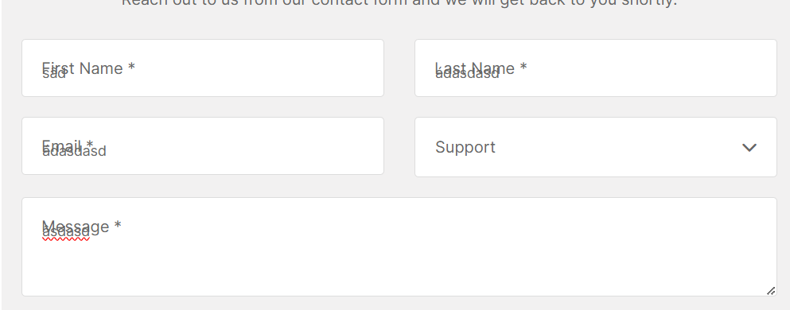

# Review bài tập về nhà buổi 9 - Lớp FullStack K10

## [Le Huu Trong](https://kaiosuke.github.io/excercise-9/)

- [x] **Bài 1:**

`Điểm: 9`

- Hiện font chữ trong bài làm đang là `sans-serif` mặc dù đã sử dụng `font-family: "Inter", sans-serif;` ở thẻ `body`, điều này là do bài làm đang chưa nhúng font Inter

  Đề xuất sửa

  ```html
  <link
    href="https://fonts.googleapis.com/css2?family=Inter:wght@100..900&display=swap"
    rel="stylesheet"
  />
  ```

- [x] **Bài 2:**

`Điểm: 10`

- [x] **Bài 3:**

`Điểm: 9`

- Thẻ `textarea` chưa có `border` và nên có thêm thuộc tính `resize: none;` để ngăn người dùng thay đổi kích thước của `textarea`.

- [x] **Điểm mạnh:**

- Duy trì được điểm mạnh của các buổi trước đó.

- [x] **Đánh giá chung:** Bài làm rất tốt, tuy nhiên cần lưu ý một số góp ý nêu trên để hoàn thiện hơn.

`Điểm tổng kết: 9.33`

`Note: Anh sửa lại bài làm theo nhận xét rồi sau đó báo lại cho em để em kiểm tra lại nha.`

## [Vu Anh Tuan](https://vatuan2710.github.io/f8-fullstack-k10/Day-9/index)

- [x] **Bài 1:**

`Điểm: 8`

- Giao diện chưa đúng với yêu cầu bài tập.

- [x] **Bài **

**PENDING**

## [Nguyen Thanh An](https://ann573.github.io/f8-fullstack-k10/BTVN/Day9/)

- [x] **Bài 1:**

`Điểm: 10`

- [x] **Bài 2:**

`Điểm: 8`

- Theo yêu cầu bài tập thì khi `hover` **icon** sẽ thu nhỏ dần lại rồi sau đó ẩn đi, **border** sẽ co lại, **Learn more** sẽ di chuyển từ dưới lên và hiện ra, khi không `hover` thì sẽ ngược lại. Tuy nhiên bài làm chỉ đang xử lý ẩn hiện các **icon, border và Learn more**, chưa có hiệu ứng.

- [x] **Bài 3:**

`Điểm: 10`

- [x] **Điểm mạnh:**

- Duy trì được điểm mạnh các buổi trước đó.

- [x] **Điểm yếu:**

- Chưa cẩn thận trong việc kiểm tra kỹ yêu cầu bài tập.

- [x] **Đánh giá chung:** Bài làm rất tốt.

`Điểm tổng kết: 9.33`

`Note: Bạn sửa lại bài làm theo nhận xét rồi sau đó báo lại cho mình để mình kiểm tra lại nha.`

## [Vu Quoc Dung](https://dungvuquoc0102.github.io/f8_fullstack_k10_repo/day9/ex01.html)

- [x] **Bài 1:**

`Điểm: 10`

- [x] **Bài 2:**

`Điểm: 9`

- Khi không còn `hover` thì **background, border và Learn more** ẩn đi một cách đột ngồi trong khi yêu cầu bài tập là ẩn đi từ từ và có hiệu ứng.

- [x] **Bài 3:**

`Điểm: 8`

- Khi nhập dữ liệu vào thẻ `input` sau đó làm mất focus xuất hiện lỗi

  

  Đề xuất sửa:

  ```css
  input:valid ~ label,
  textarea:valid ~ label {
    top: 10px;
    left: 15px;
    font-size: 0.8rem;
  }
  ```

- [x] **Điểm mạnh:**

- Duy trì được điểm mạnh các buổi trước đó.

- [x] **Điểm yếu:**

- Chưa cẩn thận trong việc kiểm tra kỹ yêu cầu bài tập.

- [x] **Đánh giá chung:** Bài làm tốt, tuy nhiên cần lưu ý một số góp ý nêu trên để hoàn thiện hơn.

`Điểm tổng kết: 9`

`Note: Anh sửa lại bài làm theo nhận xét rồi sau đó báo lại cho em để em kiểm tra lại nha.`
