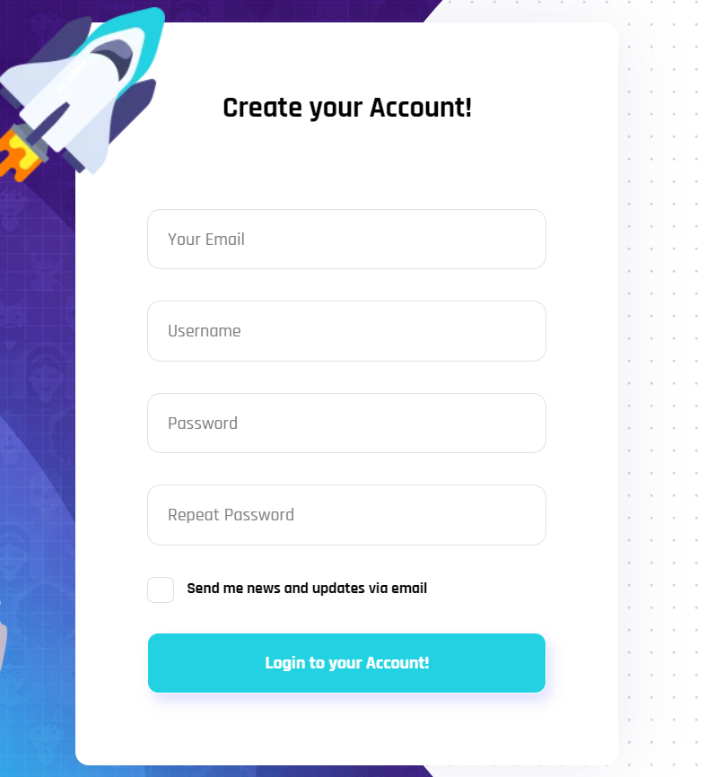
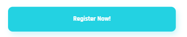

# Huy review bài tập về nhà buổi 14 - Lớp K5

## [Ngo Hoang Kim](https://kzau1612.github.io/FSK5/day_12/)

- [x] Bài 1: Màn hình max-width: 1994px

**Bài làm tốt**

Nên thêm thuộc tính: `autofocus` vào thẻ input đầu tiên để thuận tiện cho việc gõ hơn.

Các icon hầu hết đều bé hơn bản mẫu. Icon facebook chưa giống với bản mẫu
Có thể tham khảo và sử dụng [Font Awesome](https://fontawesome.com/) để tìm kiếm và sử dụng icon.

Phần `landing__title` đang bị cách xa `logo` hơn so với bản mẫu do kích thước của ảnh gốc đang không khớp với icon cộng thêm với thuộc tính `margin-top: 36px;` ở class `landing__subtitle`

Phẩn `landing-form__register` chưa có `form-text` như trong bản mẫu:

- Bản mẫu:
  
- Bài làm:
  

Khi người dùng chuyển sang form đăng ký thì nội dung của thẻ `button` cần đổi thành **Register Now!** như bản mẫu.

- Bản mẫu:
  
- Bài làm:
  

- [x] Bài 2: Màn hình max-width: 1500px

**Bài làm chưa tốt**

Chưa có responsive màn này.

- [x] Bài 3: Màn hình max-width: 1365px

**Bài làm chưa tốt**

Chưa có responsive màn này.

- [x] Bài 4: Màn hình max-width: 600px

**Bài làm chưa tốt**

Chưa có responsive màn này.

- [x] Bài 5: Màn hình max-width: 500px

**Bài làm chưa tốt**

Chưa có responsive màn này.

- [x] Đánh giá chung bài tập về nhà: Bài tập làm tốt màn hình `max-width: 1994px`, bài làm chỉ đang có duy nhất responsive màn hình `max-width: 1200px` điều này sai **breakpoint** so với bản mẫu, cần chú ý hơn các **breakpoint** như bản mẫu để tránh responsive thiếu trường hợp và cần xử lý phần input đầu tiên của các form autofocus như bản mẫu. Nên áp dụng **grid-system** để responsive hiệu quả và dễ dàng hơn.

##[Le Duc Anh](https://ducanhprogram.github.io/f8-fullstack-k5/Day-12/)

- [x] Bài 1: Màn hình max-width: 1994px

**Bài làm chưa tốt**

Icon logo không đúng, có thể inspect lên lấy ở bản mẫu, hoặc sử dụng một extension là SVG export để lấy dễ hơn.

Nên thêm thuộc tính: `autofocus` vào thẻ input đầu tiên để thuận tiện cho việc gõ hơn.

Phần form login chưa nằm ở giữa màn hình mà đang sử dụng margin-top: 60px, chỉ đúng ở 1 trường hợp

- Nên sử dụng căn giữa một cách tự động, có thể căn bằng `flex` hoặc `position+translate`

Khi focus vào input, có sử dụng border để thay đổi màu viền, tuy nhiên chưa ẩn hoặc đổi màu outline khiến cho màu outline đè lên trên màu border và tạo nên màu đen.

2 phần này là chung 1 title, khi tách ra chúng không mang đủ ý nghĩa, ngoài ra nếu sử dụng `<h2>` ở đây sẽ sai ý nghĩa vì **Welcome** to không mang ý nghĩa nào cho bài này.

```
<h2 class="landing-info-pretitle">WELCOME TO</h2>
<h1 class="landing-info-title">VIKINGER</h1>
```

Nên tách phần font face ra một file CSS khác để đỡ rối hơn.

- [x] Bài 2: Màn hình max-width: 1500px

**Bài làm chưa tốt**

Nhận xét tương tự như như màn 1994px

Ảnh chiếc tên lửa ở phần **Form** đang bị mất điều này khác so với bản mẫu do sử dụng thuộc tính `display: none`

```
.register-img {
    display: none;
}
.form-img {
    display: none;
}
```

- [x] Bài 3: Màn hình max-width: 1365px

**Bài làm chưa tốt**

Nhận xét tương tự như màn hình 1365px

Khi chuyển **form** vẫn còn hiệu ứng chuyển tab điều này không giống so với bản mẫu và việc này không tốt cho trải nghiệm người dùng do khi chuyển sang màn hình `max-width: 1365px` vẫn đang để thuộc tính `transition` ở `landing-form` và `landing-form-register`

- [x] Bài 4: Màn hình max-width: 600px

**Bài làm chưa tốt**

Chưa có responsive màn này.

- [x] Bài 5: Màn hình max-width: 500px

**Bài làm chưa tốt**

Chưa có responsive màn này.

- [x] Đánh giá chung bài tập về nhà: Bài làm **chưa** tốt. Bài làm còn nhiều chỗ chưa chỉnh chu, cần chú ý các breakpoint như bản mẫu để tránh responsive thiếu trường hợp và cần xử lý phần input đầu tiên của các form autofocus như bản mẫu. Cần dành nhiều thời gian hơn cho bài tập về nhà. Nên áp dụng **grid-system** để responsive hiệu quả và dễ dàng hơn.

##[Nguyen Tien Dat](https://tiendat211294.github.io/f8_offline_k5/buoi-12/bai-tap-buoi-12.html)

- [x] Bài 1: Màn hình max-width: 1994px

**Bài làm chưa tốt**

Giao diện sai so với bản mẫu rất nhiều

Icon logo không đúng, có thể inspect lên lấy ở bản mẫu, hoặc sử dụng một extension là SVG export để lấy dễ hơn.

2 phần này là chung 1 title, khi tách ra chúng không mang đủ ý nghĩa, ngoài ra nếu sử dụng `<h2>` ở đây sẽ sai ý nghĩa vì **Welcome** to không mang ý nghĩa nào cho bài này.

**VIKINGER** nên để trong `<h1>` thay vì span vì ở đây nó mang ý nghĩa là tiêu đề chính của trang.

Nên thêm thuộc tính: `autofocus` vào thẻ input đầu tiên để thuận tiện cho việc gõ hơn.

- [x] Bài 2: Màn hình max-width: 1500px

**Bài làm chưa tốt**

Chưa có responsive màn này.

- [x] Bài 3: Màn hình max-width: 1365px

**Bài làm chưa tốt**

Chưa có responsive màn này.

- [x] Bài 4: Màn hình max-width: 600px

**Bài làm chưa tốt**

Chưa có responsive màn này.

- [x] Bài 5: Màn hình max-width: 500px

Bài làm chưa tốt

Chưa có responsive màn này.

- [x] Đánh giá chung bài tập về nhà: Bài làm **chưa** tốt. Bài làm còn nhiều chỗ chưa chỉnh chu, sai giao diện so với bản mẫu, cần chú ý các breakpoint như bản mẫu để tránh responsive thiếu trường hợp và cần xử lý phần input đầu tiên của các form autofocus như bản mẫu. Cần dành nhiều thời gian hơn cho bài tập về nhà.

Link file css chưa hợp lý

```
<link rel="stylesheet" href="css.css" />
<link rel="stylesheet" href="grid.css" />
```

Đề xuất sửa thành:

```
<link rel="stylesheet" href="grid.css" />
<link rel="stylesheet" href="css.css" />
```

##[Bui Minh Chi](https://ronbanh549.github.io/f8-fullstack-k5/Day-12/index.html)

- [x] Bài 1: Màn hình max-width: 1994px

**Bài làm tốt**

Nên thêm thuộc tính: `autofocus` vào thẻ input đầu tiên để thuận tiện cho việc gõ hơn.

Các icon hầu hết đều bé hơn bản mẫu. Icon facebook chưa giống với bản mẫu
Có thể tham khảo và sử dụng [Font Awesome](https://fontawesome.com/) để tìm kiếm và sử dụng icon.

Phần `landing__title` đang bị cách xa `logo` hơn so với bản mẫu do kích thước của ảnh gốc đang không khớp với icon cộng thêm với thuộc tính `margin-top: 36px;` ở class `landing__subtitle`

- [x] Bài 2: Màn hình max-width: 1500px

**Bài làm chưa tốt**

Chưa có responsive màn này.

- [x] Bài 3: Màn hình max-width: 1365px

**Bài làm chưa tốt**

Chưa có responsive màn này.

- [x] Bài 4: Màn hình max-width: 600px

**Bài làm chưa tốt**

Chưa có responsive màn này.

- [x] Bài 5: Màn hình max-width: 500px

**Bài làm chưa tốt**

Chưa có responsive màn này.

- [x] Đánh giá chung bài tập về nhà: Bài tập làm tốt màn hình `max-width: 1994px`, bài làm chỉ đang có duy nhất responsive màn hình `max-width: 1200px` điều này sai **breakpoint** so với bản mẫu, cần chú ý hơn các **breakpoint** như bản mẫu để tránh responsive thiếu trường hợp và cần xử lý phần input đầu tiên của các form autofocus như bản mẫu. Nên áp dụng **grid-system** để responsive hiệu quả và dễ dàng hơn.

Link file css chưa hợp lý

```
<!-- Link CSS -->
    <link rel="stylesheet" href="./assets/css/reset.css">
    <link rel="stylesheet" href="./assets/css/styles.css">

<!-- Responsive -->
    <link rel="stylesheet" href="./assets/css/grid.css">
```

Đề xuất sửa thành:

```
    <link rel="stylesheet" href="./assets/css/reset.css">
    <link rel="stylesheet" href="./assets/css/grid.css">
    <link rel="stylesheet" href="./assets/css/styles.css">
```

##[Nguyen Duc Nhat](https://nhat0712.github.io/f8-FS-OL/Day%2012/bai12new)

- [x] Bài 1: Màn hình max-width: 1994px

**Bài làm chưa tốt**

Icon logo không đúng, có thể inspect lên lấy ở bản mẫu, hoặc sử dụng một extension là SVG export để lấy dễ hơn.

Phần form login chưa nằm ở giữa màn hình mà đang sử dụng `top: -74px;`, chỉ đúng ở 1 trường hợp
Phần form register chưa nằm ở giữa màn hình mà đang sử dụng `top: -112px;`, chỉ đúng ở 1 trường hợp

- Nên sử dụng căn giữa một cách tự động, có thể căn bằng `flex` hoặc `position+translate`

Nên thêm thuộc tính: `autofocus` vào thẻ input đầu tiên để thuận tiện cho việc sử dụng hơn

2 phần này là chung 1 title, khi tách ra chúng không mang đủ ý nghĩa

```
<span class="small-title">WELCOME TO</span>
<h1 class="title">VIKINGER</h1>
```

Nên tách phần font face ra một file CSS khác để đỡ rối hơn.

Cả 2 phần login và register đều đang lệch nhiều so với bản mẫu do class `hidden-login` và `hidden-register` đều có thuộc tính `right: -553px`

- [x] Bài 2: Màn hình max-width: 1500px

**Bài làm chưa tốt**

Chưa có responsive màn này.

- [x] Bài 3: Màn hình max-width: 600px

**Bài làm tốt**

Khi chuyển **form** vẫn còn hiệu ứng chuyển tab điều này không giống so với bản mẫu và việc này không tốt cho trải nghiệm người dùng do khi chuyển sang màn hình `max-width: 1365px` vẫn đang để thuộc tính `transition` ở `hidden-register` và `hidden-login`

- [x] Bài 4: Màn hình max-width: 600px

**Bài làm chưa tốt**

Chưa có responsive màn này.

- [x] Bài 5: Màn hình max-width: 500px

**Bài làm chưa tốt**

Chưa có responsive màn này.

- [x] Đánh giá chung bài tập về nhà: Bài làm còn nhiều chỗ chưa chỉnh chu, cần chú ý các breakpoint như bản mẫu để tránh responsive thiếu trường hợp và cần xử lý phần input đầu tiên của các form autofocus như bản mẫu. Cần dành nhiều thời gian hơn cho bài tập về nhà. Nên áp dụng **grid-system** để responsive hiệu quả và dễ dàng hơn.

##[Nguyen Van Thang](https://nvthang391.github.io/F8-FSK5/Day_12/bai1.html)

- [x] Bài 1: Màn hình max-width: 1994px

**Bài làm tốt\***

Icon logo không đúng, có thể inspect lên lấy ở bản mẫu, hoặc sử dụng một extension là SVG export để lấy dễ hơn.

Nên thêm thuộc tính: `autofocus` vào thẻ input đầu tiên để thuận tiện cho việc sử dụng hơn

2 phần này là chung 1 title, khi tách ra chúng không mang đủ ý nghĩa, ngoài ra nếu sử dụng `<h2>` ở đây sẽ sai ý nghĩa vì **Welcome** to không mang ý nghĩa nào cho bài này.

```
<h2 class="landing-info-subtitle">WELCOME TO</h2>
<h1 class="landing-info-title">VIKINGER</h1>
```

- [x] Bài 2: Màn hình max-width: 1500px

**Bài làm chưa tốt**

Responsive màn này sai hoàn toàn so với bản mẫu.

- [x] Bài 3: Màn hình max-width: 1365px

**Bài làm tốt\***

Khi ở màn này ảnh tên lửa ở đầu các **form** vẫn còn điều này sai so với bản mẫu.

- [x] Bài 4: Màn hình max-width: 600px

**Bài làm chưa tốt**

Chưa có responsive màn này.

- [x] Bài 5: Màn hình max-width: 500px

**Bài làm chưa tốt**

Chưa có responsive màn này.

- [x] Đánh giá chung bài tập về nhà: Bài làm tốt, cần chú ý các breakpoint như bản mẫu để tránh responsive thiếu trường hợp và cần xử lý phần input đầu tiên của các form autofocus như bản mẫu. Nên áp dụng **grid-system** để responsive hiệu quả và dễ dàng hơn. Nên tạo folders **images** để chứa các ảnh và nên đổi lại tên ảnh để dễ dàng quản lý hơn.

##[Dao Quang Hung](https://hungsk5.github.io/F8-Offline-SK5/Day12/baitap1.html)

- [x] Bài 1: Màn hình max-width: 1994px

**Bài làm chưa tốt**

Bài làm **không** giống với bản mẫu.

- [x] Bài 2: Màn hình max-width: 1500px

**Bài làm chưa tốt**

Chưa có responsive màn này.

- [x] Bài 3: Màn hình max-width: 1365px

**Bài làm chưa tốt**

Chưa có responsive màn này.

- [x] Bài 4: Màn hình max-width: 600px

**Bài làm chưa tốt**

Chưa có responsive màn này.

- [x] Bài 5: Màn hình max-width: 500px

**Bài làm chưa tốt**

Chưa có responsive màn này.

- [x] Đánh giá chung bài tập về nhà: Bài tập **chưa** tốt, bài làm chưa chỉnh chu, bài làm chỉ đang có duy nhất responsive màn hình `max-width: 1200px` điều này sai **breakpoint** so với bản mẫu, cần chú ý hơn các **breakpoint** như bản mẫu để tránh responsive thiếu trường hợp và cần xử lý phần input đầu tiên của các form autofocus như bản mẫu. Nên áp dụng **grid-system** để responsive hiệu quả và dễ dàng hơn. **Cần dành nhiều thời gian hơn cho việc học và làm bài tập**.
