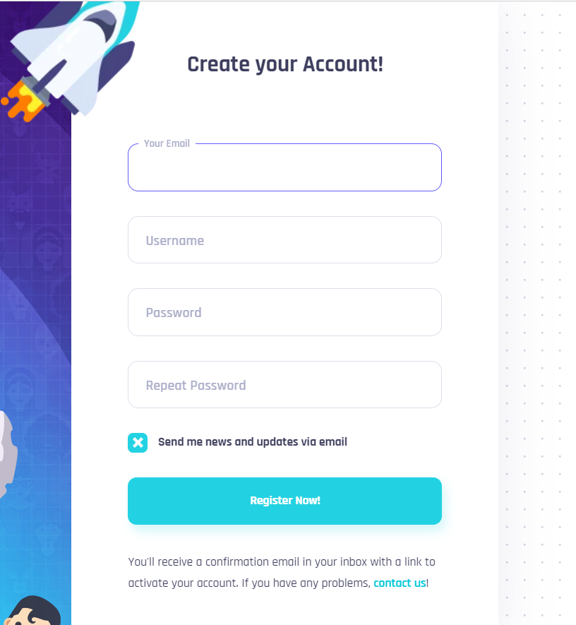
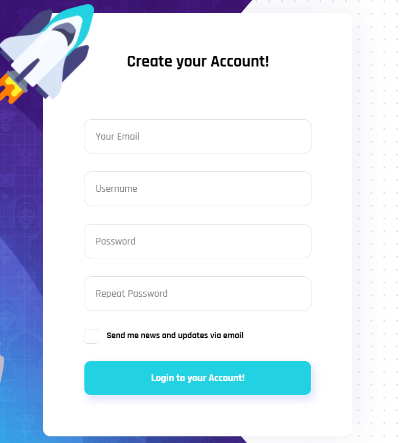
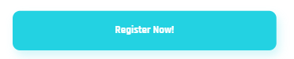

# Huy review bài tập về nhà buổi 16 - Lớp K5

## [Ngo Hoang Kim](https://github.com/kzau1612/FSK5/tree/main)

### [Day_14](https://kzau1612.github.io/FSK5/day_12/)

**[x] Bài 1: Màn hình min-width: 1501px**

**Bài làm tốt**

- Nên thêm thuộc tính: `autofocus` vào thẻ input đầu tiên để thuận tiện cho việc gõ hơn.

- Các icon hầu hết đều bé hơn bản mẫu. Icon facebook chưa giống với bản mẫu

- Có thể tham khảo và sử dụng [Font Awesome](https://fontawesome.com/) để tìm kiếm và sử dụng icon.

- Phần `landing__title` đang bị cách xa `logo` hơn so với bản mẫu do kích thước của ảnh gốc đang không khớp với icon cộng thêm với thuộc tính `margin-top: 36px;` ở class `landing__subtitle`

- Phẩn `landing-form__register` chưa có `form-text` như trong bản mẫu:

  - Bản mẫu:

    

  - Bài làm:

    

- Khi người dùng chuyển sang form đăng ký thì nội dung của thẻ `button` cần đổi thành **Register Now!** như bản mẫu.

  - Bản mẫu:

    

  - Bài làm:

    

[x] Bài 2: Màn hình max-width: 1500px

**Bài làm chưa tốt**

Chưa có responsive màn này.

[x] Bài 3: Màn hình max-width: 1365px

**Bài làm tốt**

- Khi ở màn này ảnh tên lửa ở đầu các **form** vẫn còn điều này sai so với bản mẫu.

- Khi chuyển **form** vẫn còn hiệu ứng chuyển tab điều này không giống so với bản mẫu và việc này không tốt cho trải nghiệm người dùng do khi chuyển sang màn hình `max-width: 1365px` vẫn đang để thuộc tính `transition` ở `landing-form__login` và `landing-form__register`

[x] Bài 4: Màn hình max-width: 600px

**Bài làm tốt**

- Nhận xét tương tự màn hình max-width: 1365px

[x] Bài 5: Màn hình max-width: 500px

**Bài làm tốt**

- Nhận xét tương tự màn hình max-width: 1365px

- [x] Đánh giá chung bài tập về nhà: Bài tập tốt, bài làm chưa có responsive màn hình max-width: 1500px, cần chú ý hơn các **breakpoint** ở bản mẫu để tránh responsive thiếu trường hợp. Nên áp dụng **grid-system** để responsive hiệu quả và dễ dàng hơn.

### [Day_15](https://kzau1612.github.io/FSK5/day_13/)

**[x] Màn hình Desktop:**

- `font-size` của thẻ `input` có `class` là **search\_\_input** đang bé hơn so với bản thiết kết nên thêm thuộc tính `font-size: 1.8rem;` vào `class` **search\_\_input**.

- Nên thay đổi `favicon` để giúp cho trang web chuyên nghiệp và hỗ trợ quá trình SEO một cách hiệu quả.

- Nên thêm `cursor: pointer` khi hover vào các ảnh để người dùng có cảm giác có thể ấn vào được.

**[x] Màn hình Tablet:**

- **Bài làm rất tốt**

**[x] Màn hình Mobile:**

- **Bài làm rất tốt**

**[x] Đánh giá chung**: Bài làm rất tốt màn hình mobile và tablet, tuy nhiên màn hình desktop lại đang bị lệch so với bản mẫu. Cần chú ý một số lỗi nhỏ để hoàn thiện bài tốt hơn.

## [Nguyen Tien Dat](https://github.com/tiendat211294/f8_offline_k5)

### [Day_14](https://tiendat211294.github.io/f8_offline_k5/buoi-12/bai-tap-buoi-12.html)

- Link file css chưa hợp lý

  ```html
  <link rel="stylesheet" href="css.css" />
  <link rel="stylesheet" href="grid.css" />
  ```

- Đề xuất sửa thành:

  ```html
  <link rel="stylesheet" href="./grid.css" />
  <link rel="stylesheet" href="./css.css" />
  ```

**[x] Bài 1: Màn hình min-width: 1501px**

- **Bài làm chưa tốt**

- Giao diện sai so với bản mẫu rất nhiều

- 2 phần này là chung 1 title, khi tách ra chúng không mang đủ ý nghĩa, ngoài ra nếu sử dụng `<h2>` ở đây sẽ sai ý nghĩa vì **Welcome** to không mang ý nghĩa nào cho bài này.

- **VIKINGER** nên để trong `<h1>` thay vì span vì ở đây nó mang ý nghĩa là tiêu đề chính của trang.

  ```html
  <h2>WELLCOME TO</h2>
  <span>VIKINGER</span>
  ```

- Nên thêm thuộc tính: `autofocus` vào thẻ input đầu tiên để thuận tiện cho việc gõ hơn.

**[x] Bài 2: Màn hình max-width: 1500px**

- **Bài làm tốt**

**[x] Bài 3: Màn hình max-width: 1365px**

- **Bài làm tốt**

**[x] Bài 4: Màn hình max-width: 600px**

- **Bài làm tốt**

**[x] Bài 5: Màn hình max-width: 500px**

- **Bài làm tốt**

**[x] Đánh giá chung bài tập về nhà**: Bài làm khá tốt, tuy nhiên bài làm vẫn còn nhiều chỗ chưa chỉnh chu, sai giao diện so với bản mẫu, cần xử lý phần input đầu tiên của các form autofocus như bản mẫu. Chú ý hơn đến **senmatic** và thứ tự `link` các file `css`.

### [Day_15](https://tiendat211294.github.io/f8_offline_k5/buoi-15/)

**[x] Màn hình Desktop:**

- Màn hình desktop đang bị lệch hoàn toàn so với bản mẫu do set `width: 1500px;` trong `class` **home-page**

- Khoảng cách giữa phần **sidebar** với phần **header** và phần **main** đang bằng 0 do thuộc tính `gap: 0px 0px;` trong class **home-page**, nên set lại khoảng cách thành `gap: 0px 38px;`.

- Nên thay đổi `favicon` để giúp cho trang web chuyên nghiệp và hỗ trợ quá trình SEO một cách hiệu quả.

**[x] Màn hình Tablet:**

- Phần **navigation** của **header** có thể ẩn đi và chỉ hiện ra khi người dùng cần hoặc có thể giữ nguyên `flex-direction` mặc định thay vì chuyển thành `flex-direction: column;` và tăng thêm `width` của `class` **search**.

**[x] Màn hình Mobile:**

- Chưa có responsive màn này.

**[x] Đánh giá chung**: Bài làm tốt giao diện Tablet, tuy nhiên chưa có responsive màn hình Mobile và màn Desktop đang bị lệch so với bản mẫu. Cần xem lại màn Desktop và responsive màn Mobile.

## [Le Duc Anh](https://github.com/ducanhprogram/f8-fullstack-k5)

### [Day_14]()

**Chưa nộp**

### [Day_15](https://ducanhprogram.github.io/f8-fullstack-k5/Day-13/)

**[x] Màn hình Desktop**

- **Bài làm rất tốt**

**[x] Màn hình Tablet**

- **Bài làm tốt**

- Phần `nav` của `sidebar` đang có khoảng cách khá lớn với phần `main`

- Nên sửa lại thuộc tính `position: sticky;` ở `class` **chat-btn** thành `position: fixed;` để cố định vị trí của **chat-btn** trên **viewport** giúp người dùng có thể dễ dàng truy cập khi cần dùng đến.

**[x] Màn hình Mobile**

- **Bài làm chưa tốt**

- Chưa có responsive màn này

**[x] Đánh giá chung**: Bài làm chưa có responsive cho màn hình Mobile, cần sửa lại lại một số lỗi nhở ở màn hình Tablet để hoàn thiện bài tốt hơn, giao diện trên desktop làm rất tốt.

## [Nguyen Van Thang](https://github.com/nvThang391/F8-FSK5)

### [Day_14](https://nvthang391.github.io/F8-FSK5/Day_12/bai1.html)

**[x] Bài 1: Màn hình min-width: 1501px**

- **Bài làm tốt\***

- Icon logo không đúng, có thể inspect lên lấy ở bản mẫu, hoặc sử dụng một extension là SVG export để lấy dễ hơn.

- Nên thêm thuộc tính: `autofocus` vào thẻ input đầu tiên để thuận tiện cho việc sử dụng hơn

- 2 phần này là chung 1 title, khi tách ra chúng không mang đủ ý nghĩa, ngoài ra nếu sử dụng `<h2>` ở đây sẽ sai ý nghĩa vì **Welcome** to không mang ý nghĩa nào cho bài này.

  ```html
  <h2 class="landing-info-subtitle">WELCOME TO</h2>
  <h1 class="landing-info-title">VIKINGER</h1>
  ```

**[x] Bài 2: Màn hình max-width: 1500px**

- **Bài làm chưa tốt**

- Responsive màn này sai hoàn toàn so với bản mẫu.

**[x] Bài 3: Màn hình max-width: 1365px**

- **Bài làm tốt\***

- Khi ở màn này ảnh tên lửa ở đầu các **form** vẫn còn điều này sai so với bản mẫu.

**[x] Bài 4: Màn hình max-width: 600px**

- **Bài làm chưa tốt**

- Chưa có responsive màn này.

**[x] Bài 5: Màn hình max-width: 500px**

- **Bài làm chưa tốt**

- Chưa có responsive màn này.

**[x] Đánh giá chung bài tập về nhà**: Bài làm khá tốt, cần chú ý các breakpoint như bản mẫu để tránh responsive thiếu trường hợp và cần xử lý phần input đầu tiên của các form autofocus như bản mẫu. Nên áp dụng **grid-system** để responsive hiệu quả và dễ dàng hơn. Nên tạo folders **images** để chứa các ảnh và nên đổi lại tên ảnh để dễ dàng quản lý hơn.

### [Day_15](https://nvthang391.github.io/F8-FSK5/Day_15/)

**[x] Màn hình Desktop:**

- Khoảng cách giữa phần **sidebar** với phần **header** và phần **main** đang bằng 0 do thuộc tính `gap: 0px 0px;` trong class **container**, nên set lại khoảng cách thành `gap: 0px 38px;`.

- Phần **sidebar** chỉ đang có `padding` trên dưới `padding: 53px 0 62px 0;` chưa có `padding` bên trái.

- Chiều cao của **header** đang là `height: 100px;` thấp hơn so với bản thiết kết nên đặt lại chiều cao thành `128px`.

- `font-size` của thẻ `input` trong **search-form** đang là `1.6rem` bé hơn so với bản thiết kết nên sửa lại thành `1.8rem`.

- Nên thêm `class` **active** vào thẻ `li` chứa tên trang đang được hiển thị và có thể thêm css cho phần tử giả `after` của thẻ `li` nào có class **active** thuộc tính `width: 100%;` để người dùng có thể dễ dàng biết được đang ở trang nào trong website.

- Một số ảnh đang không giống trong bản thiết kết, có thể bật **dev mode** và export từ **Figma** để có được ảnh chính xác.

- Bài làm chưa có responsive.

**[x] Đánh giá chung:** **Bài làm chưa tốt**, chưa responsive cho màn hình tablet, mobile, giao diện trên desktop chưa sát với thiết kế.

## [Bui Minh Chi](https://github.com/ronbanh549/f8-fullstack-k5)

### [Day_14](https://ronbanh549.github.io/f8-fullstack-k5/Day-12/index.html)

**[x] Bài 1: Màn hình min-width: 1501px**

- **Bài làm tốt**

- Nên thêm thuộc tính: `autofocus` vào thẻ input đầu tiên để thuận tiện cho việc gõ hơn.

- Các icon hầu hết đều bé hơn bản mẫu. Icon facebook chưa giống với bản mẫu

- Phần `landing__title` đang bị cách xa `logo` hơn so với bản mẫu do kích thước của ảnh gốc đang không khớp với icon cộng thêm với thuộc tính `margin-top: 36px;` ở class `landing__subtitle`

**[x] Bài 2: Màn hình max-width: 1500px**

- **Bài làm tốt**

**[x] Bài 3: Màn hình max-width: 1365px**

- **Bài làm chưa tốt**

- Màn hình `width: 850px` trở xuống giao diện đang bị lệch hoàn toàn so với bản mẫu do thẻ có `class` **section-landing** đang có thuộc tính `position: static;`;

**[x] Bài 4: Màn hình max-width: 600px**

- **Bài làm chưa tốt**

- Nhận xét tương tự như màn hình max-width: 1365px

**[x] Bài 5: Màn hình max-width: 500px**

- **Bài làm chưa tốt**

- Nhận xét tương tự như màn hình max-width: 1365px

**[x] Đánh giá chung bài tập về nhà:** Bài tập làm tốt màn hình `min-width: 1501px` và `max-width: 1500px`, cần xem lại bài làm từ màn hình `max-width: 1365px` trở xuống và cần xử lý phần `autofocus` của input ở các form. Nên áp dụng **grid-system** để responsive hiệu quả và dễ dàng hơn.

### [Day_15]()

**Chưa nộp**

## [Luu Ngoc Duong](https://github.com/duongluu9898/f8-duongluu-fullstack-k5)

### [Day_14](https://duongluu9898.github.io/f8-duongluu-fullstack-k5/day12/html/baitap1.html)

- **Bài làm chưa tốt**

- Giao diện lệch hoàn toàn so với bản mẫu

**[x] Đánh giá chung bài tập về nhà:** **Bài làm chưa tốt**

### [Day_15](https://duongluu9898.github.io/f8-duongluu-fullstack-k5/day15/)

**[x] Màn hình Desktop:**

- **Bài làm rất tốt**

**[x] Màn hình Tablet:**

- **Bài làm rất tốt**

- Mũi tên hiển thị phần **sidebar** khi **sidebar** được hiển thị có thể chuyển thành hướng sang bên trái.

**[x] Màn hình Mobile:**

- **Bài làm tốt**

- Các ảnh trong phần **main** đang không hiển thị được toàn bộ ảnh gốc do các thẻ `img` ở trong thẻ `main` đang có thuộc tính `height: 300px`;

**[x] Đánh giá chung:** **Bài làm tốt\***, tuy nhiên bài làm đang có quá nhiều **Media Query** với các **Break Point** giống nhau trong một file điều này không hợp lý. Trong trường hợp này nên hoàn thiện xong toàn bộ giao diện sau đó thì thực hiện **responsive** một thể cho toàn bộ trang web. Nếu muốn **responsive** riêng cho từng thành phần(header, sidebar, main,...) thì nên tách ra thành từng file(ví dụ: **\_header.scss**, **\_sidebar.scss**, **\_main.scss**, ..) rồi sau đó `import` vào một file duy nhất(trong bài làm thì sẽ là file **style.scss**).
