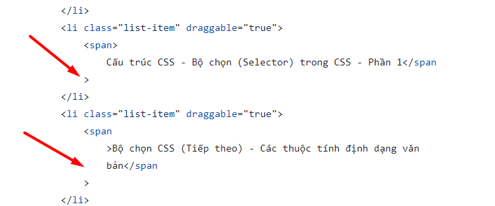
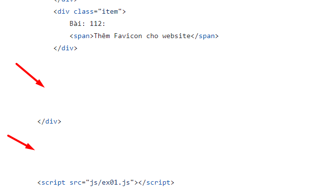
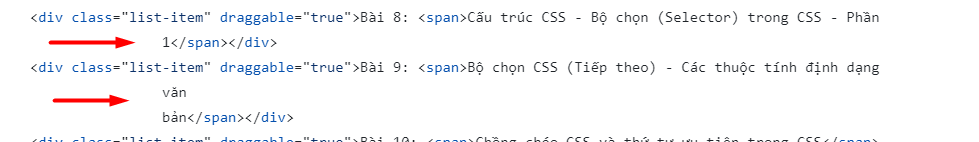

# Review bài tập về nhà buổi 33 - Lớp FullStack K8

## [Trung Tuyen](https://ptt-fullstack.github.io/JavaScript-F8/DAY-33/sortable.html)

- Các dấu lớn hơn và nhỏ hơn của các thẻ đóng và thẻ mở cần nằm trên cùng một dòng

  

- Đặt tên hàm là `render2` không mô tả rõ chức năng của nó. Tên hàm nên diễn đạt mục đích hoặc chức năng của nó để người đọc dễ hiểu và bảo trì code dễ dàng hơn.

- Cả hai hàm `render` và `render2` đều có cùng logic cơ bản: duyệt qua các phần tử trong danh sách và cập nhật text cho chúng. Sự khác biệt duy nhất là cách thức chèn (insertBefore) và thay thế (replaceChild) nội dung. Nên tạo một hàm duy nhất với một tham số để chỉ định liệu cần chèn mới hoặc thay thế nội dung. Điều này giúp tránh lặp mã và làm cho code dễ bảo trì hơn.

  Đề xuất sửa:

  ```js
  // Updates the display text of list items
  function updateListItems(replace = false) {
    const subTask = Array.from(
      list.querySelectorAll(".list-item:not(.active)")
    );
    const topic = Array.from(list.querySelectorAll(".list-item.active"));

    topic.forEach(function (task, index) {
      var span = task.firstChild;
      const textNode = document.createTextNode(`Module ${index + 1}:`);
      if (replace) {
        task.replaceChild(textNode, span);
      } else {
        task.insertBefore(textNode, span);
      }
    });

    subTask.forEach(function (task, index) {
      var span = task.firstChild;
      const textNode = document.createTextNode(`Bài ${index + 1}:`);
      if (replace) {
        task.replaceChild(textNode, span);
      } else {
        task.insertBefore(textNode, span);
      }
    });
  }
  ```

- **Điểm mạnh:**

- Thực hiện chức năng kéo thả một cách hiệu quả với việc sử dụng các sự kiện `dragstart`, `dragend`, và `dragover`.

- Xử lý cập nhật hiển thị lại nội dung hiển thị của các phần tử trong danh sách rất tốt.

- Sử dụng `querySelector` và `querySelectorAll`: Giúp truy cập và thao tác với các phần tử `DOM` một cách hiệu quả và rõ ràng.

- Sử dụng `Array.from` và các phương thức mảng: Giúp chuyển đổi `NodeList` thành mảng và sử dụng các phương thức mảng như `forEach` một cách hiệu quả.

- **Điểm yếu:**

- Lặp logic trong hàm `render` và `render2`: Hai hàm này có logic gần như tương tự nhau, gây ra sự lặp code không cần thiết.

- Đặt tên hàm không rõ ràng: Tên hàm `render2` không rõ ràng về mục đích và chức năng của nó.

- [x] **Đánh giá chung:** Bài làm tốt, tuy nhiên cần chú ý một số góp ý nêu trên để hoàn thiện hơn.

`Note: Anh sửa lại bài làm theo nhận xét rồi sau đó báo lại cho em để em kiểm tra lại nha.`

## [Nguyen Xuan Phong](https://xuanphong03.github.io/Fullstack-F8-Javascript/day-33/index.html)

- Không có bất kỳ `requestAnimationFrame` nào và `animationFrameId` cũng không được khai báo hoặc sử dụng trước đó. Điều này dẫn đến việc `cancelAnimationFrame(animationFrameId)` sẽ không thực hiện được chức năng gì và có thể gây lỗi hoặc làm cho đoạn mã khó hiểu hơn.

## [Bui Duc Duong](https://buiduong2.github.io/F8-Javascript/lession32/)

- Các chương học và các bài học được thể hiện dưới dạng danh sách do vậy nên sử dụng các thẻ `ul, li` thay vì sử dụng thẻ `div`.

- Nội dung của thẻ `title` nên được chỉnh sửa lại sao cho phù hợp với trang web để hỗ trợ quá trình SEO một cách hiệu quả.

- Khi kéo quá nhanh các bài học qua các chương và sau đó nhả chuột một cách đột ngột tại một vị trí bất kì chứ không kéo rồi thả từ từ tại một vị trí lựa chọn thì `background-color` thể hiện các chương có thể sẽ không được hiển thị chính xác, không chỉ vậy các chương và các bài học cũng không được tự động đánh số thứ tự khi sắp xếp lại do sự kiện `drop` chỉ xảy ra khi một lựa chọn có thể kéo được thả vào mục tiêu, thay vì sử dụng sự kiện `drop` thì trong trường hợp này nên sử dụng `dragend` vì nó sẽ xảy ra khi quá trình kéo kết thúc, bất kể là thành công (được thả vào khu vực mục tiêu) hay không (bị thả ra ngoài khu vực mục tiêu).

- **Điểm mạnh:**

- Sử dụng biến toàn cục hợp lý: Các biến toàn cục như `QUERY_STRING_DRAG_ITEM`, `QUERY_STRING_DRAG_ITEM_ID`, `PREFIX_GROUP_ID`, và `CLASS_DRAGGING` được định nghĩa rõ ràng và có ý nghĩa, giúp dễ hiểu và bảo trì.

- Tổ chức mã logic: Đoạn mã được chia thành các hàm riêng biệt như `getAllIdEl()` và `indexingAllDragElement()`, giúp mã dễ đọc và dễ quản lý.

- Xử lý sự kiện tốt: Sử dụng `addEventListener` để thêm sự kiện `dragstart`, `dragover` để kéo các phần tử.

- **Điểm yếu:**

- Có lỗi chính tả trong thông báo lỗi, như `"NOt Found"` và `"structur define"`.

- Chưa phân biệt được sự khác nhau giữa `dragend` và `drop`.

- [x] **Đánh giá chung:** Bài làm tốt, tuy nhiên cần chú ý một số góp ý nêu trên để hoàn thiện hơn.

`Note: Anh sửa lại bài làm theo nhận xét rồi sau đó báo lại cho em để em kiểm tra lại nha.`

## [Nguyen Duc Nhat](https://nhat0712.github.io/F8-ex/Buoi_33/index.html)

- Các chương học và các bài học được thể hiện dưới dạng danh sách do vậy nên sử dụng các thẻ `ul, li` thay vì sử dụng thẻ `div`.

- Chưa thực hiện tự động đánh số thứ tự khi sắp xếp lại các chương và các bài học.

- Khi kéo thả các chương học hoặc bài học thì không thể kéo đến vị trí cuối cùng của danh sách do khi đó `elementCenter` luôn lớn hơn `currentY`.

- **Điểm mạnh:**

- Sử dụng sự kiện `DOMContentLoaded`: Việc sử dụng `DOMContentLoaded` đảm bảo đoạn mã chỉ chạy sau khi `DOM` đã được tải hoàn chỉnh, giúp tránh lỗi khi truy cập các phần tử chưa tồn tại.

- Sử dụng các sự kiện kéo và thả (drag and drop): Đoạn mã xử lý các sự kiện kéo (`dragstart`), thả (`dragend`), và di chuyển (`dragover`), cho phép sắp xếp lại các phần tử trong danh sách.

- Sử dụng `const` và `let` hợp lý: Sử dụng `const` cho các biến không thay đổi và `let` cho các biến có thể thay đổi giá trị, giúp mã nguồn rõ ràng và tránh lỗi không mong muốn.

- **Điểm yếu:**

- Vòng lặp kiểm tra tất cả các phần tử con của danh sách mỗi lần có sự kiện `dragover`, có thể gây hiệu suất kém khi danh sách có nhiều phần tử.

- Đặt tên biến không rõ ràng: Tên biến như `list`, `element` không mô tả rõ chức năng, khiến mã khó hiểu hơn.

- [x] **Đánh giá chung:** Cần dành nhiều thời gian hơn cho bài tập về nhà, chú ý thực hiện đủ yêu cầu bài tập và chủ động đặt câu hỏi cho trợ giảng để có thể giải quyết bài tập một cách tốt nhất.

`Note: Anh sửa lại bài làm theo nhận xét rồi sau đó báo lại cho em để em kiểm tra lại nha.`

## [Cu Tien Thinh](https://thinh060903.github.io/F8-Fullstack-K8/Day-33/index.html)

- Các chương học và các bài học được thể hiện dưới dạng danh sách do vậy nên sử dụng các thẻ `ul, li` thay vì sử dụng thẻ `div`.

- Chưa hiển thị bóng của các chương học, bài học khi kéo.

- Hiện tại bài làm đang thực hiện việc thay đổi vị trí của chương học, bài học được kéo khi lắng nghe được sự kiện `drop` tuy nhiên sự kiện `drop` chỉ xảy ra khi một lựa chọn có thể kéo được thả vào mục tiêu, do đó khi bị thả ra ngoài khu vực mục tiêu thì sẽ không thể đặt chương học, bài học vào vị trí mà người dùng mong muốn.

- **Điểm mạnh:**

- Sử dụng `DOMContentLoaded`: Đảm bảo mã chỉ chạy sau khi `DOM` đã được tải đầy đủ.

- Tách biệt các chức năng: Các chức năng kéo, thả, và cập nhật thứ tự được phân chia rõ ràng thành các hàm riêng biệt.

- Cập nhật thứ tự động: Hàm `updateOrder` tự động cập nhật thứ tự của các phần tử khi có sự thay đổi.

- **Điểm yếu:**

- Chưa thực sự hiểu về sự kiện `drop`.

- Chưa cẩn thận trong việc kiểm tra kỹ yêu cầu bài tập.

- [x] **Đánh giá chung:** Cần thực hiện đủ yêu cầu bài tập và chú ý một số góp ý nêu trên để hoàn thiện hơn.

`Note: Anh sửa lại bài làm theo nhận xét rồi sau đó báo lại cho em để em kiểm tra lại nha.`

## [Vu Thi Hoai Thu](https://hoaithu222.github.io/f8_offline_k8/homework/Day-33/ex01.html)

- Không để thừa các khoảng cách

  

- Các chương học và các bài học được thể hiện dưới dạng danh sách do vậy nên sử dụng các thẻ `ul, li` thay vì sử dụng thẻ `div`.

- Nội dung của thẻ `title` nên được chỉnh sửa lại sao cho phù hợp với trang web để hỗ trợ quá trình SEO một cách hiệu quả.

- **Điểm mạnh:**

- Đoạn mã cho phép kéo và thả các phần tử (`.item`) trong danh sách (`list`) với việc cập nhật vị trí các phần tử một cách chính xác.

- Cấu trúc rõ ràng: Các hàm được tách biệt rõ ràng với mục đích cụ thể (xử lý di chuyển, cập nhật tiêu đề, lấy phần tử sau khi kéo).

- **Điểm yếu:**

- Mỗi lần di chuyển chuột, toàn bộ danh sách phần tử được duyệt lại trong hàm `getDragAfterElement`, điều này có thể ảnh hưởng đến hiệu suất khi danh sách lớn.

- [x] **Đánh giá chung:** Bài làm tốt, tuy nhiên cần chú ý một số góp ý nêu trên để hoàn thiện hơn.

`Note: Chị sửa lại bài làm theo nhận xét rồi sau đó báo lại cho em để em kiểm tra lại nha.`

## [Vu Tri Tung](https://tungv62333.github.io/f8-offline-k8/Javascript/Lesson-33/ex01.html)

- Các chương học và các bài học được thể hiện dưới dạng danh sách do vậy nên sử dụng các thẻ `ul, li` thay vì sử dụng thẻ `div`.

- Chưa hiển thị bóng của các chương học, bài học khi kéo.

- Hiện tại bài làm đang thực hiện việc thay đổi vị trí của chương học, bài học được kéo khi lắng nghe được sự kiện `drop` tuy nhiên sự kiện `drop` chỉ xảy ra khi một lựa chọn có thể kéo được thả vào mục tiêu, do đó khi bị thả ra ngoài khu vực mục tiêu thì sẽ không thể đặt chương học, bài học vào vị trí mà người dùng mong muốn.

- Sử dụng `return` trong hàm `forEach` không có tác dụng như mong đợi, `forEach` luôn tiếp tục lặp qua tất cả các phần tử trong mảng và không dừng lại khi gặp `return`.

- Vị trí của các chương học sau khi được kéo thả chưa hiển thị chính xác.

- **Điểm yếu:**

- Lặp Lại Code: `clearListItems()`, `updateModules()`, và `updateLessons()` đều lặp lại việc chọn tất cả các phần tử .`list-item` và duyệt qua chúng. Cải thiện bằng cách tạo một hàm chung để lấy các phần tử `.list-item`.

- Việc xác định vị trí drop dựa vào `clientX` chia cho 500 có thể không chính xác nếu kích thước hoặc số lượng danh sách thay đổi. Một cách tốt hơn là sử dụng các phương pháp tính toán dựa trên kích thước động.

- Chưa thực sự hiểu về sự kiện `drop`.

- Chưa cẩn thận trong việc kiểm tra kỹ yêu cầu bài tập.

- [x] **Đánh giá chung:** Cần dành nhiều thời gian hơn cho bài tập về nhà, chú ý thực hiện đủ yêu cầu bài tập và chủ động đặt câu hỏi cho trợ giảng để có thể giải quyết bài tập một cách tốt nhất.

`Note: Anh sửa lại bài làm theo nhận xét rồi sau đó báo lại cho em để em kiểm tra lại nha.`

## [Le Nhung](https://nhunglt1801.github.io/f8-fullstack-k8-exercise/day-33/)

- Ngắt dòng chưa hợp lý

  

- Các chương học và các bài học được thể hiện dưới dạng danh sách do vậy nên sử dụng các thẻ `ul, li` thay vì sử dụng thẻ `div`.

- **Điểm mạnh:**

- Đoạn mã thực hiện chức năng kéo và thả các phần tử trong danh sách với sự xử lý hợp lý các sự kiện `dragstart`, `dragover` và `dragend`.

- Đoạn mã tách biệt các chức năng thành các hàm riêng biệt (`render`, `getMouseOffset`, `getHalfHeight`, `sortable`), giúp mã dễ đọc và bảo trì.

- [x] **Đánh giá chung:** Bài làm tốt, tuy nhiên cần chú ý một số góp ý nêu trên để hoàn thiện hơn.

`Note: Anh sửa lại bài làm theo nhận xét rồi sau đó báo lại cho em để em kiểm tra lại nha.`

##
