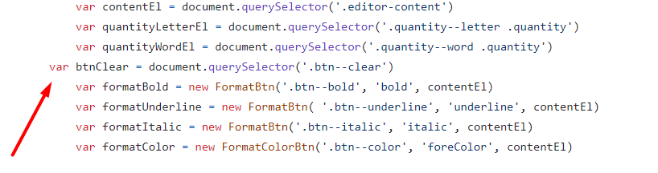

# Review bài tập về nhà buổi 34 - Lớp FullStack K8

## [Nguyen Xuan Phong](https://xuanphong03.github.io/Fullstack-F8-Javascript/day-34/homework/index.html)

- Xử lý cập nhật số từ chưa chính xác khi người dùng nhập một ký tự trở lên rồi sau đó nhập liên tiếp hoặc rất nhiều dấu cách thì số từ sẽ tăng lên cho dù người dùng không hề nhập tiếp những ký tự khác hoặc khi người dùng nhập một từ rồi sau đó xuống dòng để nhập từ tiếp theo thì số từ hiển thị trong bài làm vẫn giữ nguyên mà không tăng thêm, điều này xảy ra là do bài làm đang cập nhật số từ bằng cách cập nhật lại `wordsNumberEl.innerText = editorContent.split(" ").length;`, tuy nhiên nêu người dùng nhập vào nhiều khoảng trắng thì khi sử dụng hàm `split` để chia một chuỗi (editorContent) thành một mảng các chuỗi con, dựa trên một ký tự phân tách (delimiter) ở đây ký tự phân tách chính là khoảng trắng (" "), nếu như chuỗi đó có nhiều khoảng trắng thì khi chuyển thành mảng sẽ có những phần từ trong mảng đó là một khoảng trắng vậy nên số từ cũng sẽ tăng lên hoặc khi người dùng nhập là `abc` rồi sau đó xuống dòng nhập `xyz` thì khi sử dụng hàm `split` để chuyển thành mảng thì mảng đó sẽ có duy nhất một phần tử có giá trị là `abc\nxyz` do `\n` đại diện cho ký tự xuống dòng và nếu sử dụng `split(" ")` để chia chuỗi này thành mảng, nó chỉ tách chuỗi dựa trên khoảng trắng (dấu cách), không dựa trên ký tự xuống dòng do đó mảng chỉ có một phần tử và khi cập nhật số từ sẽ không tăng lên. Để giải quyết vấn đề này ta có thể sử dụng biểu thức chính quy để thay thế các khoảng trắng liên tiếp và ký tự dòng mới bằng một khoảng trắng và sử dụng hàm `trim()` để loại bỏ khoảng trắng thừa ở đầu và cuối.

  Đề xuất sửa:

  ```js
  var handleUpdateWordsNumber = function (editorContent = "") {
    if (!editorContent.trim()) {
      wordsNumberEl.innerText = 0;
      return;
    }
    editorContent = editorContent.trim().replace(/\s+/g, " ");
    wordsNumberEl.innerText = editorContent.split(" ").length;
  };
  ```

- Khi người dùng click vào `New` để tạo file mới chưa đổi lại tên file thành tên file mặc định.

- **Điểm mạnh:**

- Trình bày rõ ràng: Code được chia thành nhiều phần riêng biệt, dễ dàng theo dõi và hiểu các khối chức năng.

- Sử dụng comment: Các comment được sử dụng để giải thích chức năng của từng đoạn code, giúp người đọc dễ hiểu mục đích của từng đoạn mã.

- Các tên biến và hàm được đặt tên một cách mô tả, rõ ràng, giúp người đọc dễ hiểu mục đích và chức năng của chúng.

- Tìm hiểu và sử dụng tốt `Blob`, `document.execCommand()` và thư viện `html2pdf` để hoàn thành yêu cầu bài tập.

- **Điểm yếu:**

- Chưa kiểm tra kỹ những trường hợp có thể xảy ra.

- [x] **Đánh giá chung:** Bài làm tốt, tuy nhiên cần lưu ý một số góp ý nêu trên để hoàn thiện hơn.

`Note: Bạn sửa lại bài làm theo nhận xét rồi sau đó báo lại cho mình để mình kiểm tra lại nha.`

## [Trung Tuyen](https://ptt-fullstack.github.io/JavaScript-F8/DAY-34/index.html)

- Chưa xử lý sự kiện `paste` để chỉ dán văn bản thuần (plain text) vào một trình soạn thảo văn bản (text editor).

  Đề xuất sửa

  ```js
  // Xử lý sự kiện paste để chỉ dán văn bản thuần
  writingArea.addEventListener("paste", function (e) {
    e.preventDefault();
    var text = (e.clipboardData || window.clipboardData).getData("text");
    document.execCommand("insertText", false, text);
  });
  ```

- Khoảng trắng giữa các từ hay ký tự xuống dòng cũng được coi là ký tự và cần phải được đếm.

- **Điểm mạnh:**

- Trình bày rõ ràng: Code được chia thành nhiều phần riêng biệt, dễ dàng theo dõi và hiểu các khối chức năng.

- Sử dụng comment: Các comment được sử dụng để giải thích chức năng của từng đoạn code, giúp người đọc dễ hiểu mục đích của từng đoạn mã.

- Các tên biến và hàm được đặt tên một cách mô tả, rõ ràng, giúp người đọc dễ hiểu mục đích và chức năng của chúng.

- Tìm hiểu và sử dụng tốt `Blob`, `document.execCommand()` và thư viện `html2pdf` để hoàn thành yêu cầu bài tập.

- **Điểm yếu:**

- Chưa kiểm tra kỹ những trường hợp có thể xảy ra.

- [x] **Đánh giá chung:** Bài làm rất tốt, tuy nhiên cần lưu ý một số góp ý nêu trên để hoàn thiện hơn.

`Note: Anh sửa lại bài làm theo nhận xét rồi sau đó báo lại cho em để em kiểm tra lại nha.`

## [Bui Duc Duong](https://buiduong2.github.io/F8-Javascript/lession33/)

- Thụt lề chưa hợp lý

  

- Chưa xử lý sự kiện `paste` để chỉ dán văn bản thuần (plain text) vào một trình soạn thảo văn bản (text editor).

  Có thể tham khảo đoạn code sau:

  ```js
  // Xử lý sự kiện paste để chỉ dán văn bản thuần
  writingArea.addEventListener("paste", function (e) {
    e.preventDefault();
    var text = (e.clipboardData || window.clipboardData).getData("text");
    document.execCommand("insertText", false, text);
  });
  ```

- Khi người dùng click vào `New` để tạo file mới chưa đổi lại tên file thành tên file mặc định.

- Khi người dùng nhập dữ liệu trên nhiều dòng rồi sau đó bấm tổ hợp phím `Ctrl + A` và bấm xóa toàn bộ thì số ký tự hiển thị vẫn là 1.

- **Điểm mạnh:**

- Mã có nhiều hàm riêng biệt để xử lý các chức năng cụ thể như `countWord()`, `countLetter()`, `addActiveClassBtnByCurrentSelect()`, `removeAllBtnActiveClass()`, và `getSelectedNode()`.

- Tìm hiểu và sử dụng tốt `Blob`, `document.execCommand()` và thư viện `html2pdf` để hoàn thành yêu cầu bài tập.

- **Điểm yếu:**

- Chưa kiểm tra kỹ những trường hợp có thể xảy ra.

- Mặc dù có một số comment, chúng chỉ có ở một vài vị trí và không giải thích chi tiết các chức năng phức tạp hơn. Các hàm như `countWord()` và `addActiveClassBtnByCurrentSelect()` sẽ cần thêm comment để giải thích logic bên trong.

- [x] **Đánh giá chung:** Bài làm tốt, tuy nhiên cần lưu ý một số góp ý nêu trên để hoàn thiện hơn.

`Note: Anh sửa lại bài làm theo nhận xét rồi sau đó báo lại cho em để em kiểm tra lại nha.`

## [Vu Tri Tung](https://tungv62333.github.io/f8-offline-k8/Javascript/Lesson-34/ex01.html)

- Chưa xử lý sự kiện `paste` để chỉ dán văn bản thuần (plain text) vào một trình soạn thảo văn bản (text editor).

  Đề xuất sửa:

  ```js
  // Xử lý sự kiện paste để chỉ dán văn bản thuần
  editor.addEventListener("paste", function (e) {
    e.preventDefault();
    var text = (e.clipboardData || window.clipboardData).getData("text");
    document.execCommand("insertText", false, text);
  });
  ```

- Chưa xử lý case khi click vào nút **file** sẽ hiện ra một menu trong đó có thể chọn tạo file mới, lưu file dưới dạng `TXT` hoặc `PDF`, hiện bài làm đang xử lý bấm vào nút sẽ thực hiện lưu file dưới dạng `PDF` và chưa thay đổi được tên file.

- **Điểm yếu:**

- Chưa kiểm tra kỹ những trường hợp có thể xảy ra.

- Chưa thực hiện đầy đủ yêu cầu của bài tập.

- [x] **Đánh giá chung:** Cần chú ý thực hiện đúng yêu cầu bài tập, chủ động đặt câu hỏi cho trợ giảng để có thể giải quyết bài tập một cách tốt nhất.

`Note: Anh sửa lại bài làm theo nhận xét rồi sau đó báo lại cho em để em kiểm tra lại nha.`

## [Vu Thi Hoai Thu](https://hoaithu222.github.io/f8_offline_k8/homework/Day-34/ex01.html)

- Khi người dùng nhập dữ liệu trên nhiều dòng rồi sau đó bấm tổ hợp phím `Ctrl + A` và bấm xóa toàn bộ thì số ký tự hiển thị vẫn là 1.

- Chưa xử lý sự kiện `paste` để chỉ dán văn bản thuần (plain text) vào một trình soạn thảo văn bản (text editor).

  Đề xuất sửa:

  ```js
  // Xử lý sự kiện paste để chỉ dán văn bản thuần
  content.addEventListener("paste", function (e) {
    e.preventDefault();
    var text = (e.clipboardData || window.clipboardData).getData("text");
    document.execCommand("insertText", false, text);
  });
  ```

- Khi người dùng click vào `New` để tạo file mới chưa reset lại toàn bộ mọi thứ (tên file, nội dung, số từ, số ký tự).

- **Điểm mạnh:**

- Trình bày rõ ràng: Code được chia thành nhiều phần riêng biệt, dễ dàng theo dõi và hiểu các khối chức năng.

- Các tên biến và hàm được đặt tên một cách mô tả, rõ ràng, giúp người đọc dễ hiểu mục đích và chức năng của chúng.

- Tìm hiểu và sử dụng tốt `Blob`, `document.execCommand()` và thư viện `html2pdf` để hoàn thành yêu cầu bài tập.

- **Điểm yếu:**

- Chưa kiểm tra kỹ những trường hợp có thể xảy ra.

- Chưa thực hiện đầy đủ yêu cầu của bài tập.

- [x] **Đánh giá chung:** Bài làm khá tốt, tuy nhiên cần chú ý thực hiện đúng yêu cầu bài tập. Việc viết toàn bộ mã HTML và CSS trong một file có thể gây khó khăn cho việc bảo trì và quản lý mã. Nên tách riêng HTML và CSS thành các file riêng biệt. Điều này giúp mã dễ đọc hơn, dễ bảo trì hơn.

`Note: Chị sửa lại bài làm theo nhận xét rồi sau đó báo lại cho em để em kiểm tra lại nha.`

## [Cu Tien Thinh](https://thinh060903.github.io/F8-Fullstack-K8/Day-34/index.html)

- Khi người dùng nhập dữ liệu rồi sau đó bấm tổ hợp phím `Ctrl + A` và bấm xóa toàn bộ, xóa bằng từng ký tự cho đến hết hoặc click vào `New` để tạo file mới thì số ký tự hiển thị vẫn là 1.

- Chưa xử lý sự kiện `paste` để chỉ dán văn bản thuần (plain text) vào một trình soạn thảo văn bản (text editor).

  Đề xuất sửa:

  ```js
  // Xử lý sự kiện paste để chỉ dán văn bản thuần
  const editor = document.getElementById("editor");
  editor.addEventListener("paste", function (e) {
    e.preventDefault();
    var text = (e.clipboardData || window.clipboardData).getData("text");
    document.execCommand("insertText", false, text);
  });
  ```

- **Điểm mạnh:**

- Tìm hiểu và sử dụng tốt `Blob`, `document.execCommand()` và thư viện `html2pdf` để hoàn thành yêu cầu bài tập.

- **Điểm yếu:**

- Chưa kiểm tra kỹ những trường hợp có thể xảy ra.

- [x] **Đánh giá chung:** Bài làm tốt, tuy nhiên cần lưu ý một số góp ý nêu trên để hoàn thiện hơn.

`Note: Anh sửa lại bài làm theo nhận xét rồi sau đó báo lại cho em để em kiểm tra lại nha.`
