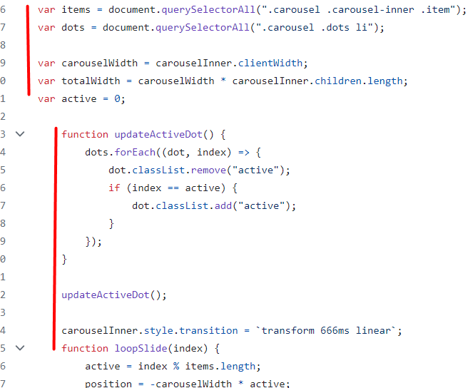

# Review bài tập về nhà buổi 32 - Lớp FullStack K9

## [Manh Vu](https://dauphaimanh.github.io/Home_K9/29-7-31/index.html?)

- Bài làm đang fix cứng các `dot` ở bên HTML, điều này là không nên vì nếu như thêm 1 ảnh thì phải vào file HTML để tạo thêm một 1 `dot` nữa, các `dot` cần phải được xử lý bằng `JavaScript` để render một cách tự động để khi thêm một ảnh mới thì một `dot` mới sẽ tự động được sinh ra.

- Thụt lề chưa hợp lý

  

- Các nút action khi click không còn tác dụng, nên thêm 1 trạng thái disabled cho nó để user dễ nhận biết hơn.

- Chưa thực hiện tính năng vuốt chuyển slide.

- [x] **Điểm yếu:**

- Chưa cần thận trong việc kiểm tra yêu cầu bài tập.

- Trình bày code chưa tốt.

- [x] **Đánh giá chung:** Bài làm chưa tốt, cần dành nhiều thời gian hơn cho bài tập và chủ động đặt câu hỏi cho trợ giảng để có thể giải quyết bài tập một cách tốt nhất.

`Note: Anh sửa lại bài làm theo nhận xét rồi sau đó báo lại cho em để em kiểm tra lại nha.`

## [Doan Manh Long](https://mlogg27.github.io/f8_fullstackoff_k9/Day_29/ex01.html)

- Các nút action khi click không còn tác dụng, nên thêm 1 trạng thái disabled cho nó để user dễ nhận biết hơn.

- [x] **Điểm mạnh:**

- Đoạn mã triển khai các chức năng cơ bản của carousel, bao gồm di chuyển qua lại giữa các mục bằng cách nhấp vào các nút, điều hướng bằng các chấm, và kéo thả các mục.

- Các biến, hàm và các thành phần khác được đặt tên một cách rõ ràng và dễ hiểu.

- Xử lý logic tốt.

- [x] Đánh giá chung: **Bài làm rất tốt**.

`Note: Anh sửa lại bài làm theo nhận xét rồi sau đó báo lại cho em để em kiểm tra lại nha.`

## [Dinh Tien Thanh](https://kirothanh.github.io/f8-fullstack-k9-homework/Day-30/index.html)\

- Các nút action khi click không còn tác dụng, nên thêm 1 trạng thái disabled cho nó để user dễ nhận biết hơn.

- [x] **Điểm mạnh:**

- Đoạn mã triển khai các chức năng cơ bản của carousel, bao gồm di chuyển qua lại giữa các mục bằng cách nhấp vào các nút, điều hướng bằng các chấm, và kéo thả các mục.

- Các biến, hàm và các thành phần khác được đặt tên một cách rõ ràng và dễ hiểu.

- Xử lý logic tốt.

- [x] Đánh giá chung: **Bài làm rất tốt**.

`Note: Anh sửa lại bài làm theo nhận xét rồi sau đó báo lại cho em để em kiểm tra lại nha.`

## [Do Kien Trung](https://geinjr.github.io/btvn-f8-b30/)

- Các nút action khi click không còn tác dụng, nên thêm 1 trạng thái disabled cho nó để user dễ nhận biết hơn.

- Bài làm chưa xử lý case khi người dùng chưa kéo đến một ngưỡng nhất định thì không chuyển slide và quay lại slide hiện tại kèm theo hiệu ứng.

- [x] **Điểm mạnh:**

- Các biến, hàm và các thành phần khác được đặt tên một cách rõ ràng và dễ hiểu.

- Xử lý logic tốt.

- [x] **Điểm yếu:**

- Chưa cần thận trong việc kiểm tra yêu cầu bài tập.

- [x] Đánh giá chung: **Bài làm tốt**.

`Note: Anh sửa lại bài làm theo nhận xét rồi sau đó báo lại cho em để em kiểm tra lại nha.`

## [Nguyen Xuan Hoang](https://nxhoang-271199.github.io/f8_fullstack_k9/Day_29/bai29.html)

- Các nút action khi click không còn tác dụng, nên thêm 1 trạng thái disabled cho nó để user dễ nhận biết hơn.

- Hiện bài làm đang xử lý tính năng vuốt chuyển slide chưa được mượt mà do khi lắng nghe sự kiện `mousedown` từ phía người dùng chưa thực hiện việc ngăn chặn hành vi mặc định (kéo thả hình ảnh) khi người dùng nhấn và giữ chuột trên một thẻ `img` .

- [x] **Điểm mạnh:**

- Đoạn mã triển khai các chức năng cơ bản của carousel, bao gồm di chuyển qua lại giữa các mục bằng cách nhấp vào các nút, điều hướng bằng các chấm, và kéo thả các mục.

- Các biến, hàm và các thành phần khác được đặt tên một cách rõ ràng và dễ hiểu.

- Xử lý logic tốt.

- [x] Đánh giá chung: **Bài làm rất tốt**.

`Note: Anh sửa lại bài làm theo nhận xét rồi sau đó báo lại cho em để em kiểm tra lại nha.`

## [Nguyen Ngoc Hao](https://ngochao22.github.io/f8-fullstack-k9/exercise/day29/)

- Các nút action khi click không còn tác dụng, nên thêm 1 trạng thái disabled cho nó để user dễ nhận biết hơn.

- Chưa thực hiện tính năng vuốt chuyển slide.

- [x] **Điểm yếu:**

- Chưa cần thận trong việc kiểm tra yêu cầu bài tập.

- Trình bày code chưa tốt.

- [x] **Đánh giá chung:** Bài làm chưa tốt, cần dành nhiều thời gian hơn cho bài tập và chủ động đặt câu hỏi cho trợ giảng để có thể giải quyết bài tập một cách tốt nhất.

`Note: Anh sửa lại bài làm theo nhận xét rồi sau đó báo lại cho em để em kiểm tra lại nha.`

## [Tran Hong Son](https://shanchen6.github.io/F8_Offline_FSK9_Now_Or_Never/Day_29/)

- Bài làm đang fix cứng các `dot` ở bên HTML, điều này là không nên vì nếu như thêm 1 ảnh thì phải vào file HTML để tạo thêm một 1 `dot` nữa, các `dot` cần phải được xử lý bằng `JavaScript` để render một cách tự động để khi thêm một ảnh mới thì một `dot` mới sẽ tự động được sinh ra.

- Các nút action khi click không còn tác dụng, nên thêm 1 trạng thái disabled cho nó để user dễ nhận biết hơn.

- Điều kiện `if ((active = 1 < 0))` trong sự kiện `prev.onclick` thừa một ngoặc đơn, cần sửa thành `if (active - 1 < 0)`.

- [x] **Điểm mạnh:**

- Đoạn mã triển khai các chức năng cơ bản của carousel, bao gồm di chuyển qua lại giữa các mục bằng cách nhấp vào các nút, điều hướng bằng các chấm, và kéo thả các mục.

- Các biến, hàm và các thành phần khác được đặt tên một cách rõ ràng và dễ hiểu.

- Xử lý logic tốt.

- [x] **Điểm yếu:**

- Gọi `clearInterval` và `setInterval` nhiều lần trong hàm `reloadSlider` có thể gây ra vấn đề hiệu suất và logic không mong muốn.

- [x] Đánh giá chung: **Bài làm rất tốt**, tuy nhiên cần lưu ý một số góp ý nêu trên để hoàn thiện hơn.

`Note: Anh sửa lại bài làm theo nhận xét rồi sau đó báo lại cho em để em kiểm tra lại nha.`

## [Phan Van Hiep](https://phanhiep02.github.io/F8O-K9/Day-30/bai-4/)

- Các nút action khi click không còn tác dụng, nên thêm 1 trạng thái disabled cho nó để user dễ nhận biết hơn.

- [x] **Điểm mạnh:**

- Đoạn mã triển khai các chức năng cơ bản của carousel, bao gồm di chuyển qua lại giữa các mục bằng cách nhấp vào các nút, điều hướng bằng các chấm, và kéo thả các mục.

- Các biến, hàm và các thành phần khác được đặt tên một cách rõ ràng và dễ hiểu.

- Xử lý logic tốt.

- [x] Đánh giá chung: **Bài làm rất tốt**.

## [Dao Van Son](https://sown1510.github.io/f8-fullstack-k9/Day29/)

- Các nút action khi click không còn tác dụng, nên thêm 1 trạng thái disabled cho nó để user dễ nhận biết hơn.

- [x] **Điểm mạnh:**

- Đoạn mã triển khai các chức năng cơ bản của carousel, bao gồm di chuyển qua lại giữa các mục bằng cách nhấp vào các nút, điều hướng bằng các chấm, và kéo thả các mục.

- Các biến, hàm và các thành phần khác được đặt tên một cách rõ ràng và dễ hiểu.

- Xử lý logic tốt.

- [x] Đánh giá chung: **Bài làm rất tốt**.

## [Pham Son](https://phamson35415.github.io/F8_fullstack_K9/DOM/eventObject/baitap2/)

- Các nút action khi click không còn tác dụng, nên thêm 1 trạng thái disabled cho nó để user dễ nhận biết hơn.

- Chưa thực hiện tính năng vuốt chuyển slide.

- Biến `test` và `x` được khai báo nhưng không sử dụng, tạo ra sự dư thừa không cần thiết.

- Tên biến `nextbnt` và `prevbnt` nên được viết đúng chính tả là `nextBtn` và `prevBtn`.

- [x] **Điểm yếu:**

- Chưa cần thận trong việc kiểm tra yêu cầu bài tập.

- [x] **Đánh giá chung:** Bài làm chưa tốt, cần dành nhiều thời gian hơn cho bài tập và chủ động đặt câu hỏi cho trợ giảng để có thể giải quyết bài tập một cách tốt nhất.

`Note: Anh sửa lại bài làm theo nhận xét rồi sau đó báo lại cho em để em kiểm tra lại nha.`
