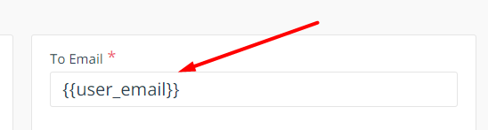

# Review bài tập về nhà buổi 48 - Lớp FullStack K6

## [Phan Van Hai](https://react-04-six.vercel.app/)

- **Chức năng đăng nhập, đăng xuất**

  - Khi **logout** chưa có **loading** có thể khiến user khi click lần đầu tiên tưởng chưa được và họ có thể sẽ click liên tục trong khoảng thời gian đợi đó.

  - Đề xuất sửa:

  ```js
  const { logout, isAuthenticated, isLoading } = useAuth0();
  if (isLoading) {
    return <div className="text-center">Vui lòng chờ đợi...</div>;
  }
  ```

  - Có thể tìm hiểu thêm về **setting** của `Auth0` để có thể thay đổi được ảnh và **text heading** ở `popup` hiện lên khi đăng nhập.

- **Chức năng gửi email**

  - Bài làm chưa thực hiện `validate` ở cả hai trường (trường nhập **email** và trường nhập tin nhắn về việc cần hỗ trợ).

  - Các trường hợp cần `validate`:

    - Không nhập **email**.

    - Nhập **email** không đúng định dạng.

    - Không nhập **nội dung** tin nhắn cần hỗ trợ.

  - Hiện bài làm đang không thể gửi được tin nhắn cần hỗ trợ đến **email** mà người dùng nhập vào trong trường nhập **email**, điều này có thể do việc cấu hình **Email Templates** trên trang **EmailJS** chưa đúng, giá trị của ô nhập liệu dưới đây cần phải là giá trị của thuộc tính `name` của thẻ `input` dùng để nhập **email** và được đặt trong `{{ }}`, ví dụ:

    

- **Giao diện**

  - Các thể `heading` như `h2, h1,..` được dùng để thể hiện một tiêu đề của một trang, một bài viết,.. Hiện tại nội dung của các thẻ `h1, h2` trong bài làm không mang ý nghĩa là một tiêu đề vậy nên không sử dụng các thẻ `heading`.

- [x] Đánh giá chung: Bài làm xử lý tốt phần đăng nhập tuy nhiên chưa thực hiện được chức năng gửi **email** đến **email** mà người dùng nhập và cần chú ý hơn đến semantic khi code giao diện.

## [Mai Viet Hoang](https://day48-two.vercel.app/)

- **Chức năng đăng nhập, đăng xuất**

  - Khi người dùng **Logout** thành công chưa hiện ra ngay trang đăng nhập mà trang gửi yêu cầu hỗ trợ vẫn hiển thị và có thông báo **Đăng xuất thành công** rồi sau đó mới hiển thị trang đăng nhập. Điều này là do khi người dùng bấm vào nút `Log out` thì hàm `handleLogout` sẽ được gọi, đầu tiên hàm sẽ thực hiện `setLoading` bằng `true` và **loading** sẽ được hiển thị, sau đó 1,5 giây thì `callback` của hàm `setTimeout` sẽ được thực thi và ở trong hàm `callback` thì việc xử lý bất đồng bộ trong `JavaScript` chưa đúng dẫn đến việc thông báo cho người dùng và set lại `isLoading` bằng `true` sẽ thực hiện trước khi **logout**.

- **Chức năng gửi email**

  - Bài làm chưa thực hiện `validate` ở cả hai trường (trường nhập **email** và trường nhập tin nhắn về việc cần hỗ trợ).

  - Các trường hợp cần `validate`:

    - Không nhập **email**.

    - Không nhập **nội dung** tin nhắn cần hỗ trợ.

  - Hiện bài làm đang không thể gửi được tin nhắn cần hỗ trợ đến **email** mà người dùng nhập vào trong trường nhập **email**, điều này có thể do việc cấu hình **Email Templates** trên trang **EmailJS** chưa đúng, giá trị của ô nhập liệu dưới đây cần phải là giá trị của thuộc tính `name` của thẻ `input` dùng để nhập **email** và được đặt trong `{{ }}`, ví dụ:

    

- **Giao diện**

  - Các thể `heading` như `h2, h1,..` được dùng để thể hiện một tiêu đề của một trang, một bài viết,.. Hiện tại nội dung của các thẻ `h1, h2` trong bài làm không mang ý nghĩa là một tiêu đề vậy nên không sử dụng các thẻ `heading`.

- [x] Đánh giá chung: Bài làm xử lý tốt phần đăng nhập tuy nhiên chưa xử lý tốt phần **logout** và chưa thực hiện được chức năng gửi **email** đến **email** mà người dùng nhập và cần chú ý hơn đến semantic khi code giao diện.
