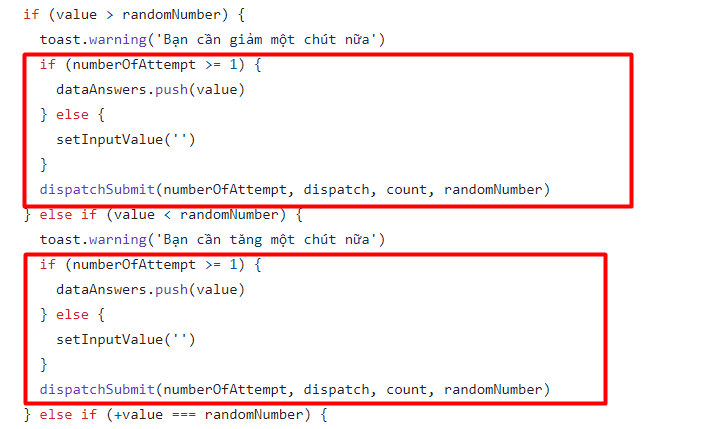

# Review bài tập về nhà buổi 49 - Lớp Fullstack K5

## [Tran Quang Vinh](https://hoccode-eight.vercel.app/)

`Bài làm không đúng theo yêu cầu đề bài. Anh xem lại kỹ yêu cầu đề bài và làm lại bài tập đúng theo yêu cầu nha anh. Sau khi anh làm xong thì anh báo em để em kiểm tra lại nha.`

## [Phan Van Hai](https://react-05-xi.vercel.app/)

- **Chức năng chuyển và lưu giao diện sáng tối:**

  - Bài làm xử lý rất tốt chức năng này.

- **Chức năng thay đổi range đoán số:**

  - Bài làm chưa xử lý chức năng này.

- **Chức năng đoán số:**

  - Chưa xử lý trường hợp người chơi đoán liên tục một số giống nhau.

  - Khi `reload` lại trang chưa `autofocus` vào `input`.

- **Chức năng thống kê kết quả của người chơi:**

  - Chưa xử lý case bấm nút xoá có confirm để xoá hết lịch sử chơi và sử dụng nút Esc để thoát modal confirm xoá.

- **Code format:**

  - Hai file `CountContext` và `CountReducer` không phải `component` và không trả về `jsx` vậy nên đặt là tên file có đuôi là `.js` sẽ hợp lý hơn.

  - Đoạn code này đang bị lặp lại, và trong lập trình cần tránh việc lặp lặp các đoạn mã như vậy (DRY - Don't Repeat Yourself)

    

  - Không sử dụng thẻ `h3` trong những trường hợp dưới đây vì chúng không mang ý nghĩa là một tiêu đề.

    

  - Việc chuyển dổi `theme` không phải là phần điều hướng và cũng không thường không nằm trông phần điều hướng của một trang(`navigation`) vậy nên không nên đặt `component` có tên `ToggleTheme` trong `component` `Nav`

- Điểm mạnh:

  - Cấu trúc được tổ chức tốt: Dự án nhìn chung được tổ chức tốt với sự phân tách rõ ràng giữa các thành phần, trợ giúp và tệp cấu hình.

  - Quy ước đặt tên rõ ràng: Hầu hết các tệp và thư mục đều tuân theo quy ước đặt tên rõ ràng.

  - Nắm chắc kiến thức về JavaScript và ReactJS

  - Xử lý logic rất tốt

  - Chủ dộng tìm hiểu và sử dụng tốt các kiến thức chưa được học trên lớp

- Điểm yếu:

  - Lặp logic khi code

  - Chưa hoàn thành đầy đủ yêu cầu bài tập

- [x] Đánh giá chung: Bài làm chưa hoàn thiện đủ chức năng theo yêu cầu bài làm và cần bổ sung để hoàn thiện bài tốt hơn.
